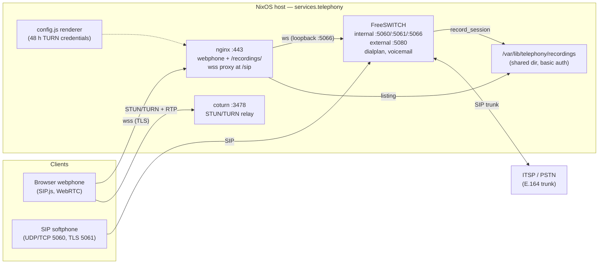

# nix-international-telephony

[](https://github.com/LarsArtmann/nix-international-telephony/actions/workflows/ci.yml)

A complete open-source telephony stack for NixOS, expressed in one flake:
**FreeSWITCH** PBX with browser-based WebRTC calling, voicemail, call recording,
simultaneous-ring groups, STUN/TURN traversal, and an ITSP gateway for
international numbers — all declared as Nix options and verified by a NixOS VM
test.

> This flake implements the Nix-native equivalent of the commonly recommended
> "FusionPBX + WebRTC" stack. FusionPBX/FreePBX themselves (PHP applications
> with interactive installers) are not packaged for Nix; here the same
> capabilities are provided by generating FreeSWITCH XML from Nix options.

## Architecture



Everything inside the host box is declared by Nix options and generated
from them; the diagram maps one-to-one onto the units in
[`docs/ops-runbook.md`](docs/ops-runbook.md).

## What you get

| Capability            | Implementation                                                                                     |
| --------------------- | -------------------------------------------------------------------------------------------------- |
| Browser calling       | Static SIP.js 0.21 webphone at `https://<domain>/` over WebRTC (`wss` proxied by nginx)            |
| SIP registrations     | FreeSWITCH `internal` profile: UDP/TCP 5060, TLS 5061, WebSocket via nginx 443                     |
| International calls   | E.164 dialling routed through a declarative ITSP gateway (`services.telephony.gateway`)            |
| Inbound numbers (DID) | Gateway DID routed to an extension or ring group                                                   |
| Simultaneous ring     | Ring groups + multi-device registration per extension                                              |
| Call recording        | `record_session` WAV files under `/var/lib/telephony/recordings` (browsable over HTTPS, see below) |
| Voicemail             | Per-extension boxes, check with `*98` from your phone                                              |
| NAT traversal         | coturn STUN/TURN, credentials handed to the webphone via `config.js`                               |
| Echo test             | Dial `9196` to verify audio end to end                                                             |

## Quick start (demo VM)

```console
nix run .#vm
```

Boots an ephemeral QEMU VM (root autologin, throwaway tmpfs root) with:

- domain `pbx.example.com`
- extensions **1000** (Alice, password `demo-1000-a1b2c3`) and **1001** (Bob, `demo-1001-d4e5f6`)
- ring group **2000** (rings both simultaneously)
- the webphone at `https://localhost/` (host port 443 is forwarded to the
  VM; self-signed cert — accept the warning; the console banner repeats
  these credentials on every root shell)
- echo test at extension `9196`

Inside the VM, check health:

```console
fs_cli -p demo-es-9f1e2c -x "sofia status"
```

Two browsers (or a browser + any SIP softphone registered to
`1000@pbx.example.com`) can call each other and `2000`.

## Using the module in your own NixOS host

```nix
{
  inputs.telephony.url = "github:LarsArtmann/nix-international-telephony";

  outputs = { self, nixpkgs, telephony }: {
    nixosConfigurations.pbx = nixpkgs.lib.nixosSystem {
      system = "x86_64-linux";
      modules = [
        telephony.nixosModules.telephony
        {
          services.telephony = {
            enable = true;
            domain = "pbx.example.com";
            eventSocketPassword = "change-me";   # fs_cli
            turn.password = "change-me-too";

            extensions."1000" = {
              password = "a-real-secret";
              displayName = "Alice";
            };
            ringGroups."2000".members = [ "1000" ];

            gateway = {
              proxy = "sip.provider.example";
              username = "account";
              password = "provider-secret";
              callerIdNumber = "441632960961";
              did = "441632960961";       # your international number
              didDestination = "2000";    # ring group answers inbound calls
            };
          };
        }
      ];
    };
  };
}
```

## Options tour

All options live under `services.telephony`:

- `domain` — SIP domain and HTTPS server name (must resolve to the host)
- `extensions` — SIP users: `password`, `displayName`, `allowInternational`, `vmPassword`
- `ringGroups` — virtual numbers ringing members simultaneously, with voicemail fallback
- `gateways` — ITSP trunks keyed by name for outbound/inbound PSTN; none configured makes PSTN dialling answer 503. Outbound calls fail over across gateways in ascending `priority` (least-cost routing); each gateway routes its own inbound `did` to `didDestination`, and `allowedCidrs` restricts inbound ITSP calls to the provider's addresses (SIP-layer ACL)
- `gateway` — deprecated single-trunk form of `gateways`
- `firewall.restrictExternalTo` — restrict port 5080 to provider CIDRs at the firewall layer (pair with `gateway.allowedCidrs`)
- `recording.enable` — record calls to `/var/lib/telephony/recordings/*.wav` (default `true`)
- `recording.serve.enable` — serve recordings at `https://<domain>/recordings/`
  behind HTTP basic auth; set `basicAuthUser` (default `admin`) and
  `basicAuthPasswordFile` (runtime file containing the password, required)
- `recording.retentionDays` — daily timer deletes recordings older than
  this many days (`null` keeps them forever)
- `rtp.startPort` / `rtp.endPort` — UDP media port range (default 16384–16584, opened in the firewall)
- `sounds.package` — prompt/music package (`null` disables prompts; voicemail is unusable without them)
- `webphone.enable` / `webphone.package` — static softphone served by nginx
- `turn.enable` / `turn.authSecret` — coturn STUN/TURN with REST-style
  ephemeral credentials: a systemd unit derives short-lived
  username/password pairs from the secret and serves them in `config.js`
  (renewed daily, valid 48 h)
- `tls.mode` — `self-signed` (per-host runtime cert, browser warning) or `manual`
  (`tls.certificate`/`tls.key`, e.g. from `security.acme`)
- `natAddress` — public IP to advertise when running behind NAT
- `natSipAddress` / `natRtpAddress` — override just the SIP or the SDP
  (media) advertisement when they differ (asymmetric NAT, SIP edge proxy);
  each defaults to `natAddress`
- `openFirewall` — open SIP/RTP/HTTPS/TURN ports (default `true`)
- `extraConfigFiles` — escape hatch for anything this module does not model:
  extra files merged into the generated FreeSWITCH config, keyed by path
  relative to the conf directory (e.g. `"dialplan/extra.xml"`). A key that
  collides with a generated file replaces it — prefer additive keys so the
  generated dialplan/profiles stay in effect.

## TLS notes

The default `self-signed` mode generates a throwaway certificate at boot for
nginx (HTTPS + the `wss://…/sip` proxy). For production, either point at an
existing certificate:

```nix
services.telephony.tls = {
  mode = "manual";
  certificate = "/var/lib/acme/pbx.example.com/fullchain.pem";
  key = "/var/lib/acme/pbx.example.com/key.pem";
};
```

…or let the module wire `security.acme` end to end (this also provisions the
same certificate to FreeSWITCH's SIP-over-TLS listener on 5061, with a path
unit re-provisioning and restarting the profile on renewal):

```nix
services.telephony.tls = {
  mode = "acme";
  acmeEmail = "you@example.com";
};
```

Without `acme`, SIP-over-TLS (port 5061) uses a FreeSWITCH-generated
self-signed certificate; it is only relevant for SIP softphones that
explicitly enable TLS — browsers always ride the nginx-proxied `wss`
transport.

## Security

- **All secrets in this flake end up in the world-readable Nix store.** For a
  home/lab PBX this is usually acceptable; for anything exposed, feed the
  sensitive values from a secret manager (sops-nix/agenix) instead of plain
  flake config, and change every default password in `hosts/pbx`.
- The event socket (`fs_cli`) listens on `127.0.0.1:8021` only.
- Inbound ITSP calls on the `external` profile are not digest-authenticated
  (industry normal). Restrict them to the provider's source addresses with
  `gateway.allowedCidrs` (SIP-layer ACL, rejects before the dialplan) and
  `firewall.restrictExternalTo` (drops at the firewall) — otherwise port
  5080 is reachable by anyone and unknown DIDs are answered with 404.
- TURN uses REST-style ephemeral credentials (`turn.authSecret`, coturn
  `use-auth-secret`): the served `config.js` carries username/password
  pairs derived from the shared secret, valid for 48 h and renewed daily.
  Anyone who can load the webphone can use the relay within that window —
  rotate `turn.authSecret` to revoke everyone at once.
- **Emergency services (911/112) are not wired**: real emergency calling needs
  a provider package and verified address handling. Do not rely on this PBX
  for emergency calls.
- Recording consent: `recording.enable` records without an announcement —
  check your jurisdiction's consent law. The same applies before enabling
  `recording.serve`: recorded conversations are personal data; the endpoint
  is password-protected, so keep the password file out of the store and put
  real TLS (`tls.mode = "acme"`) in front before exposing it beyond trusted
  networks.

## Development

```console
nix flake check   # evaluates, builds packages and runs the NixOS VM test
nix develop       # treefmt (nixfmt + prettier) + nil, installs pre-commit hooks
nix fmt           # treefmt, wired via flake-parts
```

Bump the pinned sip.js tarball (recomputes the hash and rebuilds the
bundle to verify):

```console
./packages/webphone/update.sh        # or: update.sh 0.22.0 for a specific version
```

Layout:

```
flake.nix                 outputs: module, demo host, packages, VM checks
tests/                    NixOS VM tests: common.nix fixtures + dialplan /
                          webphone / tls-turn / pbx (integration) suites
modules/telephony.nix     NixOS module (services.telephony.*)
modules/freeswitch.nix    pure generator: Nix options -> FreeSWITCH XML config
packages/webphone/        static SIP.js softphone (bundled with esbuild, no CDN)
packages/sounds.nix       FreeSWITCH prompts + music on hold
hosts/pbx/                example/deployment host
docs/ops-runbook.md       operator procedures (fs_cli, certs, gateways)
```

Operating a deployed host (fs_cli cheat-sheet, certificate rotation,
gateway REG-state debugging, recordings and TURN rotation, emergency
actions): see [`docs/ops-runbook.md`](docs/ops-runbook.md).

## License

[MIT](LICENSE) for this repository's code. Bundled third-party assets: SIP.js
(MIT — notice shipped as `sip.min.js.LEGAL.txt` next to the browser bundle),
FreeSWITCH sounds (upstream packages: prompts MPL-style, music CC-BY — see
`packages/sounds.nix` sources).
