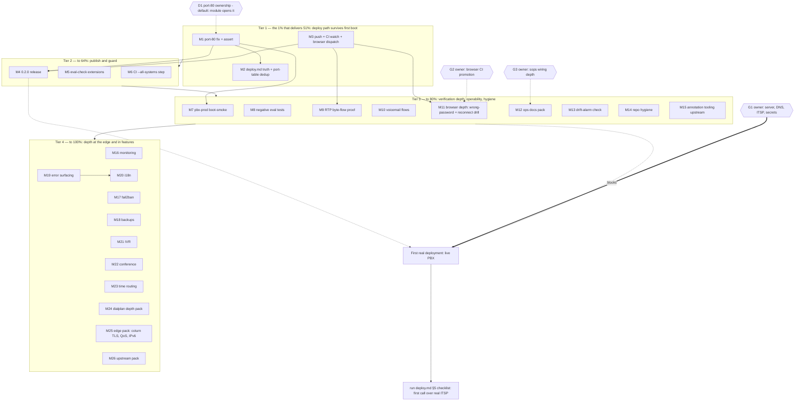

# Execution Plan: Trustworthy Stack → Live Production PBX (Pareto)

**Date:** 2026-08-27 11:04 CEST
**Source of truth:** `TODO_LIST.md` (10 open rows, curated by the docs-health pass an hour ago) + `ROADMAP.md` raw ideas + `docs/status/2026-08-27_11-01_docs-health-audit-annotation-archive.md` §f. This plan is a point-in-time snapshot; new tasks it surfaced were added back to TODO_LIST.md.
**Method:** Pareto planning skill — 1%/4%/20% tiers, medium tasks (30–100 min), then fine breakdown (≤12 min each).
**Context:** v0.1.0 is public; the repo-side deployment path is built and eval-gated (`hosts/pbx-prod`, `docs/deploy.md`, gitleaks-clean history). The customer is the owner deploying a real PBX on a real ITSP trunk. Today's gaps are **one real go-live blocker** (ACME port-80), **release friction** (v0.2.0 uncut, 9 commits unpushed), and **verification depth** (assertion paths never exercised negatively, media flow unproven, boot shape of the prod template never smoked).

---

## 1. Pareto Breakdown

### The 1% that delivers 51% — make the deploy path actually survive first boot (M1–M3)

One lever: fix the ACME port-80 gap and make the deployment docs tell the truth. Why this is the keystone:

- `tls.mode = "acme"` + `openFirewall` never opens TCP 80 → HTTP-01 challenge times out on a default-firewalled host → no cert → nginx/wss/webphone dead on day one. This breaks the exact scenario `hosts/pbx-prod` exists for (found by the 2026-08-27 self-review, confirmed in `modules/telephony/edge.nix`).
- The deploy runbook's port table omits 80 and 22 (an operator following it firewalls themselves out twice) and counts secrets imprecisely.
- 9 commits sit unpushed — CI has never validated the deployment path at all.
- Everything else repo-side for go-live is DONE; without these three, the first real deployment fails at step one.

### The 4% that delivers 64% — publish and guard (M4–M6)

- Cut v0.2.0: the Unreleased section is release-ready (secrets, browser E2E, aarch64 CI, deployment path) and gitleaks is clean — publishing anchors the value and resets the changelog baseline.
- Harden `checks.telephony-eval` (port-80 assert, candidate-ACL, wss-binding, per-`*File` placeholders): seconds-cost regression guards for every generated-XML invariant we ever debugged in a VM.
- Add CI `--all-systems --no-build`: catches cross-arch eval breakage (the drv-context bug class) for minutes, before the arm job wastes hours.

### The 20% that delivers 80% — verification depth, operability, hygiene (M7–M15)

Boot-smoke the production host shape, negative eval assertions (exactly-one-of), RTP byte-flow proof, voicemail deposit/retrieval, browser wrong-password + reconnect drill, ops docs (diagnostics teaching, agenix variant), drift-alarm, repo hygiene (helper dedupe, CHANGELOG lint), annotation-tooling upstream fix. The stack becomes *operable and self-defending*, not just demonstrable.

### The other 20% (to reach 100%) — depth at the edge and in features (M16–M26)

Monitoring, fail2ban, backups, webphone error surfacing + i18n, IVR/conference/business-hours/voicemail-email, coturn TLS/QoS/IPv6, upstream ecosystem work. YAGNI-checked: nothing here gates go-live.

### Gates (owner decisions, then execute)

| ID  | Item                                   | Gate                                                        |
| --- | ------------------------------------- | ----------------------------------------------------------- |
| G1  | First real deployment inputs          | Server/VPS, DNS, ITSP choice (ROADMAP Q2), real secrets      |
| G2  | Browser E2E CI promotion              | periodic/per-push vs manual-only (owner appetite, ROADMAP Q3) |
| G3  | sops-nix wiring depth                 | docs-only recipe stands until owner opts in (ROADMAP Q1)     |
| D1  | Port-80 ownership                     | folded into M1 — default: module opens it; owner can veto     |

---

## 2. Comprehensive Plan — medium tasks (30–100 min each, ALL TODOs)

Sorted by tier, then impact/effort/customer-value. `Dep` = dependencies.

| ID  | Tier | Task                                                                                          | Impact    | Effort | Dep | Unblocks / verifies                                    |
| --- | ---- | --------------------------------------------------------------------------------------------- | --------- | ------ | --- | ------------------------------------------------------ |
| M1  | 1%   | Open TCP 80 in acme mode under `openFirewall` + port-80 eval assert (D1 default)               | Critical  | 50min  | D1  | First-boot ACME issuance; TODO row 1                    |
| M2  | 1%   | deploy.md truth pass: port 80+22 rows, exact secret count, `fs_cli -p "$(cat …)"`; canonical port table (runbook wins) | Critical | 40min | M1  | Operator cannot firewall themselves out                |
| M3  | 1%   | Push the 9 local commits; watch both CI jobs; dispatch browser-e2e workflow once               | High      | 30min  | —   | First CI validation of the deploy path + manual job     |
| M4  | 4%   | Cut v0.2.0: date the CHANGELOG, tag, `gh release create`, repo metadata polish                 | High      | 45min  | M1–M3 | Public anchor; changelog baseline reset                |
| M5  | 4%   | Extend `checks.telephony-eval`: `apply-candidate-acl`, `wss-binding 7443`, one placeholder per configured `*File` | High | 45min | —  | Seconds-cost regression guards                          |
| M6  | 4%   | CI step: `nix flake check --all-systems --no-build`                                            | Medium    | 30min  | —   | Cross-arch eval breakage caught cheap                   |
| M7  | 20%  | Boot-smoke VM test for the `pbx-prod` shape (stubbed secrets, self-signed override)            | High      | 75min  | M1  | Prod template's unit graph provably starts              |
| M8  | 20%  | Negative eval tests: both `password`+`passwordFile` trips exactly-one-of (ext, gw, ES, TURN)   | Medium    | 35min  | —   | Assertion paths exercised                               |
| M9  | 20%  | RTP byte-flow assertion in the browser E2E (media stats, not just channels up)                 | Medium    | 60min  | M3  | Real media proof; TODO row                             |
| M10 | 20%  | Voicemail deposit/retrieval scripted test (message lands, `*98`+PIN plays it, wrong PIN denies) | Medium  | 90min  | —   | Voicemail row → FULLY_FUNCTIONAL                        |
| M11 | 20%  | Browser E2E depth: wrong-password leg asserts on-screen error; reconnect drill (kill nginx → backoff → re-register) | Medium | 75min | M3 | Webphone resilience proven end to end                  |
| M12 | 20%  | Docs pack: runbook teaches `wsprobe.py` + browser failure dumps; agenix variant in `docs/secrets.md` | Medium | 90min | —  | Operators can self-diagnose; recipe completeness        |
| M13 | 20%  | Drift-alarm check: TODO_LIST rows duplicating FULLY_FUNCTIONAL FEATURES rows → fail            | Medium    | 60min  | —   | Doc drift becomes a gate error, not archaeology         |
| M14 | 20%  | Repo hygiene: `sip_server` → common.nix, `wait_for_freeswitch` port param, timedelta migration, favicon, CHANGELOG repeated-heading lint | Low | 90min | — | Faster bisect; decay class killed                      |
| M15 | 20%  | Extend docs-health annotation scripts (section scope, M/B IDs, shape assertion); propose upstream | Medium | 60min | — | Next mass annotation can't repeat the newline bug      |
| M16 | rest | Monitoring: fs_cli health timer + alerts on profile down / gateway REG failure                 | Medium    | 90min  | —   | Sick stack announces itself                             |
| M17 | rest | fail2ban / SIP rate-limiting posture for 5060/5080                                             | Medium    | 60min  | —   | Scanner resistance                                       |
| M18 | rest | Backups story: recordings/voicemail/CDR single-copy → documented timer + restore procedure     | Medium    | 60min  | —   | Data-loss risk retired                                   |
| M19 | rest | Webphone: surface transport/registration errors in the UI (status pill beyond "offline")       | Medium    | 60min  | —   | Users see why they're offline                            |
| M20 | rest | Webphone i18n (de/en) with persisted language toggle                                           | Medium    | 90min  | M19 | German operator UX                                       |
| M21 | rest | Declarative IVR menus (options → dialplan XML + prompt mapping)                                | Medium    | 100min | —   | PBX feature depth                                        |
| M22 | rest | Conference rooms (mod_conference wiring + options)                                             | Medium    | 75min  | —   | PBX feature depth                                        |
| M23 | rest | Time-based routing (business hours) per ring group                                             | Medium    | 75min  | —   | PBX feature depth                                        |
| M24 | rest | Dialplan depth pack: voicemail-to-email, per-extension caller-id override, `*97` record toggle | Medium | 100min | M10 | PBX feature depth                                        |
| M25 | rest | Edge pack: coturn TLS/DTLS listeners, QoS/DSCP marking, IPv6 profiles behind `ipv6.enable`     | Low       | 100min | —   | Edge correctness                                         |
| M26 | rest | Upstream pack: nixpkgs freeswitch-unit ordering PR, nix-ssh-config kbd-interactive issue, flake-update cadence | Medium | 100min | — | Ecosystem gives back                                     |

Totals: 26 actionable tasks (~24 h) + 3 owner gates (G1–G3) + 1 folded decision (D1).

---

## 3. Fine Breakdown — micro tasks ≤12 min each (ALL TODOs)

Grouped by parent; execute top to bottom within a group. `⏱` sums to the parent estimate including verification runs.

### M1 — ACME port-80 fix (50min)

| ID   | Task                                                                          | Min | Dep  |
| ---- | ----------------------------------------------------------------------------- | --- | ---- |
| M1.1 | `edge.nix`: `allowedTCPPorts` gains 80 when `tls.mode == "acme"` && `openFirewall` | 12 | — |
| M1.2 | `tests/eval.nix`: assert 80 present (acme fixture) and absent (self-signed)   | 12  | M1.1 |
| M1.3 | Full eval gate + quick VM suite spot-run                                      | 10  | M1.2 |
| M1.4 | FEATURES/TODO/CHANGELOG flips in the same commit (single-home rule)           | 8   | M1.3 |
| M1.5 | README TLS note: drop the port-80 caveat (now fixed)                          | 8   | M1.4 |

### M2 — deploy.md truth pass (40min)

| ID   | Task                                                                                         | Min | Dep  |
| ---- | -------------------------------------------------------------------------------------------- | --- | ---- |
| M2.1 | Port table: add TCP 80 (ACME) + TCP 22 (SSH) rows; fix "five random strings" → 4 mandatory + 2 optional | 12 | — |
| M2.2 | `fs_cli -p "$(cat /run/secrets/…)"` file-mode notes in §5 + ops-runbook cheat-sheet | 12 | — |
| M2.3 | Dedup: ops-runbook port table becomes canonical; deploy.md links it and keeps only hoster-firewall framing | 12 | M2.1 |
| M2.4 | Read-through vs `hosts/pbx-prod` CHANGEMEs; gate + commit                                    | 4   | M2.3 |

### M3 — Push + CI validation (30min)

| ID   | Task                                                 | Min | Dep  |
| ---- | ---------------------------------------------------- | --- | ---- |
| M3.1 | `git status` clean; push `origin main` (9→10 commits) | 5   | —    |
| M3.2 | `gh run watch` the check job (x86)                   | 10  | M3.1 |
| M3.3 | `gh run watch` the aarch64 job                       | 5   | M3.1 |
| M3.4 | Dispatch browser-e2e workflow; watch to green        | 10  | M3.1 |

### M4 — 0.2.0 release (45min)

| ID   | Task                                                                 | Min | Dep   |
| ---- | -------------------------------------------------------------------- | --- | ----- |
| M4.1 | CHANGELOG: `## [Unreleased]` → `## [0.2.0] - 2026-08-27`, fresh empty Unreleased | 10 | M1–M3 |
| M4.2 | Known-limitations refresh (secrets story changed; aarch64 boot-proof; RTP assert state) | 10 | M4.1 |
| M4.3 | `git tag -a v0.2.0` + `gh release create` with notes from CHANGELOG | 12 | M4.2 |
| M4.4 | Repo metadata: topics, description                                  | 8   | M4.3 |
| M4.5 | TODO/FEATURES flips + commit                                        | 5   | M4.4 |

### M5 — eval-check extensions (45min)

| ID   | Task                                                                 | Min | Dep |
| ---- | -------------------------------------------------------------------- | --- | --- |
| M5.1 | Assert `apply-candidate-acl localnet.auto` in internal profile XML   | 10  | —   |
| M5.2 | Assert `wss-binding 127.0.0.1:7443` present                          | 10  | —   |
| M5.3 | Assert exactly one `@TELEPHONY_*@` placeholder per configured `*File` option | 12 | — |
| M5.4 | Gate + CHANGELOG line + commit                                      | 13  | M5.1–M5.3 |

### M6 — CI cross-arch eval step (30min)

| ID   | Task                                                            | Min | Dep |
| ---- | --------------------------------------------------------------- | --- | --- |
| M6.1 | ci.yml: `nix flake check --all-systems --no-build` step/job      | 12  | —   |
| M6.2 | Push + verify the run (catches nothing = success first time)    | 12  | M6.1 |
| M6.3 | CHANGELOG line + commit                                         | 6   | M6.2 |

### M7 — pbx-prod boot-smoke (75min)

| ID   | Task                                                                          | Min | Dep  |
| ---- | ------------------------------------------------------------------------------ | --- | ---- |
| M7.1 | Test node from the pbx-prod shape: tmpfiles-stubbed secrets, tls → self-signed | 12  | —    |
| M7.2 | Parametrize `tests/boot.nix` (or new suite) for the prod shape                 | 12  | M7.1 |
| M7.3 | Asserts: units up, sofia bound non-loopback, nginx serving, no CHANGEME leaked  | 12  | M7.2 |
| M7.4 | ACME-mode skip logic (issuance can't run in VM; eval covers wiring)            | 12  | M7.3 |
| M7.5 | Run + fix fallout                                                              | 12  | M7.4 |
| M7.6 | FEATURES pbx-prod row upgrade + gate + commit                                  | 15  | M7.5 |

### M8 — negative eval assertions (35min)

| ID   | Task                                                              | Min | Dep |
| ---- | ----------------------------------------------------------------- | --- | --- |
| M8.1 | Eval-only machines: extension + gateway both-set → assertion fires | 12  | —   |
| M8.2 | Same for eventSocket + TURN pairs                                 | 12  | —   |
| M8.3 | Wire into checks + gate + commit                                  | 11  | M8.1–M8.2 |

### M9 — RTP byte-flow proof (60min)

| ID   | Task                                                                | Min | Dep |
| ---- | ------------------------------------------------------------------- | --- | --- |
| M9.1 | In-VM: fs_cli `uuid_media_stats`/`show detailed_calls` field survey | 12  | —   |
| M9.2 | Assert RTP bytes/packets > 0 on both legs while the call is up      | 12  | M9.1 |
| M9.3 | Two confirmation runs of the browser suite                          | 12  | M9.2 |
| M9.4 | TODO flip + gate + commit                                           | 12  | M9.3 |

### M10 — voicemail flows (90min)

| ID    | Task                                                                  | Min | Dep  |
| ----- | --------------------------------------------------------------------- | --- | ---- |
| M10.1 | Deposit leg: INVITE → extension voicemail, leave message (test node)  | 12  | —    |
| M10.2 | Assert message file/counter appears per extension                     | 12  | M10.1 |
| M10.3 | Retrieval leg: `*98` + PIN navigates and plays                        | 12  | M10.2 |
| M10.4 | Wrong-PIN denial assert                                               | 12  | M10.3 |
| M10.5 | `vmPasswordFile` file-mode variant if cheap                           | 12  | M10.4 |
| M10.6 | FEATURES voicemail row → FULLY_FUNCTIONAL + gate + commit             | 12  | M10.5 |

### M11 — browser depth (75min)

| ID    | Task                                                                           | Min | Dep |
| ----- | ------------------------------------------------------------------------------ | --- | --- |
| M11.1 | Wrong-password login asserts the on-screen error (not just no-register)        | 12  | —   |
| M11.2 | Reconnect drill: kill nginx mid-session                                        | 12  | —   |
| M11.3 | Assert backoff markers + re-register + call works after recovery               | 12  | M11.2 |
| M11.4 | DTMF keypad UI case (established call, key press → dtmf-relay marker)          | 12  | —   |
| M11.5 | Two full suite runs + gate + ROADMAP flip (drill idea done) + commit           | 12  | M11.1–M11.4 |

### M12 — ops docs pack (90min)

| ID    | Task                                                                  | Min | Dep |
| ----- | --------------------------------------------------------------------- | --- | --- |
| M12.1 | Runbook: wsprobe.py walkthrough (when + how to read Via/WSS controls) | 12  | —   |
| M12.2 | Runbook: browser failure-dump playbook (console/log/dumps decision tree) | 12 | — |
| M12.3 | secrets.md: agenix variant section (module-source-verified like sops)  | 12  | —   |
| M12.4 | Cross-link from option descriptions + README                           | 12  | M12.1–M12.3 |
| M12.5 | Accuracy read-through vs current tests + gate + commit                 | 12  | M12.4 |

### M13 — drift-alarm check (60min)

| ID    | Task                                                                  | Min | Dep |
| ----- | --------------------------------------------------------------------- | --- | --- |
| M13.1 | Script: parse TODO_LIST task names vs FULLY_FUNCTIONAL FEATURES rows  | 12  | —   |
| M13.2 | Wire as a check (no VM; pure eval/shell)                              | 12  | M13.1 |
| M13.3 | Dry-run against current docs (must pass; inject a fake dupe to prove it fails) | 12 | M13.2 |
| M13.4 | Gate + AGENTS note + commit                                           | 12  | M13.3 |

### M14 — repo hygiene (90min)

| ID    | Task                                                                  | Min | Dep |
| ----- | --------------------------------------------------------------------- | --- | --- |
| M14.1 | `sip_server` helper: pbx.nix + dialplan.nix → tests/common.nix        | 12  | —   |
| M14.2 | `wait_for_freeswitch`: parametrize the probed port                    | 10  | —   |
| M14.3 | VM-test timeouts → `datetime.timedelta` (deprecation noise gone)      | 12  | —   |
| M14.4 | favicon.ico in the webphone package                                   | 8   | —   |
| M14.5 | Pre-commit lint: no repeated `### <type>` under one CHANGELOG version | 12  | —   |
| M14.6 | Full gate + pre-commit `--all-files` + commit                         | 12  | M14.1–M14.5 |

### M15 — annotation tooling upstream (60min)

| ID    | Task                                                                  | Min | Dep |
| ----- | --------------------------------------------------------------------- | --- | --- |
| M15.1 | `annotate-rows.py`: section scoping (heading prefix arg)              | 12  | —   |
| M15.2 | Non-numeric row IDs (M1/B1) + post-write shape assertion (line count) | 12  | M15.1 |
| M15.3 | Dry-run + real-run regression on copies of this repo's reports        | 12  | M15.2 |
| M15.4 | Propose upstream (skill repo PR/issue with the newline-bug story)     | 12  | M15.3 |

### M16 — monitoring (90min)

| ID    | Task                                                                  | Min | Dep |
| ----- | --------------------------------------------------------------------- | --- | --- |
| M16.1 | Timer script: fs_cli `sofia status` + gateway REG-state poll          | 12  | —   |
| M16.2 | Failure path: journal-logged + unit fails loud                        | 12  | M16.1 |
| M16.3 | Profile-down detection (bindings absent)                              | 12  | M16.2 |
| M16.4 | Gateway REG-fail detection (NOREG/FAILED state)                       | 12  | M16.2 |
| M16.5 | Runbook "monitoring" section                                          | 12  | M16.4 |
| M16.6 | VM smoke (stop profile → timer alerts) + gate + commit                | 12  | M16.5 |

### M17 — fail2ban / SIP rate-limit (60min)

| ID    | Task                                                                  | Min | Dep |
| ----- | --------------------------------------------------------------------- | --- | --- |
| M17.1 | fail2ban jail for SIP scanning on 5060/5080 (option-gated)            | 12  | —   |
| M17.2 | Fail2ban posture doc (what it does NOT cover: digest auth is the real gate) | 12 | M17.1 |
| M17.3 | VM test: repeated bad REGISTERs → ban                                 | 12  | M17.1 |
| M17.4 | Gate + flips + commit                                                 | 12  | M17.3 |

### M18 — backups (60min)

| ID    | Task                                                                  | Min | Dep |
| ----- | --------------------------------------------------------------------- | --- | --- |
| M18.1 | Inventory backup targets (recordings, voicemail spool, CDR CSV)       | 10  | —   |
| M18.2 | deploy.md: restic/rsync timer example (doc-first, no new dep)         | 12  | M18.1 |
| M18.3 | Restore procedure walkthrough                                         | 12  | M18.2 |
| M18.4 | ROADMAP flip (backups idea done) + gate + commit                      | 10  | M18.3 |

### M19 — webphone error surfacing (60min)

| ID    | Task                                                                  | Min | Dep |
| ----- | --------------------------------------------------------------------- | --- | --- |
| M19.1 | Status pill states design: transport/registration/auth errors         | 10  | —   |
| M19.2 | Wire transport disconnect reason into the pill                        | 12  | M19.1 |
| M19.3 | Wire registration failure (401/timeout) into the pill                 | 12  | M19.2 |
| M19.4 | Markup/JS asserts in the webphone suite + gate + commit               | 12  | M19.3 |

### M20 — webphone i18n (90min)

| ID    | Task                                                                  | Min | Dep  |
| ----- | --------------------------------------------------------------------- | --- | ---- |
| M20.1 | Strings table de/en extracted from markup + JS                        | 12  | —    |
| M20.2 | Language toggle + localStorage persistence                            | 12  | M20.1 |
| M20.3 | Migrate all UI strings (login, phone, history, errors)                | 24  | M20.2 |
| M20.4 | Browser suite case/formatting re-check + gate + commit                | 12  | M20.3 |

### M21 — IVR (100min)

| ID    | Task                                                                  | Min | Dep |
| ----- | --------------------------------------------------------------------- | --- | --- |
| M21.1 | `ivrs` option schema (menu tree, timeouts, repeat)                    | 12  | —   |
| M21.2 | Generator: menu XML + sound/prompt mapping                            | 24  | M21.1 |
| M21.3 | Dialplan integration + DTMF routing                                   | 12  | M21.2 |
| M21.4 | VM test: dial-in, key through, land at destination                    | 12  | M21.3 |
| M21.5 | README options tour + FEATURES + gate + commit                        | 12  | M21.4 |

### M22 — conference rooms (75min)

| ID    | Task                                                                  | Min | Dep |
| ----- | --------------------------------------------------------------------- | --- | --- |
| M22.1 | `conferences` option schema (pin, profile, moh)                       | 12  | —   |
| M22.2 | Generator: mod_conference wiring + dialplan entries                   | 12  | M22.1 |
| M22.3 | VM test: two legs join, media bridge assert                           | 12  | M22.2 |
| M22.4 | README/FEATURES + gate + commit                                       | 12  | M22.3 |

### M23 — time-based routing (75min)

| ID    | Task                                                                  | Min | Dep |
| ----- | --------------------------------------------------------------------- | --- | --- |
| M23.1 | `ringGroups.<n>.timeWindow` option (days/hours, tz)                   | 12  | —   |
| M23.2 | Generator: dialplan time condition → out-of-hours destination         | 12  | M23.1 |
| M23.3 | VM test with faked clock or window edges                             | 12  | M23.2 |
| M23.4 | README/FEATURES + gate + commit                                       | 12  | M23.3 |

### M24 — dialplan depth pack (100min)

| ID    | Task                                                                  | Min | Dep  |
| ----- | --------------------------------------------------------------------- | --- | ---- |
| M24.1 | Voicemail-to-email (`vm-mailto` option + mailer doc caveat)           | 12  | —    |
| M24.2 | Per-extension outbound caller-id override option                      | 12  | —    |
| M24.3 | `*97` per-call recording toggle (+ announcement option)               | 12  | —    |
| M24.4 | VM tests for all three                                                | 12  | M24.1–M24.3 |
| M24.5 | README/FEATURES + gate + commit                                       | 12  | M24.4 |

### M25 — edge pack (100min)

| ID    | Task                                                                  | Min | Dep |
| ----- | --------------------------------------------------------------------- | --- | --- |
| M25.1 | coturn TLS/DTLS listener option (`turns:`, cert wiring)               | 12  | —   |
| M25.2 | QoS/DSCP marking options for RTP                                      | 12  | —   |
| M25.3 | `ipv6.enable` → internal-ipv6/external-ipv6 profiles                  | 24  | —   |
| M25.4 | Eval checks + firewall v6 rules review                                | 12  | M25.3 |
| M25.5 | README/FEATURES + gate + commit                                       | 12  | M25.4 |

### M26 — upstream pack (100min)

| ID    | Task                                                                  | Min | Dep |
| ----- | --------------------------------------------------------------------- | --- | --- |
| M26.1 | Verify-then-file: nix-ssh-config kbd-interactive issue (evidence: our telephony-ssh asserts) | 12 | — |
| M26.2 | nixpkgs PR prep: freeswitch unit `network-online.target` ordering (our loopback-race evidence) | 12 | — |
| M26.3 | `services.telephony` upstreamability checklist (nixosTests shape, module review) | 12 | — |
| M26.4 | Scheduled `nix flake update` PR cadence (workflow or documented ritual) | 12  | —   |

---

## 4. Execution Graph

Execution order: T1 strictly first (it unblocks everything and validates 10
commits of shipped work), then T2 (release + guards), T3 in table order, T4
last. Answer G1–G3/D1 whenever convenient — G1 is the actual 51%: repo-side
work is done; the live PBX needs only owner inputs plus M1–M2.

---

## 5. Rules of engagement

- **No Verschlimmbesserung**: every task ends with `nix flake check` green;
  if a change fights the architecture (e.g. IVR menu-tree complexity),
  stop and reconsider instead of wedging it in.
- Each micro-task commits only when the gate is green (groups above already
  include their gate+commit step).
- Features flipped to verified get: FEATURES.md status update + TODO removal +
  CHANGELOG entry in the same commit (single-home-per-fact discipline).
- This plan is a snapshot. Living state lives in TODO_LIST.md; to refresh this
  file later, annotate it (docs-health ANNOTATE), never rewrite.
