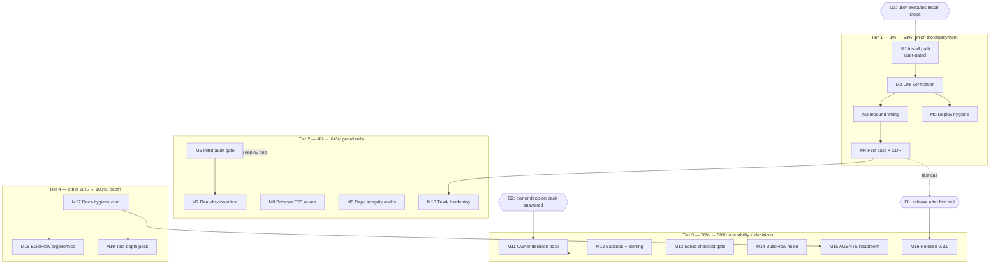

# Pareto Plan: Finish the Live Deployment, Then Lock the Guard Rails

**When:** 2026-09-15 10:18 CEST
**Sources:** `TODO_LIST.md` (22 verified rows, rebuilt 2026-09-15), status reports
`2026-09-15_09-19` (docs-health round 2, §f 1–35) and `2026-09-14_19-14`
(deployment state, §f 1–30), ROADMAP open questions.
**Living state:** this file is a point-in-time snapshot. Executed work lands in
`TODO_LIST.md` (delete-the-row) and `CHANGELOG.md`; refresh this plan later by
annotating it (docs-health ANNOTATE), never by rewriting it.
**Secrecy rule:** no real domains, DIDs, IPs, usernames, or key material in
this repo — real values live in the private flake and `~/.pbx-prod-secrets/`.

---

## 1. Pareto Breakdown

### The 1% that delivers 51% — finish the install and prove the live stack (M1–M5)

Everything repo-side is built and VM-proven; the deployment is one rescue-boot
plus a reinstall away from a running PBX. Until a real call completes, the
whole stack is a very well-tested hypothesis. M1–M2 unblock it; M3–M5 close
the inbound/outbound loops and pay the deploy-hygiene debt the 09-14 session
created (second server, AAAA removed, Terraform drift).

### The 4% that delivers 64% — hard guards for the deploy path (M6–M10)

The 09-14 first-boot hang proved that green eval/build/VM suites do NOT prove
deployability (the VM tests `mkForce` the metal boot path away). M6–M7 turn
that lesson into gates so it cannot recur; M8 validates the ruff-driven
exception narrowing under real Selenium; M9 closes this week's repo-integrity
loose ends (unaudited `flake.lock` mutation, unverified formatter exclusion,
red Dependabot PR); M10 pins inbound trust to the provider once the trunk is
proven.

### The 20% that delivers 80% — operability, safety, owner decisions (M11–M16)

The stack is about to hold real conversations: backups, alerting, the
scrub-checklist habit, BuildFlow noise control, and AGENTS.md headroom are
what keep it operable after the first call. Seven owner decisions block
otherwise-finished work (recording consent is URGENT — it gates real
traffic); M11 batch-captures them. M16 ships release 0.3.0 when the first
real call lands.

### The other 20% (to reach 100%) — docs hygiene, tooling probes, test depth (M17–M19)

Continuity work from the docs-health passes (annotate-and-archive the old
reports, HTML open rows, drift-gate extensions), BuildFlow ergonomics probes,
and the small test-depth items verified missing today (`assert_fs_hour`,
helper dedupe, conference pin leg). Explicitly NOT tasks: the raw ideas in
`ROADMAP.md` themes 1–6 (DISA, IPv6 SIP, QoS/DSCP, Kamailio, SIP.js bump,
mod_verto, watchdog deep-dive, voicemail transcription, gateway keepalive,
egress routing, agent-calling MVP, llms.txt, …) stay raw until refined —
they are accounted for here, not planned here.

Totals: **19 medium tasks (~22 h) + 2 owner gates (G1–G2) + 1 folded decision
(D1, release timing).**

## 2. Comprehensive Plan — medium tasks (30–100 min each, ALL TODOs)

Sorted by tier, then impact/effort/customer-value. `Dep` = dependencies.

| ID  | Tier | Task                                                                                                                                                        | Impact   | Effort | Dep     | Unblocks / verifies                                   |
| --- | ---- | ------------------------------------------------------------------------------------------------------------------------------------------------------------- | -------- | ------ | ------- | ------------------------------------------------------- |
| M1  | 1%   | Install path, user-gated: rescue-enable + power-cycle, rerun the fixed `install-pbx.sh` from evo-x2, run `push-secrets.sh`, BatchMode throughout, log to file    | Critical | 100min | G1      | Server runs the fixed closure; secrets spliced          |
| M2  | 1%   | Live-stack verification: units (freeswitch/coturn/nginx/sshd), webhook `/telnyx/webhooks/health` over HTTPS, ACME cert issuer, gateway REGED, deploy.md §5 walk | Critical | 45min  | M1      | The stack is actually up, not just installed            |
| M3  | 1%   | Inbound wiring: PATCH messaging-profile `webhook_url`, send+receive one SMS end to end via `/recent`, close the outbound-call loop from webhook events          | Critical | 45min  | M2      | The 2026-09-14 open loops (SMS reply, "did it ring")    |
| M4  | 1%   | First real calls + CDR: webphone register → outbound E.164; inbound to the US DID → ring group; CDR rows in Master.csv confirmed                                 | Critical | 60min  | M2      | The product works; release gate for 0.3.0               |
| M5  | 1%   | Deploy hygiene: static IPv6 + gateway in the private flake, AAAA re-add via the domains repo, delete the old (billing) server, reconcile `infra/hcloud.tf`      | High     | 50min  | M2      | One server, one truth; v6 reachable                     |
| M6  | 4%   | Initrd-audit gate: script greps the built initrd for the target platform's bus drivers (virtio for cloud, nvme/ahci otherwise); wire into the deploy flow       | High     | 45min  | —       | The 10-second check that would have saved 09-14         |
| M7  | 4%   | Real-disk-boot VM test: boot the actual disko image via `virtualisation.diskInterface` (metal path, not the `mkForce`d stand-in root)                           | High     | 100min | —       | Initrd/disk-driver class of bugs becomes VM-visible     |
| M8  | 4%   | Browser E2E re-run: validate the ruff `WebDriverException` narrowing live; review the failure-dump artifact question while in there                             | High     | 60min  | —       | The narrowed handlers survive a real session            |
| M9  | 4%   | Repo integrity audits: diff `flake.lock` inputs moved by `849e951` (revert/changelog), rerun `buildflow format` vs webphone assets + treefmt, fix/close the red Dependabot PR | High | 45min  | —       | No unaudited self-modifications; main CI stays green    |
| M10 | 4%   | Trunk hardening: `allowedCidrs` + `restrictExternalTo` with Telnyx source nets, enable fail2ban on prod, redeploy                                               | High     | 40min  | M4      | Port 5080 speaks only to the provider                   |
| M11 | 20%  | Owner decision pack (one question batch, then execute answers): recording-consent posture (URGENT, gates real traffic), Warsaw/DE DIDs, Telnyx key rotation, browser-CI cadence, mainProgram policy, qemuGuest, Hetzner Cloud Firewall, CHANGELOG culture for docs/infra | High | 30min | G2      | Seven blocked rows become work or Won't-implement       |
| M12 | 20%  | Backups + alerting sink: restic/Hetzner-snapshot recipe for `/var/lib/freeswitch` + secrets dir (encrypted target only), OnFailure routing wired to a notifier  | Medium   | 60min  | —       | Single-copy data stops being a data-loss risk           |
| M13 | 20%  | Scrub-checklist script: real-value greps (DIDs ±`+`/spaces, personal numbers, usernames, IPs, key IDs) over tree AND `git log --all -S`; wire into pre-commit   | Medium   | 45min  | —       | The 09-03 personal-data leak class gets a gate          |
| M14 | 20%  | BuildFlow noise decisions in `.buildflow.yml`: per-tool excludes (jscpd/lychee keep webphone assets), bandit B101/B108/B311 skips, vulture whitelist, pytest-test decision, `todo_min_severity`; probe whether lychee reads `lychee.toml` | Medium | 60min | — | Detect-only noise stops masking real signal            |
| M15 | 20%  | AGENTS.md headroom: migrate long-form entries to `docs/session-craft.md` with one-line pointers; add the `resolved =` annotation + archive rule                  | Medium   | 45min  | —       | The 377-line cap stops eating the next lesson           |
| M16 | 20%  | Release 0.3.0 after the first real call: cut `[Unreleased]`, date it, tag, `gh release create`, repo metadata refresh                                           | Medium   | 40min  | M4, G3  | Public anchor for the deployment era                    |
| M17 | rest | Docs-hygiene continuation: verdict sweep + archive of the 9 old 08-21/22 reports; resolve/mark the HTML report's open rows; decide the micro-verdict convention; DOMAIN_LANGUAGE time-window entries; deploy.md clock note; docs-drift extension (flag TODO rows citing archived files); batch `git show --stat` the ~25 hashes cited by round 2 | Low | 100min | — | Archives stay trustworthy; no ghost citations          |
| M18 | rest | BuildFlow ergonomics: probe `BUILDFLOW_MAX_TIME` env (shrink the AGENTS.md note if it works), document dev/fast local default, trial `watch`/`diff`/`--failed-only` once each | Low | 40min | — | Full runs stop biting; recovery path known             |
| M19 | rest | Test-depth micro pack: `assert_fs_hour` helper in `tests/common.nix`, dedupe `time-routing.nix`'s local `call()`, conference pin leg (wrong pin denied)          | Low      | 60min  | —       | The three verified test gaps close                     |

## 3. Fine Breakdown — micro tasks ≤12 min each

### M1 — Install path (user-gated; I prepare, user executes) (100min)

| ID    | Task                                                                                                             | Effort |
| ----- | ------------------------------------------------------------------------------------------------------------------ | ------ |
| M1.1  | Write the one-page runbook snippet: rescue-enable in the Hetzner panel, power-cycle, exact `install-pbx.sh` invocation with `-i` + `BatchMode` + log-to-file | 12min  |
| M1.2  | Verify `install-pbx.sh` on evo-x2 still points at the fixed closure (virtio initrd present: `zstdcat \| cpio -t \| grep virtio`) before hand-off | 12min  |
| M1.3  | USER: enable rescue system + power-cycle (~2 min hands-on; my wait)                                               | 5min   |
| M1.4  | USER: run `install-pbx.sh` (fails fast now; log to file, foreground)                                             | 20min  |
| M1.5  | USER: run `push-secrets.sh`; I verify perms (640/turnserver) and splice (`grep '@TELEPHONY_'` runtime XML → empty) | 12min  |
| M1.6  | Post-install smoke: ssh in, `systemctl status` the five units, first-boot journal sanity                          | 12min  |

### M2 — Live-stack verification (45min)

| ID    | Task                                                                                                                       | Effort |
| ----- | ---------------------------------------------------------------------------------------------------------------------------- | ------ |
| M2.1  | `curl` the webhook `/telnyx/webhooks/health` (force IPv4 past DNS cache); expect 200                                           | 12min  |
| M2.2  | ACME check: cert issuer via python-urllib (not curl), vhost serving, TCP 80 reachable only in acme mode                        | 12min  |
| M2.3  | USER: `fs_cli -p "$(cat …/telephony_event_socket)" -x 'sofia status gateway …'` → REGED (user-run; loopback-only socket)        | 10min  |
| M2.4  | Walk deploy.md §5 checklist item by item; note any drift between doc and reality (fix doc in the same commit)                  | 12min  |

### M3 — Inbound wiring (45min)

| ID    | Task                                                                                                                   | Effort |
| ----- | ------------------------------------------------------------------------------------------------------------------------ | ------ |
| M3.1  | PATCH messaging-profile `webhook_url` → live endpoint; confirm 200                                                        | 10min  |
| M3.2  | USER: text the US DID; I read the reply via token-gated `/recent`; the 09-14 dropped-reply loop finally closes             | 12min  |
| M3.3  | Redial the test target; read call events from the webhook JSONL to answer "did it ring" (09-14 §d.5)                       | 12min  |
| M3.4  | Record Telnyx webhook behaviors worth keeping into `docs/providers/telnyx.md` (retries, event shapes)                      | 12min  |

### M4 — First real calls + CDR (60min)

| ID    | Task                                                                                                                  | Effort |
| ----- | ----------------------------------------------------------------------------------------------------------------------- | ------ |
| M4.1  | USER: webphone login from the browser (8443 → real host); register extension 1000 over wss                                 | 10min  |
| M4.2  | Outbound: dial the test mobile in E.164; confirm audio + caller ID shows the US DID                                        | 12min  |
| M4.3  | Inbound: call the US DID from the mobile; ring group answers                                                               | 10min  |
| M4.4  | CDR: `Master.csv` gains a row per leg; sanity-check rates vs the $5 credit                                                 | 12min  |
| M4.5  | Post-first-call status report skeleton + CHANGELOG `[Unreleased]` entry for the deployment era                             | 12min  |

### M5 — Deploy hygiene (50min)

| ID    | Task                                                                                                            | Effort |
| ----- | ----------------------------------------------------------------------------------------------------------------- | ------ |
| M5.1  | USER: read the new server's IPv6 /64 from the panel; I pin static v6 + fe80::1 gateway in the private flake          | 12min  |
| M5.2  | Re-add the AAAA record via the domains repo (scoped apply, plan reviewed first); verify v6 reachability             | 12min  |
| M5.3  | USER: delete the old billing server once M2/M3 are green                                                            | 5min   |
| M5.4  | `infra/hcloud.tf`: import the live server into Terraform state or retire the module (record the decision inline)     | 12min  |
| M5.5  | `git worktree prune` + remove stale `result*` store symlinks (verified ignored today; do, don't route)               | 2min   |

### M6 — Initrd-audit gate (45min)

| ID    | Task                                                                                                                 | Effort |
| ----- | ---------------------------------------------------------------------------------------------------------------------- | ------ |
| M6.1  | Script: build the toplevel, extract the initrd, `zstdcat \| cpio -t`, grep for the platform's bus drivers; exit non-zero on miss | 12min |
| M6.2  | Platform map: virtio (cloud) vs nvme/ahci (metal) — read from a small attr or host arg, not hardcoded per host            | 12min  |
| M6.3  | Wire into the deploy flow (runbook step + deploy.md mention); prove it catches a stripped initrd (negative test)           | 12min  |
| M6.4  | Gate run + `nix fmt` + changelog entry                                                                                    | 6min   |

### M7 — Real-disk-boot VM test (100min)

| ID    | Task                                                                                                                   | Effort |
| ----- | ------------------------------------------------------------------------------------------------------------------------ | ------ |
| M7.1  | Spike: build the disko image for the prod shape in a VM-checkable form; measure closure cost                              | 30min  |
| M7.2  | Boot it via `virtualisation.diskInterface` with the REAL initrd (no `mkForce` of root/NIC/grub); assert kernel finds `/`   | 20min  |
| M7.3  | Keep it outside `checks` if the closure is fat (mirror the browser-suite precedent); document the run command              | 12min  |
| M7.4  | Assert the initrd carries virtio_scsi (the actual Hetzner bus) — the assertion M6 approximates at build time               | 12min  |
| M7.5  | `nix fmt` + changelog + AGENTS.md one-liner (metal-path lesson now gated, not just recorded)                               | 6min   |

### M8 — Browser E2E re-run (60min)

| ID    | Task                                                                                                          | Effort |
| ----- | ---------------------------------------------------------------------------------------------------------------- | ------ |
| M8.1  | Run `legacyPackages.telephony-browser` once on the current tree (ruff narrowing under real Selenium)              | 20min  |
| M8.2  | If red: read the dumps (console, event log, chromedriver, wsprobe); narrow or revert the offending handler        | 20min  |
| M8.3  | Decide the failure-dumps-as-CI-artifact question with evidence in hand (size, usefulness of today's dumps)         | 12min  |
| M8.4  | Log the outcome in the 09-15 report's §b.4 (annotate, don't rewrite) + TODO row update                            | 6min   |

### M9 — Repo integrity audits (45min)

| ID    | Task                                                                                                                 | Effort |
| ----- | ---------------------------------------------------------------------------------------------------------------------- | ------ |
| M9.1  | `git show 849e951 -- flake.lock`: list moved inputs; decide revert vs changelog; execute                                | 12min  |
| M9.2  | Rerun `buildflow format`; assert zero touches under `packages/webphone/assets/**` and treefmt still green                | 12min  |
| M9.3  | Dependabot PR: rebase/recreate or close with rationale; CI must be green on main afterwards                             | 12min  |
| M9.4  | Record outcomes in the 09-15 report + CHANGELOG if the lock change survives                                             | 6min   |

### M10 — Trunk hardening (40min)

| ID    | Task                                                                                                         | Effort |
| ----- | --------------------------------------------------------------------------------------------------------------- | ------ |
| M10.1 | Collect Telnyx source nets for the signaling/Media gateways (docs/providers/telnyx.md is the source of truth)     | 10min  |
| M10.2 | Set `allowedCidrs` + `restrictExternalTo` in the private flake; redeploy                                         | 12min  |
| M10.3 | Enable fail2ban; confirm the jail sees the file-backed log path (runbook §SIP scanning)                          | 10min  |
| M10.4 | Negative probe: INVITE from a non-listed source on 5080 → rejected before dialplan (mirror tests/pbx.nix assert)  | 8min   |

### M11 — Owner decision pack (30min)

| ID    | Task                                                                                                                        | Effort |
| ----- | ------------------------------------------------------------------------------------------------------------------------------ | ------ |
| M11.1 | Assemble the 8 decisions with my recommendation each (consent, DIDs/KYC, key rotation, CI cadence, mainProgram, qemuGuest, hoster FW, CHANGELOG culture) | 12min |
| M11.2 | Ask via the question tool; capture answers verbatim                                                                             | 10min  |
| M11.3 | Execute/schedule each answer (TODO row updates; Won't-implement gets reasons in ROADMAP/TODO_LIST, never silent)                 | 8min   |

### M12 — Backups + alerting (60min)

| ID    | Task                                                                                                      | Effort |
| ----- | -------------------------------------------------------------------------------------------------------------- | ------ |
| M12.1 | Pick the target (restic-to-B2/Hetzner snapshots); secrets dir only to encrypted targets                          | 12min  |
| M12.2 | Draft the systemd timer/unit shape; check it against the existing tmpfiles/RAF hardening conventions              | 12min  |
| M12.3 | Wire `OnFailure=` for `telephony-health` (+ backups unit) to a notifier; document the sink in the runbook          | 12min  |
| M12.4 | Restore rehearsal (the unglamorous half): pull one file back out, verify                                          | 12min  |
| M12.5 | Restore-rehearsal note into the runbook §Backups                                                                  | 6min   |

### M13 — Scrub-checklist script (45min)

| ID    | Task                                                                                                     | Effort |
| ----- | ----------------------------------------------------------------------------------------------------------- | ------ |
| M13.1 | Enumerate value classes + spacing variants (DIDs ±`+`/spaces, personal numbers, usernames, IPs, key IDs)      | 12min  |
| M13.2 | Script: grep tree + `git log --all -S` per value; fail on hit with file:line output                          | 12min  |
| M13.3 | Pre-commit wiring + a self-test fixture (a fake value that must trip it)                                    | 12min  |
| M13.4 | Runbook/AGENTS pointer; changelog entry                                                                     | 6min   |

### M14 — BuildFlow noise decisions (60min)

| ID    | Task                                                                                                               | Effort |
| ----- | --------------------------------------------------------------------------------------------------------------------- | ------ |
| M14.1 | Probe per-tool config in `.buildflow.yml` (unknown-key check first); restore jscpd/lychee coverage on webphone assets   | 12min  |
| M14.2 | lychee: does BuildFlow's invocation read `lychee.toml`? (inspect the invocation; then root-dir + archived-doc excludes)  | 12min  |
| M14.3 | bandit: config or `skip_steps` for B101/B108/B311 in tests/; vulture whitelist (load-bearing TLS attrs)                 | 12min  |
| M14.4 | pytest-test: `skip_steps` with rationale or a minimal smoke suite                                                       | 8min   |
| M14.5 | `todo_min_severity` probe (drift_alarm f-string FP); confirm no real INFO-level TODOs get hidden                        | 8min   |
| M14.6 | `buildflow verify-config` + one full run to confirm the noise floor dropped                                             | 8min   |

### M15 — AGENTS.md headroom (45min)

| ID    | Task                                                                                                       | Effort |
| ----- | ------------------------------------------------------------------------------------------------------------- | ------ |
| M15.1 | Pick the long-form entries to migrate (noise catalog details, interactive-driver recipe, clock lesson)          | 8min   |
| M15.2 | Create `docs/session-craft.md`; move content with anchors; leave one-line pointers in AGENTS.md                | 12min  |
| M15.3 | Add the `resolved =`/archive rule + fast-gate-before-slow-gate habit (freed lines)                              | 12min  |
| M15.4 | `wc -l AGENTS.md` back under cap; `checks.docs-drift` + treefmt green                                           | 6min   |

### M16 — Release 0.3.0 (40min)

| ID    | Task                                                                                              | Effort |
| ----- | ---------------------------------------------------------------------------------------------------- | ------ |
| M16.1 | CHANGELOG: date `[Unreleased]` → `[0.3.0]`; headings lint green; add the deployment-era entries        | 12min  |
| M16.2 | Tag + `gh release create` from the CHANGELOG section                                                  | 8min   |
| M16.3 | Repo metadata refresh (description/topics mention the running PBX, not just the template)             | 8min   |
| M16.4 | Post-release: annotate this plan's M16 row; TODO row deletion                                         | 6min   |

### M17 — Docs-hygiene continuation (100min)

| ID    | Task                                                                                                        | Effort |
| ----- | -------------------------------------------------------------------------------------------------------------- | ------ |
| M17.1 | Verdict sweep of the 9 old 08-21/22 reports: check open tails vs today's code; `done at`/routed arrows          | 30min  |
| M17.2 | `git mv` the fully-resolved ones; completeness gate (`grep -rLn '~~' archived/` → empty)                        | 12min  |
| M17.3 | HTML 13-52 report: resolve or mark its ~24 open rows (`<del>` + evidence)                                       | 20min  |
| M17.4 | Micro-verdict convention decision (per-row vs parent-pointer) — write it into AGENTS.md once headroom exists    | 10min  |
| M17.5 | DOMAIN_LANGUAGE: "time window"/"after-hours destination" entries (verified absent today)                        | 8min   |
| M17.6 | deploy.md known-gaps: clock-jump note (mirrors the new runbook section)                                         | 8min   |
| M17.7 | docs-drift extension: TODO rows citing `archived/` files fail the gate                                          | 12min  |

### M18 — BuildFlow ergonomics (40min)

| ID    | Task                                                                                       | Effort |
| ----- | --------------------------------------------------------------------------------------------- | ------ |
| M18.1 | Probe `BUILDFLOW_MAX_TIME=60m` env (flags→env mapping); if it works, shrink the AGENTS.md note | 10min  |
| M18.2 | Document `--build-mode dev/fast` as the local default in the runbook/AGENTS.md                | 8min   |
| M18.3 | Trial `watch`, `diff`, `--failed-only` once each; record one-line verdicts                    | 16min  |
| M18.4 | Persist findings; note anything worth upstreaming (ties to TODO row 20)                       | 6min   |

### M19 — Test-depth micro pack (60min)

| ID    | Task                                                                                           | Effort |
| ----- | ------------------------------------------------------------------------------------------------- | ------ |
| M19.1 | `assert_fs_hour` helper in `tests/common.nix`; refactor time-routing to use it                    | 12min  |
| M19.2 | Dedupe `time-routing.nix`'s local `call()` into common helpers                                    | 12min  |
| M19.3 | Conference pin leg: wrong pin denied, right pin joins; byte-assert unchanged                      | 20min  |
| M19.4 | Full local gate (`buildflow --max-time 60m`), then commit; annotate this plan's M19 row           | 12min  |

## 4. Execution Graph

T1 is strictly first — everything else is worth less than a running PBX.
T2's audits/gates are deploy-independent and can interleave while the user
executes G1. T3's decision pack (M11) should run as early as possible: its
answers unblock or kill five other rows. T4 is genuinely deferrable.

## 5. Rules of Engagement

1. **User-gated steps are USER steps** (M1.3–M1.5, M3.2, M4.1–M4.3, M5.1, M5.3,
   M11): prepare, verify after, never improvise someone else's hands-on part.
2. **No real values in this repo** — domains, DIDs, IPs, usernames, keys live
   in the private flake and the secrets dir; the scrub gate (M13) enforces it.
3. **Fast gate before slow gate**: `nix fmt` + statix/deadnix/eval checks
   (seconds) before any 20–60 min VM realization; `buildflow` full runs with
   `--max-time 60m` only.
4. **Docs are annotate-never-rewrite**: status reports and plans get inline
   `done at`/routed markers; archives move via `git mv` only when every item
   carries a marker.
5. **No Verschlimmbesserung**: every M-task ends with the relevant gate green
   (`nix flake check` for code/test changes, drift/changelog/treefmt for docs);
   CI-only reliance is deliberate, never accidental.
6. **One home per fact**: executed work lands in TODO_LIST (row deleted) +
   CHANGELOG; this plan gets annotated, not updated in place.
