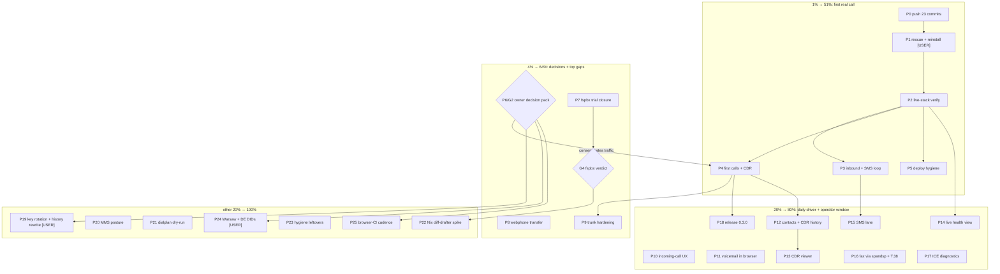

# Pareto Plan: First Real Call → Daily Driver

**When:** 2026-09-16 19:05 CEST
**Sources:** `TODO_LIST.md` (9 verified rows, post-18:15), status reports
`2026-09-16_18-32` (license round §f, 43 items), `2026-09-16_18-00`
(session2 todo-blitz + self-review), `2026-09-16_18-15` (hcloud retired,
scrub gate armed), `2026-09-16_16-43` (fspbx arc), this session's UI/UX
needs analysis and SMS/MMS/fax/history scorecard, `docs/providers/*`,
ROADMAP.md.
**Supersedes:** `2026-09-15_10-18_live-pbx-deployment-pareto-plan.md`
(annotated below; its M6/M7/M12/M13 + parts of M9/M17 are DONE per
session2's 18:00/18:15 reports — the rest is carried into this plan).
**Living state:** point-in-time snapshot; executed work lands in
`TODO_LIST.md` (delete-the-row) and `CHANGELOG.md`; refresh by annotating.
**Secrecy rule:** no real domains, DIDs, IPs, usernames, or key material
here — real values live in the private flake and `~/.pbx-prod-secrets/`.

---

## 1. Pareto Breakdown

### The 1% that delivers 51% — the first real call on the deployed PBX (P0–P5)

Everything repo-side is built, VM-proven, and metal-boot-proven; a US DID
is active on Telnyx with Call Control + outbound profile + a unit-tested
webhook receiver in the private flake. Until a real call completes, the
whole stack — including this week's UI/UX and channel work — is a very
well-tested hypothesis. P0 protects the work (23 unpushed commits, the
daemon's push loop is dead); P1–P5 execute the existing runbook and close
the 09-14 open loops (SMS reply, "did it ring", deploy hygiene).

### The 4% that delivers 64% — close every open decision loop + the two biggest UX gaps (P6–P9)

Seven TODO rows are blocked on owner decisions (recording consent URGENT —
it gates real traffic), the fspbx trial needs an evidence-based verdict
(not vibes), webphone transfer is the single biggest daily-driver gap, and
the trunk must be pinned to Telnyx CIDRs once traffic flows. All four are
small; together they convert "a deployed PBX" into "a PBX I can operate
and live in".

### The 20% that delivers 80% — daily-driver phone + honest operator window (P10–P18)

The phone finishers (notifications, in-browser voicemail, contacts +
CDR-backed history, ICE diagnostics) and the operator minimum (CDR
rendering, live health view, SMS lane decision, fax via mod_spandsp +
verified Telnyx T.38), ending with release 0.3.0 as the public anchor of
the deployment era. Principle inherited from the UI/UX analysis: the
operator surface is a **window, never an editor** — nothing mutates
runtime state; config stays Nix.

### The other 20% (to reach 100%) — security debt, deep features, hygiene (P19–P25)

Telnyx key rotation + history-rewrite decision (owner), MMS posture
(API-only, likely Won't-implement-now), dialplan dry-run simulator, Nix
diff-drafter concept spike, hygiene leftovers (AGENTS headroom, BuildFlow
ergonomics, test-depth pack, docs archive), Warsaw/DE DID purchases
(owner, KYC windows), browser-CI cadence. Explicitly NOT tasks: ROADMAP
themes 1–6 raw ideas (DISA, IPv6 SIP, QoS/DSCP, Kamailio, SIP.js bump,
mod_verto, watchdog, transcription, keepalive, egress routing,
agent-calling MVP, llms.txt, …) stay raw until refined.

**Totals: 26 medium tasks (30–100 min) + 4 owner gates (G1–G4) + ~120
micro tasks (≤12 min).**

## 2. Comprehensive Plan — medium tasks (30–100 min, ALL TODOs)

Sorted by tier, then impact / effort / customer-value. `Dep` =
dependencies. `G*` = owner gate.

| ID  | Tier | Task | Impact | Effort | Dep | Unblocks / verifies |
| --- | ---- | ---- | ------ | ------ | --- | ------------------- |
| P0  | 1%   | Repo integrity: restart/diagnose the dead daemon push loop, push the 23 unpushed local commits, verify origin/main == main and CI green | Critical | 30min | — | All work is actually public; deploy-from-git possible |
| P1  | 1%   | Deployment execution pack (user-gated): rescue-enable + power-cycle, rerun the fixed `install-pbx.sh` from evo-x2, `push-secrets.sh`, BatchMode, log to file | Critical | 100min | P0, G1 | Server runs the fixed closure; secrets spliced |
| P2  | 1%   | Live-stack verification: units, webhook `/telnyx/webhooks/health` 200, ACME issuer, gateway REGED, deploy.md §5 walk | Critical | 45min | P1 | The stack is actually up, not just installed |
| P3  | 1%   | Inbound wiring + SMS loop: PATCH messaging-profile webhook URL, send+receive one SMS via token-gated `/recent`, close the "did it ring" loop from webhook events | Critical | 45min | P2 | The 09-14 open loops finally close |
| P4  | 1%   | First real calls + CDR: webphone registers on the real host, outbound E.164 with US DID caller-ID, inbound → ring group, Master.csv rows | Critical | 60min | P2, G2 (consent) | The product works; release gate for 0.3.0 |
| P5  | 1%   | Deploy hygiene: static IPv6 + AAAA re-add, delete the old billing server, `git worktree prune`, deploy.md drift commit | High | 50min | P2 | One server, one truth; v6 reachable |
| P6  | 4%   | Owner decision pack v2 (one batched ask, then execute): recording consent (URGENT), Warsaw/DE DIDs, Telnyx key rotation, browser-CI cadence, fspbx g1–g3, MMS posture, history-rewrite option B | High | 30min | G2 | Seven+ blocked rows become work or Won't-implement |
| P7  | 4%   | fspbx trial closure: snapshot disk, wire SIP hostfwd, softphone call + echo + CDR-in-GUI, click fax/SMS apps, verdict memo (kill-or-keep with evidence), destroy or persist VM per verdict | High | 100min | — | g1–g3 answered with evidence, not impressions |
| P8  | 4%   | Webphone call transfer: blind (REFER) + attended (hold→bridge→replace) with UI, tests, FEATURES row | High | 100min | — | The #1 daily-driver gap; desk-phone parity |
| P9  | 4%   | Trunk hardening: Telnyx source CIDRs into `allowedCidrs` + `restrictExternalTo`, fail2ban on prod, negative probe from non-listed source | High | 40min | P4 | Port 5080 speaks only to the provider |
| P10 | 20%  | Webphone incoming-call UX: browser Notification permission flow, ringtone + tab-title flash, reconnect/re-register polish with call-state recovery | High | 60min | — | Calls stop being missable |
| P11 | 20%  | Voicemail in-browser: list + play + delete messages, MWI badge (backend via ESL/voicemail API or shared-dir service; auth posture) | High | 100min | — | Voicemail stops requiring a phone call |
| P12 | 20%  | Contacts + CDR-backed history: history endpoint reading Master.csv (or mod_cdr_sql switch decision), contacts store, click-to-dial/redial | High | 100min | P4 | History survives reloads; dialing gets fast |
| P13 | 20%  | Operator CDR/history viewer: render Master.csv (or SQL CDR) with date/number filter, recordings link-out, htpasswd reuse | Medium | 100min | P4 | "What calls happened" stops meaning ssh+grep |
| P14 | 20%  | Operator live health: ESL status endpoint (channels/registrations/gateway REG), unit + cert/ACME status, dashboard cards, loopback/auth posture | Medium | 100min | P2 | The ops-runbook's fs_cli recipes, clickable |
| P15 | 20%  | SMS lane decision + implementation: Telnyx-API-only vs `mod_sms` chatplan (decision memo first, owner input), in-phone SMS UI if chosen, webhook SMS → history integration | Medium | 60min | P3 | SMS stops being a curl exercise |
| P16 | 20%  | Fax enablement: `fax.enable` options (DID routing → `rxfax` via mod_spandsp), `t38gateway` trunk posture, G.711 fallback VM test, live test against Telnyx T.38 (verified-capable) | Medium | 100min | P4 | The only verified-real fax path we have |
| P17 | 20%  | Webphone ICE/turn diagnostics panel: candidate list, turn allocation, codec, RTT/packet stats, plain-language "why is my call silent" hints | Medium | 60min | — | NAT/ICE (the #1 failure mode) becomes self-service |
| P18 | 20%  | Release 0.3.0 after first real call: cut `[Unreleased]`, date, tag, `gh release create`, repo metadata refresh | Medium | 40min | P4, G3 | Public anchor for the deployment era |
| P19 | rest | Security debt (owner): rotate the Telnyx API key (transited chat), then history-rewrite option B (3 pushed commits) or documented acceptance | High | 30min | G2 | Credential + personal-data debt stops compounding |
| P20 | rest | MMS posture: decision doc — HTTP-API-only (Telnyx/Twilio) when a concrete need appears; Won't-implement now, note in ROADMAP | Low | 30min | — | The question stops re-opening |
| P21 | rest | Dialplan dry-run simulator: offline condition-matcher ("what happens if I call X at time T"), CLI/endpoint + UI integration, tests | Medium | 100min | — | Time-routing/anti-action traps become visible pre-deploy |
| P22 | rest | Nix diff-drafter concept spike: form → generated `telephony.*` snippet (extensions/groups/IVR), copy/PR flow; verdict build-or-drop | Low | 100min | P7 (verdict) | GUI convenience without a second config brain |
| P23 | rest | Hygiene leftovers: AGENTS.md headroom migration, BuildFlow ergonomics probes (`BUILDFLOW_MAX_TIME` env), test-depth pack (`assert_fs_hour`, time-routing dedupe, conference pin leg), docs archive continuation, browser E2E re-run (09-15 M8) | Low | 100min | — | Continuity debt stops accruing |
| P24 | rest | Warsaw + DE DIDs (owner, external): re-purchase in the 48h KYC window, DE national order, dialplan/dest entries + tests | High | 50min | G2 | International coverage grows |
| P25 | rest | Browser-E2E CI cadence promotion: owner picks periodic/per-push; edit workflow, verify one run | Low | 15min | G2 | The 1–2 GB suite earns its keep automatically |

Owner gates: **G1** rescue-boot/reinstall hands-on steps · **G2** decision
pack (consent, DIDs, key, cadence, MMS, history rewrite, fspbx verdict) ·
**G3** release timing · **G4** fspbx kill-or-keep ( fed by P7, part of G2).

## 3. Fine Breakdown — micro tasks ≤12 min each (ALL TODOs)

Sorted within each parent by execution order; parents stay tier-sorted as
above.

### P0 — Repo integrity (30min)

| ID   | Task | Effort |
| ---- | ---- | ------ |
| P0.1 | Diagnose the daemon's push loop (systemd user units / logs; session2 18:00 §d.4) | 12min |
| P0.2 | Push local main (23 commits) or restart the loop; verify `origin/main == main` | 6min |
| P0.3 | Confirm CI green on the pushed HEAD (gh run watch) | 12min |

### P1 — Deployment execution pack (100min, user-gated)

| ID   | Task | Effort |
| ---- | ---- | ------ |
| P1.1 | Write the one-page runbook snippet: rescue-enable, power-cycle, exact `install-pbx.sh` invocation (BatchMode, log-to-file) | 12min |
| P1.2 | Verify `install-pbx.sh` on evo-x2 points at the fixed closure (initrd contains virtio: `zstdcat \| cpio -t \| grep virtio`) | 12min |
| P1.3 | USER: enable rescue system + power-cycle | 5min |
| P1.4 | USER: run `install-pbx.sh` (fails fast, foreground, logged) | 20min |
| P1.5 | USER: run `push-secrets.sh`; I verify perms + splice (`@TELEPHONY_` absent from runtime XML) | 12min |
| P1.6 | Post-install smoke: five units active, first-boot journal sane | 12min |

### P2 — Live-stack verification (45min)

| ID   | Task | Effort |
| ---- | ---- | ------ |
| P2.1 | Webhook health: `GET /telnyx/webhooks/health` → 200 (force IPv4 past DNS cache) | 12min |
| P2.2 | ACME: real issuer (not minica placeholder), vhost serving, port 80 only in acme mode | 12min |
| P2.3 | USER: `fs_cli` → `sofia status gateway` REGED (loopback socket) | 10min |
| P2.4 | Walk deploy.md §5; fix doc drift in the same commit | 12min |

### P3 — Inbound wiring + SMS loop (45min)

| ID   | Task | Effort |
| ---- | ---- | ------ |
| P3.1 | PATCH messaging-profile `webhook_url` → live endpoint; confirm 200 | 10min |
| P3.2 | USER: text the US DID; read the reply via token-gated `/recent` | 12min |
| P3.3 | Redial test target; answer "did it ring" from webhook call events | 12min |
| P3.4 | Record Telnyx webhook behaviors (retries, event shapes) in docs/providers/telnyx.md | 12min |

### P4 — First real calls + CDR (60min)

| ID   | Task | Effort |
| ---- | ---- | ------ |
| P4.1 | USER: webphone login on the real host; register 1000 over wss | 10min |
| P4.2 | Outbound E.164: audio + caller-ID shows the US DID | 12min |
| P4.3 | Inbound: call the DID from the mobile; ring group answers | 10min |
| P4.4 | Master.csv: one row per leg; sanity-check rates vs credit | 12min |
| P4.5 | Post-first-call status report skeleton + CHANGELOG `[Unreleased]` | 12min |

### P5 — Deploy hygiene (50min)

| ID   | Task | Effort |
| ---- | ---- | ------ |
| P5.1 | USER: read the new IPv6 /64; I pin static v6 + gateway in the private flake | 12min |
| P5.2 | Re-add AAAA via the domains repo (scoped apply, plan reviewed); verify v6 | 12min |
| P5.3 | USER: delete the old billing server | 5min |
| P5.4 | `git worktree prune` + stale `result*` symlink cleanup | 2min |
| P5.5 | Commit deploy.md drift fixes | 12min |

### P6 — Owner decision pack v2 (30min)

| ID   | Task | Effort |
| ---- | ---- | ------ |
| P6.1 | Assemble the decisions with a recommendation each (consent, DIDs, key, cadence, fspbx g1–g3, MMS, history rewrite) | 12min |
| P6.2 | Ask via the question tool; capture answers verbatim | 10min |
| P6.3 | Execute answers: TODO row updates; Won't-implement gets reasons, never silence | 8min |

### P7 — fspbx trial closure (100min)

| ID   | Task | Effort |
| ---- | ---- | ------ |
| P7.1 | `qemu-img snapshot` the known-good disk (should have been done first — debt) | 5min |
| P7.2 | Add hostfwd tcp/udp 15060→5060 + narrow RTP range; restart VM (no cloud-init bump needed) | 12min |
| P7.3 | Create extensions 1001/1002 via GUI (or solved XSRF API flow) | 12min |
| P7.4 | Register host softphone; call 1001→1002; verify two-way audio | 12min |
| P7.5 | Echo 9196 call; verify CDR row renders in the GUI | 12min |
| P7.6 | Click through `app/fax`, `app/fax_queue`, `app/sms`: present? functional? honest notes | 12min |
| P7.7 | Verdict memo: kill-or-keep recommendation with evidence (GUI quality vs DB-truth inversion) + status report | 12min |
| P7.8 | Execute verdict: destroy VM + annotate docs (kill) OR relocate state + persist plan (keep) | 12min |

### P8 — Webphone call transfer (100min)

| ID   | Task | Effort |
| ---- | ---- | ------ |
| P8.1 | Research sip.js transfer mechanics (REFER / Replaces) against our pinned 0.21.2 | 12min |
| P8.2 | UI: transfer button + destination picker on the active-call card | 12min |
| P8.3 | Implement blind transfer (REFER) | 12min |
| P8.4 | Implement attended transfer (hold → dial → bridge → replace) | 12min |
| P8.5 | CSP/config.js checks (no new external fetches) | 6min |
| P8.6 | Test: transfer leg asserted in VM suite or browser E2E | 12min |
| P8.7 | `nix fmt` + CHANGELOG + FEATURES row | 6min |

### P9 — Trunk hardening (40min)

| ID   | Task | Effort |
| ---- | ---- | ------ |
| P9.1 | Collect Telnyx signaling/media source nets (docs/providers/telnyx.md = truth) | 10min |
| P9.2 | Set `allowedCidrs` + `restrictExternalTo` in the private flake; redeploy | 12min |
| P9.3 | Enable fail2ban on prod; jail sees the file-backed log path | 10min |
| P9.4 | Negative probe: INVITE from non-listed source on 5080 → rejected pre-dialplan | 8min |

### P10 — Incoming-call UX (60min)

| ID   | Task | Effort |
| ---- | ---- | ------ |
| P10.1 | Notification permission flow + incoming-call notification | 12min |
| P10.2 | Ringtone + tab-title flash while ringing | 12min |
| P10.3 | Reconnect polish: re-register + call-state recovery display | 12min |
| P10.4 | Browser-E2E assert for the notification/ring path | 12min |
| P10.5 | `nix fmt` + CHANGELOG + FEATURES row | 6min |

### P11 — Voicemail in-browser (100min)

| ID   | Task | Effort |
| ---- | ---- | ------ |
| P11.1 | Backend decision: ESL/voicemail API vs shared-dir reader (auth, scope) | 12min |
| P11.2 | Minimal endpoint: list mailboxes/messages (authed) | 12min |
| P11.3 | Audio streaming: WAV playback with sane auth | 12min |
| P11.4 | UI: message list + play + delete | 12min |
| P11.5 | MWI badge on the webphone header | 12min |
| P11.6 | Tests (VM: deposit → list → play loop) + security posture note | 12min |
| P11.7 | `nix fmt` + CHANGELOG + FEATURES row | 6min |

### P12 — Contacts + CDR-backed history (100min)

| ID   | Task | Effort |
| ---- | ---- | ------ |
| P12.1 | CDR source decision: parse Master.csv vs switch mod_cdr_sql (write the tradeoff down) | 12min |
| P12.2 | History endpoint (authed), pagination or window | 12min |
| P12.3 | Contacts store decision (config.js today; JSON file later?) | 12min |
| P12.4 | UI: contacts + click-to-dial + redial from history | 12min |
| P12.5 | Tests + `nix fmt` + CHANGELOG + FEATURES row | 12min |

### P13 — Operator CDR viewer (100min)

| ID   | Task | Effort |
| ---- | ---- | ------ |
| P13.1 | Render-path decision: separate operator page vs webphone section | 12min |
| P13.2 | CDR parse/format util + unit tests | 12min |
| P13.3 | Table UI with date/number filter | 12min |
| P13.4 | Recordings link-out (existing htpasswd dir) | 12min |
| P13.5 | Auth reuse (htpasswd file) + fail2ban note | 12min |
| P13.6 | Tests + `nix fmt` + CHANGELOG + FEATURES row | 6min |

### P14 — Operator live health (100min)

| ID   | Task | Effort |
| ---- | ---- | ------ |
| P14.1 | ESL status endpoint: channels, registrations, gateway REG state | 12min |
| P14.2 | Unit + cert/ACME + CDR-service status endpoint | 12min |
| P14.3 | Dashboard cards UI | 12min |
| P14.4 | Auto-refresh + honest failure states ("ESL unreachable") | 12min |
| P14.5 | Security: loopback-only bind or auth; document exposure choice | 12min |
| P14.6 | Tests (VM asserts endpoint output) + `nix fmt` + CHANGELOG + FEATURES | 12min |

### P15 — SMS lane (60min)

| ID   | Task | Effort |
| ---- | ---- | ------ |
| P15.1 | Decision memo: Telnyx-API-only vs `mod_sms` chatplan (with owner input) | 12min |
| P15.2 | Spike: `mod_sms` chatplan in the VM (if chosen) | 12min |
| P15.3 | In-phone SMS UI: thread list + send (if chosen) | 12min |
| P15.4 | Integrate webhook-received SMS into history (P12 endpoint) | 12min |
| P15.5 | `nix fmt` + CHANGELOG + FEATURES row | 6min |

### P16 — Fax (100min)

| ID   | Task | Effort |
| ---- | ---- | ------ |
| P16.1 | Options design: `fax.enable`, DID→fax destination, spandsp module check | 12min |
| P16.2 | Inbound: `rxfax` dialplan extension + TIFF storage dir (recordings pattern) | 12min |
| P16.3 | Trunk: `t38gateway` posture vs G.711 passthrough decision | 12min |
| P16.4 | Outbound scope decision (email-to-fax etc. — likely not now) | 12min |
| P16.5 | VM test: G.711 fax leg (T.38 not simulatable in QEMU honestly) | 12min |
| P16.6 | Live test vs Telnyx T.38 (verified `t38_fax_gateway_enabled`) post-deploy | 12min |
| P16.7 | `nix fmt` + CHANGELOG + FEATURES row | 6min |

### P17 — ICE/turn diagnostics (60min)

| ID   | Task | Effort |
| ---- | ---- | ------ |
| P17.1 | Expose ICE candidate list + turn allocation state in a panel | 12min |
| P17.2 | Connection quality: RTT, packet loss, codec display | 12min |
| P17.3 | Plain-language hints mapped to failure states ("no srflx → turn blocked?") | 12min |
| P17.4 | Tests (panel presence) + `nix fmt` + CHANGELOG + FEATURES | 12min |

### P18 — Release 0.3.0 (40min)

| ID   | Task | Effort |
| ---- | ---- | ------ |
| P18.1 | Cut CHANGELOG `[Unreleased]` → 0.3.0 with date | 12min |
| P18.2 | Tag `v0.3.0` + `gh release create` | 12min |
| P18.3 | Repo metadata refresh; verify tag on pkg/release pages if applicable | 12min |

### P19 — Security debt, owner (30min)

| ID   | Task | Effort |
| ---- | ---- | ------ |
| P19.1 | USER: rotate the Telnyx API key; update CC/outbound scripts + secrets | 12min |
| P19.2 | History-rewrite decision: execute option B (AGENTS.md protocol) or document acceptance | 12min |

### P20 — MMS posture (30min)

| ID   | Task | Effort |
| ---- | ---- | ------ |
| P20.1 | Decision doc: HTTP-API-only (Telnyx/Twilio) when a concrete need appears | 12min |
| P20.2 | ROADMAP note + TODO row closed as Won't-implement-for-now with reason | 6min |

### P21 — Dialplan dry-run (100min)

| ID   | Task | Effort |
| ---- | ---- | ------ |
| P21.1 | Design: offline condition matcher over the generated dialplan (time, CID, dest) | 12min |
| P21.2 | Prototype as CLI against the generated XML | 12min |
| P21.3 | Time-window evaluation correctness test (mirror time-routing suite) | 12min |
| P21.4 | UI integration (operator page button: "simulate this number") | 12min |
| P21.5 | Tests + `nix fmt` + CHANGELOG + FEATURES row | 12min |

### P22 — Nix diff-drafter spike (100min)

| ID   | Task | Effort |
| ---- | ---- | ------ |
| P22.1 | Concept spike: form → generated `telephony.extensions."1002"` snippet | 12min |
| P22.2 | Template inventory: extension, ring group, IVR | 12min |
| P22.3 | Copy-to-clipboard / patch-file flow (no direct mutation ever) | 12min |
| P22.4 | Verdict memo: build-or-drop (depends on P7's fspbx outcome) | 12min |

### P23 — Hygiene leftovers (100min)

| ID   | Task | Effort |
| ---- | ---- | ------ |
| P23.1 | AGENTS.md headroom: migrate long-form entries to docs/session-craft.md + pointers | 12min |
| P23.2 | BuildFlow ergonomics probe: `BUILDFLOW_MAX_TIME` env, `--failed-only`, `watch` once each | 12min |
| P23.3 | Test-depth pack: `assert_fs_hour` helper, time-routing `call()` dedupe, conference pin leg | 12min |
| P23.4 | Docs archive continuation: verdict-sweep the remaining old reports | 12min |
| P23.5 | Browser E2E re-run on current tree (09-15 M8) + failure-dump artifact decision | 12min |

### P24 — Warsaw + DE DIDs (50min, owner/external)

| ID   | Task | Effort |
| ---- | ---- | ------ |
| P24.1 | USER: re-purchase Warsaw DID + submit the 5 KYC requirements inside the 48h window | 20min |
| P24.2 | USER: order the DE national DID (KYC per docs/providers) | 12min |
| P24.3 | Dialplan/`didDestination` entries + eval tests for both DIDs | 12min |

### P25 — Browser-CI cadence (15min)

| ID   | Task | Effort |
| ---- | ---- | ------ |
| P25.1 | Owner picks periodic/per-push; edit workflow; one verified run | 12min |

## 4. Execution Graph

## 5. Verification / sorting criteria

- **Impact**: unblocks other work > owner-visible capability > hygiene.
- **Effort**: from the 09-15 plan's calibrated estimates (same tasks) and
  today's trial experience (VM cycle ≈ 2–3 min, install 10–30 min).
- **Customer-value**: the only customer is the owner — "can I make, take,
  and trust calls yet" outranks everything; "can I see what happened"
  (CDR/health) next; channels (SMS/fax) after; drafters/simulators last.

## 6. Execution log (append-only)

- 2026-09-16 19:05 — plan created; supersedes 2026-09-15 plan (M6, M7,
  M12, M13, hcloud-retire, Dependabot done by session2; M1–M5 carried as
  P1–P5, M8 carried as P23.5, M10 → P9, M11 → P6, M16 → P18, M19 → P23.3).
- 2026-09-16 19:08 — P0 resolved before execution: `origin/main == main`
  at commit time (the daemon's push loop recovered; the 23 commits from
  the 18:00 report are pushed). P0.3 (CI green on HEAD) still worth one
  glance.
- 2026-09-16 19:20 — G2 answered (P6 executed): (1) consent = ALL calls
  recorded by default, risk accepted → P4 ungated; (2) fspbx = close it
  properly (P7 lane); (3) P1 deploy = NOT now, deferred behind P19.2 + P7;
  (4) P19 = history rewrite option B approved NOW, key rotation stays
  blocked; (5) P24 DIDs = deferred until first calls green. Execution
  order this session: P19.2 → P7.
- 2026-09-16 19:35 — **P19.2 DONE**: git-filter-repo replaced all 23
  pattern spellings (blobs + 1 commit message) across the 3 offending
  09-03 commits; `scrub-check.sh --history` OK; force-push with lease
  (`7c89cca...f250ef7`); origin/main re-verified 0 pickaxe hits; tags
  v0.1.0/v0.2.0 predate the leak and kept their hashes. NOTE: the scan
  also flagged daemon commit 51dc0fe — it was the CLEANUP commit
  (pickaxe counts removals too), not a reintroduction. Residual
  exposure (GitHub PR-ref caches, old clones) recorded in CHANGELOG.
