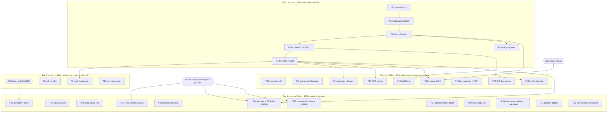

# Pareto Plan Round 2: First Real Call → Daily Driver (continuation)

**When:** 2026-09-17 08:05 CEST
**Sources:** `TODO_LIST.md` (27 verified rows, rebuilt by the 2026-09-17
docs-health round), status report `2026-09-17_07-21` (§f 1–36), the
superseded `2026-09-16_19-05` plan (P0–P25; its execution log), ROADMAP.
**Supersedes:** `docs/planning/2026-09-16_19-05_first-call-to-daily-driver-pareto-plan.md`
(annotated + archived). **P-IDs are kept stable** for carried lanes so
TODO_LIST/report citations stay valid; new work is P26+. Completed lanes
are listed in §6, not re-planned.
**Living state:** point-in-time snapshot; executed work lands in
`TODO_LIST.md` (delete-the-row) and `CHANGELOG.md`; refresh by annotating.
**Secrecy rule:** no real domains, DIDs, IPs, usernames, or key material
here — real values live in the private flake and `~/.pbx-prod-secrets/`.

---

## 1. Pareto Breakdown

### The 1% that delivers 51% — ship the backlog, then the first real call (P0–P5)

The docs-health round left 12 verified-green commits stranded on local
main (the daemon's push loop stalled a third time) — nothing public
exists until they land. Then everything repo-side is built, VM-proven and
metal-boot-proven; a US DID is active on Telnyx with Call Control + an
outbound profile + a unit-tested webhook receiver in the private flake.
Until a real call completes, the whole stack — including this week's
security and docs work — is a very well-tested hypothesis. P1–P5 execute
the existing runbook and close the 09-14 open loops (SMS reply, "did it
ring", deploy hygiene). Owner consent posture is already decided
(record-all, 2026-09-16).

### The 4% that delivers 64% — close the decision loop + pin the posture + top UX gap (G2, P8, P9, P26)

The fspbx verdict is the one decision still gating real work (P22
framing + three evidence loose ends hang on it). Webphone transfer is
the single biggest daily-driver gap. Trunk hardening converts "port 5080
open to the world" into "speaks only to Telnyx" once traffic flows. The
ssh-posture eval pin stops the next session from silently re-breaking
the documented `nixos-rebuild --target-host` path.

### The 20% that delivers 80% — daily-driver phone + honest operator window (P10–P18)

The phone finishers (notifications, in-browser voicemail, contacts +
CDR-backed history, ICE diagnostics) and the operator minimum (CDR
rendering, live health view, SMS lane, fax via mod_spandsp + verified
Telnyx T.38), ending with release 0.3.0 as the public anchor of the
deployment era. Principle carried from the UI/UX analysis: the operator
surface is a **window, never an editor** — config stays Nix.

### The other 20% (to reach 100%) — security debt, depth, hygiene (P19.1, P20–P25, P27–P29, P31, P32 + owner gates)

Telnyx key rotation (owner), MMS posture doc, dry-run simulator,
diff-drafter spike (post-verdict), the extended test-depth pack,
backup-restore proof, scrub-gate UX, daemon-push observability,
round-2/3 hygiene probes, and the docs-health tooling contribution.
Explicitly NOT tasks: ROADMAP themes 1–6 raw ideas (DISA, IPv6 SIP,
QoS/DSCP, Kamailio, SIP.js bump, mod_verto, transcription, keepalive,
egress routing, agent-calling MVP, llms.txt, …) stay raw until refined.

**Totals: 25 medium tasks (15–100 min) + 4 owner gates + ~130 micro
tasks (≤12 min).**

## 2. Comprehensive Plan — medium tasks (15–100 min, ALL TODOs)

Sorted by tier, then impact / effort / customer-value. `Dep` =
dependencies. `G*` = owner gate. `USER` = owner hands-on steps inside.

| ID    | Tier | Task                                                                                                                                                                                                                                                                                                                                                | Impact   | Effort | Dep    | Unblocks / verifies                                       |
| ----- | ---- | --------------------------------------------------------------------------------------------------------------------------------------------------------------------------------------------------------------------------------------------------------------------------------------------------------------------------------------------------- | -------- | ------ | ------ | --------------------------------------------------------- |
| P0    | 1%   | Repo delivery: push the 12-commit local backlog (docs-health round 3 + this plan), confirm origin CI green — executed at plan-write time (see §6) → done — 08:25 push (§6 log)                                                                                                                                                                      | Critical | 15min  | —      | Everything is public; deploy-from-git possible            |
| P1    | 1%   | Deployment execution pack (USER-gated): rescue-enable + power-cycle, rerun the fixed `install-pbx.sh` from evo-x2, `push-secrets.sh`, BatchMode, log to file → open — deploy lane (TODO_LIST High row; owner hands-on)                                                                                                                              | Critical | 100min | P0, G1 | Server runs the fixed closure; secrets spliced            |
| P2    | 1%   | Live-stack verification: units, webhook health endpoint 200, ACME issuer, gateway REGED, deploy.md §5 walk → open — deploy lane                                                                                                                                                                                                                     | Critical | 45min  | P1     | The stack is actually up, not just installed              |
| P3    | 1%   | Inbound wiring + SMS loop: PATCH messaging-profile webhook URL, send+receive one SMS via token-gated `/recent`, close the "did it ring" loop from webhook events → open — deploy lane                                                                                                                                                               | Critical | 45min  | P2     | The 09-14 open loops finally close                        |
| P4    | 1%   | First real calls + CDR: webphone registers on the real host, outbound E.164 with US-DID caller-ID, inbound → ring group, Master.csv rows → open — deploy lane                                                                                                                                                                                       | Critical | 60min  | P2, G3 | The product works; release gate for 0.3.0                 |
| P5    | 1%   | Deploy hygiene: static IPv6 + AAAA re-add, delete the old (billing) server, deploy.md drift commit → open — deploy lane                                                                                                                                                                                                                             | High     | 50min  | P2     | One server, one truth; v6 reachable                       |
| G2    | 4%   | fspbx verdict sign-off (owner): kill = revoke the live Sanctum PAT + stop VM + trash `/var/tmp/fspbx-trial`; keep = relocate + snapshot. Gates P22 + 3 loose ends → open — TODO_LIST blocked row (fspbx verdict)                                                                                                                                    | High     | 15min  | —      | P22 framing; trial lane closes                            |
| P8    | 4%   | Webphone call transfer: blind (REFER) + attended (hold→bridge→replace), UI, tests, FEATURES row → done — 2026-09-17 (shipped; browser E2E transfer leg green)                                                                                                                                                                                       | High     | 100min | —      | The #1 daily-driver gap; desk-phone parity                |
| P9    | 4%   | Trunk hardening: Telnyx source CIDRs into `allowedCidrs` + `restrictExternalTo`, fail2ban on prod, negative probe from a non-listed source → open — deploy lane (P9, after first calls)                                                                                                                                                             | High     | 40min  | P4     | Port 5080 speaks only to the provider                     |
| P26   | 4%   | Pin the pbx-prod SSH posture: eval (or prod-boot) assertion for keys-only root + `allowUsers` + kbd-interactive off — nothing fails today if someone reverts `flake.nix` → done — 2026-09-17 (sshd pinning asserts + `prodshaped` node, tests/ssh.nix)                                                                                              | Medium   | 30min  | —      | The documented `--target-host` path cannot silently break |
| P10   | 20%  | Webphone incoming-call UX: browser Notification flow, ringtone + tab-title flash, reconnect/re-register polish with call-state recovery → done — 2026-09-17 (notifications, ringtone, title flash; FEATURES row)                                                                                                                                    | High     | 60min  | —      | Calls stop being missable                                 |
| P11   | 20%  | Voicemail in-browser: list + play + delete, MWI badge (backend via ESL or shared-dir service; auth posture) → done — 2026-09-17 (phone API + voicemail panel)                                                                                                                                                                                       | High     | 100min | —      | Voicemail stops requiring a phone call                    |
| P12   | 20%  | Contacts + CDR-backed history: history endpoint reading Master.csv, contacts store, click-to-dial/redial → done — 2026-09-17 (contacts + CDR-backed history)                                                                                                                                                                                        | High     | 100min | P4     | History survives reloads; dialing gets fast               |
| P13   | 20%  | Operator CDR viewer: render Master.csv with date/number filter, recordings link-out, htpasswd reuse → done — 2026-09-17 (CDR viewer)                                                                                                                                                                                                                | Medium   | 100min | P4     | "What calls happened" stops meaning ssh+grep              |
| P14   | 20%  | Operator live health: ESL status endpoint (channels/registrations/gateway REG), unit + cert/ACME cards, loopback/auth posture → done — 2026-09-17 (health cards)                                                                                                                                                                                    | Medium   | 100min | P2     | The ops-runbook's fs_cli recipes, clickable               |
| P15   | 20%  | SMS lane decision + implementation: Telnyx-API-only vs `mod_sms` chatplan (memo first, owner input), in-phone SMS UI if chosen, webhook SMS → history → done — 2026-09-17 (Telnyx-API-only decision; `smsMessageStore` + SMS tab)                                                                                                                   | Medium   | 60min  | P3     | SMS stops being a curl exercise                           |
| P16   | 20%  | Fax enablement: `fax.enable` options (DID → `rxfax` via mod_spandsp), `t38gateway` posture, G.711 fallback VM test, live test against Telnyx T.38 (verified-capable) → done — 2026-09-17 (fax suite green); the live trunk test rides the deploy lane                                                                                               | Medium   | 100min | P4     | The only verified-real fax path we have                   |
| P17   | 20%  | Webphone ICE/turn diagnostics panel: candidates, turn allocation, codec, RTT/packet stats, plain-language "why is my call silent" hints → done — 2026-09-17 (ICE panel)                                                                                                                                                                             | Medium   | 60min  | —      | NAT/ICE (the #1 failure mode) becomes self-service        |
| P18   | 20%  | Release 0.3.0 after the first real call: cut `[Unreleased]`, date, tag, `gh release create`, repo metadata refresh → open — TODO_LIST blocked row (v0.3.0)                                                                                                                                                                                          | Medium   | 40min  | P4, G4 | Public anchor for the deployment era                      |
| P19.1 | rest | Security debt (owner): rotate the Telnyx API key (transited chat + /tmp), update the `KEY…` scrub pattern in the same action → open — TODO_LIST blocked row (key rotation)                                                                                                                                                                          | High     | 30min  | G3     | Credential debt stops compounding                         |
| P20   | rest | MMS posture: decision doc — HTTP-API-only when a concrete need appears; Won't-implement now, note in ROADMAP → done — `docs/decisions/2026-09-17_mms-posture-http-api-only.md`                                                                                                                                                                      | Low      | 30min  | —      | The question stops re-opening                             |
| P21   | rest | Dialplan dry-run simulator: offline condition-matcher ("what happens if I call X at time T"), CLI/endpoint + UI integration, tests → done — 2026-09-17 (`dialplan_sim.py` + simulator UI + suite coverage)                                                                                                                                          | Medium   | 100min | —      | Time-routing/anti-action traps become visible pre-deploy  |
| P22   | rest | Nix diff-drafter concept spike: form → generated `telephony.*` snippet, copy/PR flow; verdict build-or-drop (framing waits on G2) → done — don't-build-now (`docs/decisions/2026-09-17_nix-diff-drafter-verdict.md`)                                                                                                                                | Low      | 60min  | G2     | GUI convenience without a second config brain             |
| P23.3 | rest | Test-depth micro pack: `assert_fs_hour`, time-routing `call()` dedupe, conference wrong-pin leg, recordings-not-served negative, sshd pinning asserts, prod-shaped ssh node, deprecated-gateway file-secret leg, `wait_for_freeswitch` port param, demo-VM host-side ssh smoke → done — a–h by the 14:06 session, i by the 19:40 session (SMOKE-OK) | Low      | 100min | —      | The verified test gaps close                              |
| P24   | rest | Warsaw + DE DIDs (owner, external): re-purchase in the 48h KYC window, DE national order, dialplan/dest entries + tests → open — TODO_LIST blocked row (Warsaw/DE DIDs)                                                                                                                                                                             | High     | 50min  | G3, P4 | International coverage grows                              |
| P25   | rest | Browser-E2E CI cadence (owner): pick periodic/per-push; edit workflow, verify one run → open — TODO_LIST blocked row (browser E2E CI)                                                                                                                                                                                                               | Low      | 15min  | G3     | The 1–2 GB suite earns its keep automatically             |
| P27   | rest | Backup-suite upgrade: assert a real `restic restore` round-trip (only backup+ls proven); decide /etc host keys in paths → open — TODO_LIST Low row (backup suite)                                                                                                                                                                                   | Low      | 45min  | —      | Restore stops being an untested assumption                |
| P28   | rest | `scrub-check.sh --history`: label add-vs-remove in HITs (pickaxe counts removals — a cleanup commit looks like a reintroduction) → done — ADDED/REMOVED/edited labels shipped (CHANGELOG)                                                                                                                                                           | Low      | 30min  | —      | The next history scan has no ghost hunts                  |
| P29   | rest | Repo-integrity micro pack: daemon-push observability (alert or standing ahead-count check; 3 stalls in 2 days) + `core.hooksPath` probe (who sets it; does it shadow the daemon's hooks) → done — `scripts/ahead-check.sh` + probe recorded (hooksPath unset)                                                                                       | Low→Med  | 45min  | —      | Silent-push-stall class dies; hooks behavior known        |
| P31   | rest | Round-2/3 hygiene probes: batch `git show --stat` the ~25 hashes cited by docs-health round 2; `buildflow doctor --verbose` vs reality; `buildflow upgrade` + db VACUUM; the "1 skipped" step + webphone app.js formatting-only review; mypy-coverage decision → open — TODO_LIST hygiene row (app.js half overtaken by the extraction)             | Low      | 100min | —      | Documentation evidence hardens; tool drift known          |
| P32   | rest | Contribute the arrow-annotator to the docs-health skill (line-count-preserving writes + per-shape dry-runs baked in) — the shipped tools lack the routed-arrow kind this repo leans on → open — TODO_LIST hygiene row (P32)                                                                                                                         | Low      | 30min  | —      | Future sessions stop hand-rolling annotators              |

Owner gates: **G1** rescue-boot/reinstall hands-on steps · **G2** fspbx
verdict sign-off · **G3** security/exposure pack (key rotation timing,
residual-exposure appetite, scrub-pattern placeholders) · **G4** release
timing (0.3.0 after first call). Consent (the old G2 of the 19:05 plan)
is ANSWERED: record-all, 2026-09-16.

Blocked rows with no plan lane (standing, owner-decided): sops-nix
example host wiring; `flake-meta-checker` mainProgram policy; upstream
BuildFlow feedback (all after verify-before-filing); GitHub
residual-exposure handling; the three scrub-pattern placeholders.

## 3. Fine Breakdown — micro tasks ≤12 min each (ALL TODOs)

Sorted within each parent by execution order; parents stay tier-sorted.
Micro rows inherit their parent row's verdict (the recorded
parent-marker convention): a parent marked done/open above settles the
whole subsection below it.

### P0 — Repo delivery (15min) — DONE at write time (§6)

| ID   | Task                                                       | Effort |
| ---- | ---------------------------------------------------------- | ------ |
| P0.1 | Commit this plan + TODO/plan-archive wiring (detailed msg) | 12min  |
| P0.2 | `git push` the 12-commit backlog (owner-authorized here)   | 3min   |
| P0.3 | `gh run watch` — CI green on the new head                  | 12min  |

### P1 — Deployment execution pack (100min, USER-gated)

| ID   | Task                                                                                                    | Effort |
| ---- | ------------------------------------------------------------------------------------------------------- | ------ |
| P1.1 | Runbook snippet: rescue-enable, power-cycle, exact `install-pbx.sh` invocation (BatchMode, log-to-file) | 12min  |
| P1.2 | Verify `install-pbx.sh` on evo-x2 points at the fixed closure (`zstdcat \| cpio -t \| grep virtio`)     | 12min  |
| P1.3 | USER: enable rescue system + power-cycle                                                                | 5min   |
| P1.4 | USER: run `install-pbx.sh` (fails fast, foreground, logged)                                             | 20min  |
| P1.5 | USER: run `push-secrets.sh`; verify perms + splice (`@TELEPHONY_` absent from runtime XML)              | 12min  |
| P1.6 | Post-install smoke: five units active, first-boot journal sane                                          | 12min  |

### P2 — Live-stack verification (45min)

| ID   | Task                                                                            | Effort |
| ---- | ------------------------------------------------------------------------------- | ------ |
| P2.1 | Webhook health: `GET /telnyx/webhooks/health` → 200 (force IPv4 past DNS cache) | 12min  |
| P2.2 | ACME: real issuer (not placeholder), vhost serving, port 80 only in acme mode   | 12min  |
| P2.3 | USER: `fs_cli` → `sofia status gateway` REGED (loopback socket)                 | 10min  |
| P2.4 | Walk deploy.md §5; fix doc drift in the same commit                             | 12min  |

### P3 — Inbound wiring + SMS loop (45min)

| ID   | Task                                                                                | Effort |
| ---- | ----------------------------------------------------------------------------------- | ------ |
| P3.1 | PATCH messaging-profile `webhook_url` → live endpoint; confirm 200                  | 10min  |
| P3.2 | USER: text the US DID; read the reply via token-gated `/recent`                     | 12min  |
| P3.3 | Redial test target; answer "did it ring" from webhook call events                   | 12min  |
| P3.4 | Record Telnyx webhook behaviors (retries, event shapes) in docs/providers/telnyx.md | 12min  |

### P4 — First real calls + CDR (60min)

| ID   | Task                                                              | Effort |
| ---- | ----------------------------------------------------------------- | ------ |
| P4.1 | USER: webphone login on the real host; register 1000 over wss     | 10min  |
| P4.2 | Outbound E.164: audio + caller-ID shows the US DID                | 12min  |
| P4.3 | Inbound: call the DID from the mobile; ring group answers         | 10min  |
| P4.4 | Master.csv: one row per leg; sanity-check rates vs credit         | 12min  |
| P4.5 | Post-first-call status report skeleton + CHANGELOG `[Unreleased]` | 12min  |

### P5 — Deploy hygiene (50min)

| ID   | Task                                                                      | Effort |
| ---- | ------------------------------------------------------------------------- | ------ |
| P5.1 | USER: read the new IPv6 /64; pin static v6 + gateway in the private flake | 12min  |
| P5.2 | Re-add AAAA via the domains repo (scoped apply, plan reviewed); verify v6 | 12min  |
| P5.3 | USER: delete the old billing server                                       | 5min   |
| P5.4 | `git worktree prune` + stale `result*` cleanup (habit; last done 09-17)   | 2min   |
| P5.5 | Commit deploy.md drift fixes                                              | 12min  |

### G2 — fspbx verdict execution (15min + loose ends)

| ID  | Task                                                                         | Effort |
| --- | ---------------------------------------------------------------------------- | ------ |
| V.1 | USER: sign off kill-or-keep (recommendation: kill; NixOS-first; keep as ref) | 5min   |
| V.2 | If kill: revoke the live Sanctum PAT (it sits in console logs)               | 10min  |
| V.3 | If kill: `pkill -9 -f disk.qcow2` + `trash /var/tmp/fspbx-trial`             | 5min   |
| V.4 | If keep: relocate to persistent storage + post-wiring snapshot               | 12min  |
| V.5 | Close loose ends: CDR-GUI render + who-answers-1002 (verify) or mark moot    | 12min  |

### P8 — Webphone call transfer (100min)

| ID   | Task                                                                       | Effort |
| ---- | -------------------------------------------------------------------------- | ------ |
| P8.1 | Research sip.js transfer mechanics (REFER / Replaces) vs our pinned 0.21.2 | 12min  |
| P8.2 | UI: transfer button + destination picker on the active-call card           | 12min  |
| P8.3 | Implement blind transfer (REFER)                                           | 12min  |
| P8.4 | Implement attended transfer (hold → dial → bridge → replace)               | 12min  |
| P8.5 | CSP/config.js checks (no new external fetches)                             | 6min   |
| P8.6 | Test: transfer leg asserted in VM suite or browser E2E                     | 12min  |
| P8.7 | `nix fmt` + CHANGELOG + FEATURES row                                       | 6min   |

### P9 — Trunk hardening (40min)

| ID   | Task                                                                         | Effort |
| ---- | ---------------------------------------------------------------------------- | ------ |
| P9.1 | Collect Telnyx source nets (docs/providers/telnyx.md is the source of truth) | 10min  |
| P9.2 | Set `allowedCidrs` + `restrictExternalTo` in the private flake; redeploy     | 12min  |
| P9.3 | Enable fail2ban on prod; confirm the jail sees the file-backed log path      | 10min  |
| P9.4 | Negative probe: INVITE from a non-listed source on 5080 → rejected           | 8min   |

### P26 — Pin pbx-prod SSH posture (30min)

| ID    | Task                                                                                 | Effort |
| ----- | ------------------------------------------------------------------------------------ | ------ |
| P26.1 | Eval assertion: keys-only root, `allowUsers`, kbd-interactive off (eval.nix pattern) | 12min  |
| P26.2 | Option: prod-boot variant node asserting the positive root-key path                  | 12min  |
| P26.3 | Gate run + `nix fmt` + CHANGELOG                                                     | 6min   |

### P10 — Incoming-call UX (60min)

| ID    | Task                                                          | Effort |
| ----- | ------------------------------------------------------------- | ------ |
| P10.1 | Browser Notification permission flow + incoming toast         | 12min  |
| P10.2 | Ringtone + tab-title flash                                    | 12min  |
| P10.3 | Reconnect polish: call-state recovery after transport rebuild | 12min  |
| P10.4 | Tests (browser E2E incoming leg) + fmt + FEATURES             | 12min  |

### P11 — Voicemail in-browser (100min)

| ID    | Task                                                                     | Effort |
| ----- | ------------------------------------------------------------------------ | ------ |
| P11.1 | Backend decision: ESL voicemail API vs shared-dir service (auth posture) | 12min  |
| P11.2 | List endpoint/unit (messages + envelope metadata)                        | 12min  |
| P11.3 | WAV playback in the browser                                              | 12min  |
| P11.4 | Delete + auth posture (reuse recordings htpasswd pattern)                | 12min  |
| P11.5 | MWI badge on the toolbar                                                 | 12min  |
| P11.6 | Tests + fmt + CHANGELOG/FEATURES                                         | 12min  |

### P12 — Contacts + CDR-backed history (100min)

| ID    | Task                                                                     | Effort |
| ----- | ------------------------------------------------------------------------ | ------ |
| P12.1 | History endpoint reading Master.csv (or record the mod_cdr_sql decision) | 12min  |
| P12.2 | Contacts store (server-side or localStorage decision memo first)         | 12min  |
| P12.3 | Click-to-dial / redial UI                                                | 12min  |
| P12.4 | Tests + fmt + CHANGELOG/FEATURES                                         | 12min  |

### P13 — Operator CDR viewer (100min)

| ID    | Task                                                  | Effort |
| ----- | ----------------------------------------------------- | ------ |
| P13.1 | Render Master.csv rows (window-not-editor: read-only) | 12min  |
| P13.2 | Date/number filter                                    | 12min  |
| P13.3 | Recordings link-out + htpasswd reuse                  | 12min  |
| P13.4 | Tests + fmt + CHANGELOG/FEATURES                      | 12min  |

### P14 — Operator live health view (100min)

| ID    | Task                                                    | Effort |
| ----- | ------------------------------------------------------- | ------ |
| P14.1 | ESL status endpoint: channels/registrations/gateway REG | 12min  |
| P14.2 | Unit + cert/ACME status cards                           | 12min  |
| P14.3 | Loopback/auth posture (no new exposure)                 | 12min  |
| P14.4 | Tests + fmt + CHANGELOG/FEATURES                        | 12min  |

### P15 — SMS lane (60min)

| ID    | Task                                                                    | Effort |
| ----- | ----------------------------------------------------------------------- | ------ |
| P15.1 | Decision memo: Telnyx-API-only vs mod_sms chatplan (costs, history, UX) | 12min  |
| P15.2 | Owner input on the memo                                                 | 10min  |
| P15.3 | Implement the chosen lane                                               | 12min  |
| P15.4 | Webhook SMS → history integration + tests                               | 12min  |

### P16 — Fax enablement (100min)

| ID    | Task                                                       | Effort |
| ----- | ---------------------------------------------------------- | ------ |
| P16.1 | `fax.enable` option design (DID routing → rxfax file sink) | 12min  |
| P16.2 | Dialplan leg + mailer notification (voicemail patterns)    | 12min  |
| P16.3 | G.711 fallback VM test                                     | 12min  |
| P16.4 | `t38gateway` trunk posture vs Telnyx (verified-capable)    | 12min  |
| P16.5 | Live test against the Telnyx trunk                         | 12min  |

### P17 — ICE/turn diagnostics panel (60min)

| ID    | Task                                         | Effort |
| ----- | -------------------------------------------- | ------ |
| P17.1 | Candidate-list UI (local/relay/srflx states) | 12min  |
| P17.2 | Turn allocation, codec, RTT/packet stats     | 12min  |
| P17.3 | Plain-language "why is my call silent" hints | 12min  |
| P17.4 | Tests + fmt + CHANGELOG/FEATURES             | 12min  |

### P18 — Release 0.3.0 (40min)

| ID    | Task                                                                       | Effort |
| ----- | -------------------------------------------------------------------------- | ------ |
| P18.1 | CHANGELOG: date `[Unreleased]` → `[0.3.0]`; headings lint green            | 12min  |
| P18.2 | Tag + `gh release create` from the CHANGELOG section                       | 8min   |
| P18.3 | Repo metadata refresh (description/topics: running PBX, not just template) | 8min   |
| P18.4 | Post-release: annotate this plan's P18 row; TODO row deletion              | 6min   |

### P19.1 — Telnyx key rotation (30min, owner-gated)

| ID     | Task                                                              | Effort |
| ------ | ----------------------------------------------------------------- | ------ |
| P19.1a | USER: rotate the key in the portal (old key still load-bearing)   | 10min  |
| P19.1b | Update the CC/outbound-profile scripts + the `KEY…` scrub pattern | 12min  |
| P19.1c | Verify the scripts still work; scrub gate green                   | 12min  |

### P20 — MMS posture doc (30min)

| ID    | Task                                                                     | Effort |
| ----- | ------------------------------------------------------------------------ | ------ |
| P20.1 | Decision doc: HTTP-API-only (Telnyx/Twilio) when a concrete need appears | 12min  |
| P20.2 | ROADMAP/TODO flips (Won't-implement-for-now with reasons)                | 6min   |

### P21 — Dialplan dry-run simulator (100min)

| ID    | Task                                                                       | Effort |
| ----- | -------------------------------------------------------------------------- | ------ |
| P21.1 | Condition-matcher core (regex/date-time semantics mirroring the generator) | 12min  |
| P21.2 | Time-window + toll-allow evaluation ("call X at time T → which extension") | 12min  |
| P21.3 | CLI/endpoint wrapper                                                       | 12min  |
| P21.4 | UI integration + tests + fmt + CHANGELOG                                   | 12min  |

### P22 — Nix diff-drafter spike (60min, after G2)

| ID    | Task                                                                 | Effort |
| ----- | -------------------------------------------------------------------- | ------ |
| P22.1 | Form → generated `telephony.*` snippet spike (extensions/groups/IVR) | 12min  |
| P22.2 | Copy/PR flow concept (window, never editor)                          | 12min  |
| P22.3 | Verdict memo: build-or-drop                                          | 12min  |

### P23.3 — Test-depth micro pack (100min)

| ID     | Task                                                                         | Effort |
| ------ | ---------------------------------------------------------------------------- | ------ |
| P23.3a | `assert_fs_hour` helper in tests/common.nix; refactor time-routing to use it | 12min  |
| P23.3b | Dedupe time-routing's local `call()` into common helpers                     | 12min  |
| P23.3c | Conference wrong-pin leg (denied) + right-pin byte-assert unchanged          | 12min  |
| P23.3d | Recordings-not-served negative assert (`recording.serve.enable = false`)     | 12min  |
| P23.3e | sshd pinning asserts (HostKeyAlgorithms/permittunnel/ClientAlive/banner)     | 12min  |
| P23.3f | Prod-shaped ssh test node (root-positive + non-root-refused)                 | 12min  |
| P23.3g | Secrets-suite deprecated-gateway file-secret leg                             | 12min  |
| P23.3h | `wait_for_freeswitch` port param                                             | 12min  |
| P23.3i | Demo-VM host-side ssh smoke (`nix run .#vm` + key login)                     | 12min  |
| P23.3j | Full local gate + annotate this plan's row                                   | 12min  |

### P24 — Warsaw + DE DIDs (50min, owner + external)

| ID    | Task                                                               | Effort |
| ----- | ------------------------------------------------------------------ | ------ |
| P24.1 | USER: re-purchase Warsaw in the portal                             | 10min  |
| P24.2 | USER: submit the 5 KYC requirements inside the ~48h release window | 12min  |
| P24.3 | USER: DE national order + KYC                                      | 12min  |
| P24.4 | Second-gateway stanza + dialplan/dest entries + tests              | 12min  |

### P25 — Browser-E2E CI cadence (15min, owner-gated)

| ID    | Task                            | Effort |
| ----- | ------------------------------- | ------ |
| P25.1 | USER: pick periodic/per-push    | 5min   |
| P25.2 | Edit `.github/workflows/ci.yml` | 10min  |
| P25.3 | Verify one run                  | 12min  |

### P27 — Backup restore proof (45min)

| ID    | Task                                                                      | Effort |
| ----- | ------------------------------------------------------------------------- | ------ |
| P27.1 | Backup-suite `restic restore` round-trip assert (canary out == canary in) | 12min  |
| P27.2 | Decide /etc host keys in backup paths (private-flake posture)             | 12min  |
| P27.3 | Runbook sync if the answer changes the recipe                             | 6min   |

### P28 — Scrub-gate UX (30min)

| ID    | Task                                                        | Effort |
| ----- | ----------------------------------------------------------- | ------ |
| P28.1 | Pickaxe add-vs-remove detection (diff the hit commit)       | 12min  |
| P28.2 | Label HITs (ADD vs REMOVE) in `--history` output            | 12min  |
| P28.3 | Self-test with the 51dc0fe cleanup-commit shape + changelog | 6min   |

### P29 — Repo-integrity micro pack (45min)

| ID    | Task                                                                                | Effort |
| ----- | ----------------------------------------------------------------------------------- | ------ |
| P29.1 | Push observability: alert on failed pushes or a standing ahead-count check          | 12min  |
| P29.2 | `core.hooksPath` probe: who sets it; does it shadow `.git/hooks` for daemon commits | 12min  |
| P29.3 | Document both outcomes in AGENTS (one home per fact)                                | 6min   |

### P31 — Round-2/3 hygiene probes (100min)

| ID    | Task                                                                                        | Effort |
| ----- | ------------------------------------------------------------------------------------------- | ------ |
| P31.1 | Batch `git show --stat` the ~25 hashes cited by docs-health round 2                         | 12min  |
| P31.2 | `buildflow doctor --verbose` vs reality (9 "unavailable" tools that ran)                    | 12min  |
| P31.3 | `buildflow upgrade` + the suggested buildflow.db VACUUM (2.7 GB)                            | 12min  |
| P31.4 | Confirm the final green run's "1 skipped" step; webphone app.js formatting-only diff review | 12min  |
| P31.5 | mypy-coverage decision (all tests/*.py vs selenium-only) + config flip                      | 12min  |

### P32 — Docs-health tooling contribution (30min)

| ID    | Task                                                                                                     | Effort |
| ----- | -------------------------------------------------------------------------------------------------------- | ------ |
| P32.1 | Port the arrow-annotator with the invariants (line-count preservation, descending writes, shape re-read) | 12min  |
| P32.2 | Dry-run/shape-check tests against a scratch corpus                                                       | 12min  |
| P32.3 | Land in the skill assets (or PR to the skill repo) + note in its changelog                               | 12min  |

## 4. Execution Graph

## 5. Verification / sorting criteria

- **Impact**: unblocks other work > owner-visible capability > hygiene.
- **Effort**: calibrated against the 09-15/19:05 plans' estimates and
  this week's actuals (docs pass ≈ 90 min real vs 100 min planned).
- **Customer-value**: the only customer is the owner — "can I make,
  take, and trust calls yet" outranks everything; "can I see what
  happened" (CDR/health) next; channels (SMS/fax) after;
  drafters/simulators last.
- **Anti-Verschlimmbesserung rules**: every code task ends with the
  relevant gate green (`nix flake check` or the targeted suite) + `nix
  fmt` BEFORE the daemon can ship it; docs tasks end with the drift +
  changelog + scrub gates; the operator surface stays a window, never
  an editor; no real values in this repo (scrub gate enforces).

## 6. Execution log (append-only)

- 2026-09-17 08:05 — plan created; supersedes the 19:05 plan (P0
  recovered-by-itself, P6/P7/P19.2/P23.1/P23.2/P23.4/P23.5 done per its
  log; the rest carried with stable P-IDs). New lanes: P26–P32 from the
  2026-09-17 docs-health harvest.
- 2026-09-17 08:05 — **P0 DONE at write time**: this plan + the
  docs-health round-3 tree committed and pushed per the owner's explicit
  instruction (the 12-commit backlog, incl. the cosmetic damaged-blob
  intermediates from the annotation incident — accepted per the owner's
  push order, matching my accept recommendation). CI check queued.
- 2026-09-17 08:25 — P0.2 DONE (push `3f90fb4`; origin == main, 12-commit
  backlog delivered). **P0.3 BLOCKED, not this plan's code**: main CI is
  red in `telephony-conference` — the parallel UI/UX batch session's own
  still-red suite (its 08:10 report owns it). Precise diagnosis handed
  over: the scripted INVITE from 1000 to the E.164 test number loops on
  `proxy-authenticate … stale=true` until the 30s action timeout;
  deterministic across two runs (35188808052 + rerun). The earlier
  b7692ad red was its unformatted module edits (16:35 lesson); the
  current tree is format-clean. No action from this lane — the owner
  session is mid-iteration on the conference-pin assert.
