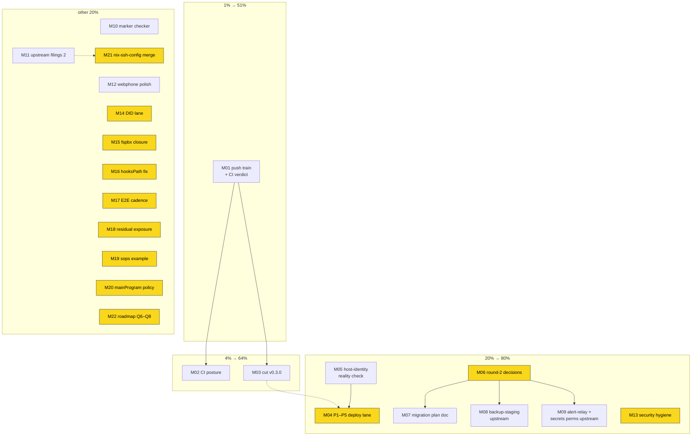

# Ship the Train & Clear the Gates — Round-5 Pareto Plan

_2026-09-29 09:12 CEST · successor to the round-4 plan
(`2026-09-29_04-52_first-call-to-daily-driver-round4-pareto-plan.md`),
whose entire non-owner-gated lane is DONE and verified (execution reports:
`docs/status/archived/2026-09-29_07-32_…m01-m16…md`,
`docs/status/2026-09-29_09-20_round4-m17-m27-execution-complete.md`)._

## Situation (what changed since round 4)

- **23 commits sit unpushed on local main** — the whole round-3/4 train
  (relock, guards, suites, scripts, hardening) is locally proven
  (full-mode BuildFlow green shape, `nix flake check` green at the final
  tree, 45/45 unit tests, six-hook pre-commit battery, scrub tree+history
  clean) but **origin has never verdict-ed any of it**.
- **TODO_LIST holds zero actionable rows** — all 12 open rows are
  owner-gated (deploy lane, release cut, CI posture, security hygiene,
  DID, fspbx, landmines, appetite calls).
- **pbx.artmann.tech answers green externally (14/14)** — whether that
  is the finished P1–P5 deployment or the old billing server is THE
  unanswered owner question; it decides whether the deploy lane is
  "verify + close" or "do it all".
- Round 4 left a small AI backlog: two un-filed upstream candidates, the
  marker-checker tool living in a heredoc, one unpushed webphone commit.
- **This round's mandate explicitly includes `git push`** — the standing
  push gate is lifted for this plan's M01.

## Step 1 — Pareto breakdown

### The 1% that delivers 51%

1. **Push the 23-commit train + secure a completed green origin CI
   verdict.** Everything else is commentary until origin agrees the
   train is green. (AI, mandate given.)

### The 4% that deliver 64%

2. **CI posture on main** (branch protection + required checks, or
   failure notification) — trust in every FUTURE push; the 2026-09-24/25
   26-hour unnoticed red streak is the evidence. (Owner decision, AI
   execution ~30min once decided.)
3. **Cut v0.3.0** — `[Unreleased]` is finalized and hook-green; a
   version pin is what integrators and the deploy lane reference.
   (Owner timing, AI execution ~45min once dated.)

### The 20% that deliver 80%

4. **P1–P5 deploy lane** (or its "already live" shortcut, pending the
   host-identity answer): first calls + CDR rows, webhook URL PATCH,
   IPv6/AAAA, old-server deletion, §5 checklist, trunk hardening, live
   security pass. (Owner hands-on, AI verification support.)
5. **Host-identity reality check + lane rerouting** — one `verify-live`
   pass plus host-side §5 evidence; turns the owner question into a
   decision packet. (AI, cheap.)
6. **Round-2 upstream-migration chain**: M06 owner decisions →
   migration plan doc → backup-staging module → alert-relay/secrets-perms
   upstreaming. (Gate: M06.)
7. **Security hygiene**: Telnyx key rotation + scrub-prefix coupling +
   the three OWNER-TO-ADD placeholders. (Owner hands, AI gates.)

### The other 20% to reach 100%

8. Marker-checker tool landing (scripts/ + docs gate) — keeps the
   archive-honesty sweeps mechanical. (AI.)
9. Upstream filings batch 2 (git-hooks.nix healing, pma dead
   `skip_hooks`, BuildFlow findings-gate ignore mechanism) — ecosystem
   fixes flow both ways. (AI, verify-first.)
10. Webphone repo polish lane (push the cross-link comment, SECURITY.md,
    DOMAIN_LANGUAGE.md — all flagged open in the 09-18 retro sweep).
    (AI, out-of-repo.)
11. DID lane (Warsaw KYC window + DE national DID) — owner portal work.
12. fspbx trial closure — sign-off then revoke/stop/trash. (Owner.)
13. Small appetite calls: GitHub residual exposure, sops-nix example
    host, browser-E2E cadence, flake-meta mainProgram policy.
    (Owner, each ≤20min.)

## Step 2 — comprehensive plan (30–100 min tasks, 22 total)

Sorted by importance / impact / effort / customer-value. `Gate` marks an
owner decision or hands-on step that must happen first.

| #   | Task (30–100 min)                                                                                        | Impact   | Effort | Customer value                        | Gate           |
| --- | -------------------------------------------------------------------------------------------------------- | -------- | ------ | ------------------------------------- | -------------- |
| M01 | Push the 23-commit train; watch the origin run to a COMPLETED verdict (rerun if runner-canceled)         | Critical | 45min  | Origin proves the whole round-3/4 train | Push mandate (given) |
| M02 | CI posture: decide protection+required-checks vs notification, implement via API, red-probe-verify       | Critical | 30min  | Every future push trustworthy         | Owner decision |
| M03 | Cut v0.3.0: date `[Unreleased]`, annotated tag, `gh release create`, metadata refresh, tag-CI verify     | High     | 45min  | Integrators can pin a version         | Owner timing   |
| M04 | FIRST REAL DEPLOYMENT P1–P5 (or "already-live" shortcut): webhook URL PATCH, outbound loop, IPv6/AAAA, old-server delete, §5 checklist, first calls + CDR, trunk hardening, live security pass | Critical | 100min | The product exists (owner) | Owner hands-on + M05 |
| M05 | Host-identity reality check: `verify-live.sh` full pass + host-side §5 evidence; decision packet rerouting the P1–P5 lane | Critical | 30min  | Ends the "is it live?" ambiguity      | —              |
| M06 | Round-2 decision batch: backup doctrine, migration timing, kexec appetite (ADR-style notes + row routing) | High     | 30min  | Unblocks the migration lane           | Owner decisions |
| M07 | Round-2 migration plan doc: belongs-table, never-publish scrub checklist, invariants, verification matrix | High     | 90min  | Safe upstream moves                   | M06            |
| M08 | Backup-staging module option upstream (sqlite .backup, MANIFEST, retention, freshness) + VM test         | High     | 100min | Backup story for every consumer       | M06            |
| M09 | Alert-relay collision fix + secrets perms-heal option upstream + tests                                   | Medium   | 90min  | One alert story, one secrets dir      | M06            |
| M10 | Land the block-aware marker checker as `scripts/` (+ self-test) and wire a docs gate                     | Medium   | 60min  | Archive honesty stays mechanical      | —              |
| M11 | Upstream filings batch 2 (verify-first): git-hooks.nix non-convergent healing; pma dead `skip_hooks`; BuildFlow findings-gate ignore mechanism | Medium | 60min | Ecosystem fixes flow both ways        | —              |
| M12 | Webphone repo polish: push the cross-link comment; SECURITY.md; DOMAIN_LANGUAGE.md                       | Low      | 60min  | Upstream repo reaches parity          | —              |
| M13 | Security hygiene: rotate Telnyx key, update KEY-prefix scrub pattern, fill-or-drop 3 placeholders, `scrub-check --history` | Medium | 30min  | Credential hygiene                    | Owner          |
| M14 | DID lane: Warsaw re-purchase + 5 KYC requirements inside the ~48h window; DE national DID order; providers doc lead-times | High | 60min | Real inbound numbers                  | Owner portal   |
| M15 | fspbx trial closure: verdict sign-off → revoke Sanctum PAT, stop VM, trash trial dir; close loose ends  | Medium   | 30min  | No zombie attack surface              | Owner sign-off |
| M16 | Fix host-global `core.hookspath=.githooks` landmine (home-manager): real dir or drop; re-run canary     | Medium   | 15min  | Every repo's hooks actually run       | Owner          |
| M17 | Browser E2E CI cadence: pick periodic / per-push / lock-rev trigger; wire + smoke-run                    | Low      | 15min  | Browser regressions caught            | Owner cadence  |
| M18 | GitHub residual-exposure call: support GC request vs accept residual + clone inventory                  | Low      | 30min  | Closure on the rewrite                | Owner          |
| M19 | sops-nix example host go/no-go (docs recipe stands)                                                      | Low      | 20min  | Secrets story complete                | Owner          |
| M20 | flake-meta mainProgram policy: accept info finding vs wait for upstream carve-out (BuildFlow#27 filed)  | Low      | 10min  | Noise baseline closed                 | Owner          |
| M21 | Merge nix-ssh-config `update_flake_lock_action` branch (HM → HEAD) once its CI is green; relock here after | Medium | 30min  | Kills the 96-behind drift at the source | Owner merge    |
| M22 | Roadmap open questions 6–8 sweep (qemuGuest on prod, lock governance, aarch64 emulation): decide or park | Low      | 30min  | No silent open questions              | Owner          |

## Step 3 — fine breakdown (≤12 min each)

Grouped under their medium parent (global order = Step 2 order;
within a group, execution order). `g` marks an owner/hands-on gate step.

| #      | Micro-task                                                                            | Min | Gate |
| ------ | ------------------------------------------------------------------------------------- | --- | ---- |
| f01.01 | `git status` clean-check; `git push origin main`                                      | 5   | —    |
| f01.02 | `gh run list -b main`, grab the new run id, watch to a COMPLETED conclusion           | 12  | —    |
| f01.03 | Runner-canceled → `gh run rerun --failed`; record verdict + close the lane            | 10  | —    |
| f02.01 | Owner picks: protection+required checks vs notification vs both                      | 5   | g    |
| f02.02 | Configure via API (`gh api -X PUT repos/…/branches/main/protection`)                  | 10  | —    |
| f02.03 | Or configure the failure-notification path                                            | 10  | —    |
| f02.04 | Verify with a deliberately red probe branch                                           | 10  | —    |
| f03.01 | Owner dates the release                                                              | 2   | g    |
| f03.02 | CHANGELOG `[Unreleased]` → `[0.3.0] - <date>` + headings hook run                     | 10  | —    |
| f03.03 | Annotated tag `v0.3.0` + push tag                                                    | 5   | —    |
| f03.04 | `gh release create v0.3.0` with notes                                                | 10  | —    |
| f03.05 | Repo metadata refresh (topics/description)                                           | 10  | —    |
| f03.06 | Verify the tag's CI run went green                                                   | 10  | —    |
| f04.01 | (If host already live) host-side §5 checklist + first-call/CDR evidence               | 12  | g    |
| f04.02 | PATCH the messaging-profile webhook URL                                              | 10  | g    |
| f04.03 | Close the outbound-call loop                                                          | 12  | g    |
| f04.04 | Re-add static IPv6 + AAAA record                                                      | 10  | g    |
| f04.05 | Delete the old (billing) server                                                      | 10  | g    |
| f04.06 | First real calls + CDR rows check                                                    | 12  | g    |
| f04.07 | Trunk hardening: Telnyx source CIDRs + fail2ban posture                              | 12  | g    |
| f04.08 | Live security pass: Hetzner Cloud Firewall + one `ssh-audit`                         | 12  | g    |
| f04.09 | (If NOT live) rescue-boot + `install-pbx.sh` + `push-secrets.sh`                      | 12  | g    |
| f05.01 | `scripts/verify-live.sh pbx.artmann.tech` full pass, capture output                  | 10  | —    |
| f05.02 | Host-side evidence via ssh (§5 on-host block) if owner grants access                 | 12  | g    |
| f05.03 | Write the decision packet (live vs old server) into the owner question + P1–P5 row   | 10  | —    |
| f06.01 | Owner picks backup doctrine (restic dogfood vs staging+pull upstream)                | 10  | g    |
| f06.02 | Owner picks round-2 timing (now vs after deploy backlog)                             | 5   | g    |
| f06.03 | Owner picks kexec appetite (public/private/fleet)                                    | 5   | g    |
| f06.04 | Record ADR-style notes + route TODO rows                                             | 10  | —    |
| f07.01 | Draft the belongs-table                                                              | 12  | —    |
| f07.02 | Copy the never-publish scrub checklist verbatim                                      | 10  | —    |
| f07.03 | Write the invariants list                                                            | 10  | —    |
| f07.04 | Write the verification matrix                                                        | 12  | —    |
| f07.05 | Review pass + file under docs/planning                                               | 10  | —    |
| f08.01 | `backupStaging` option interface (types + descriptions)                              | 12  | —    |
| f08.02 | Staging script: sqlite .backup + state.paths copy + MANIFEST                          | 12  | —    |
| f08.03 | Retention + freshness/disk-full checks                                               | 12  | —    |
| f08.04 | Timers + unit hardening                                                              | 12  | —    |
| f08.05 | VM test suite (stage → verify → restore path)                                        | 12  | —    |
| f08.06 | Downstream migration notes (what the private repo drops)                             | 10  | —    |
| f08.07 | Gates + CHANGELOG + FEATURES row                                                     | 12  | —    |
| f09.01 | Design the alert-collision resolution (module owns the template)                     | 12  | —    |
| f09.02 | Module-owned relay unit + template fix                                               | 12  | —    |
| f09.03 | `secretsDir` option + perms-heal unit                                                | 12  | —    |
| f09.04 | Tests for both arms                                                                  | 12  | —    |
| f09.05 | Downstream coordination + gates + CHANGELOG                                          | 12  | —    |
| f10.01 | Promote the heredoc checker to `scripts/markers-check.py` (argparse, --self-test)    | 12  | —    |
| f10.02 | Run over all archived files; prove zero unmarked scoped items                        | 10  | —    |
| f10.03 | Negative self-test (planted miss must fire)                                          | 10  | —    |
| f10.04 | Optional docs gate wiring or documented manual cadence (no Verschlimmbesserung)      | 12  | —    |
| f10.05 | Gates + TODO row + CHANGELOG                                                         | 10  | —    |
| f11.01 | Verify git-hooks.nix healing refusal at source (nix-community/git-hooks.nix)         | 12  | —    |
| f11.02 | File the git-hooks.nix issue                                                         | 10  | —    |
| f11.03 | Verify pma `skip_hooks` dead code at source; file issue                              | 12  | —    |
| f11.04 | Draft BuildFlow findings-gate ignore-mechanism issue (extends #25–27)                | 12  | —    |
| f11.05 | File + close rows                                                                    | 10  | —    |
| f12.01 | Push webphone main (1 comment commit; CI verdicts it)                                | 5   | —    |
| f12.02 | SECURITY.md for webphone (nix-ssh-config parity)                                     | 12  | —    |
| f12.03 | DOMAIN_LANGUAGE.md for webphone                                                      | 12  | —    |
| f12.04 | Gates (webphone CI green) + row close                                                | 10  | —    |
| f13.01 | Generate + swap the Telnyx API key                                                   | 10  | g    |
| f13.02 | Update the KEY-prefix scrub pattern                                                  | 5   | —    |
| f13.03 | Fill or drop the three OWNER-TO-ADD placeholders                                     | 10  | g    |
| f13.04 | `scrub-check --history --strict` + row closures                                      | 10  | —    |
| f14.01 | Warsaw DID re-purchase in the portal                                                 | 10  | g    |
| f14.02 | Submit the 5 KYC requirements inside the window                                      | 12  | g    |
| f14.03 | DE national DID order                                                                | 12  | g    |
| f14.04 | Update providers doc lead-times + row close                                          | 10  | —    |
| f15.01 | Record the fspbx sign-off                                                            | 5   | g    |
| f15.02 | Revoke the live Sanctum PAT                                                          | 5   | g    |
| f15.03 | Stop the VM + trash the trial dir                                                    | 10  | g    |
| f15.04 | Close the loose-ends note + row                                                      | 10  | —    |
| f16.01 | home-manager: real hooks dir or drop the entry; deploy                               | 10  | g    |
| f16.02 | Re-run the canary through a fresh repo's hook path                                   | 5   | —    |
| f17.01 | Owner picks the E2E cadence                                                          | 5   | g    |
| f17.02 | Wire schedule/lock-rev trigger in ci.yml                                             | 10  | —    |
| f17.03 | Smoke-run + CI-budget check + row close                                              | 12  | —    |
| f18.01 | Draft the GitHub support GC request (or record acceptance)                           | 12  | g    |
| f18.02 | Clone inventory on other machines (owner knowledge)                                  | 10  | g    |
| f18.03 | Audit stale Dependabot PR refs                                                       | 10  | —    |
| f19.01 | sops example host go/no-go + row close                                               | 10  | g    |
| f20.01 | Accept the mainProgram finding or park on BuildFlow#27; row close                     | 10  | g    |
| f21.01 | Check nix-ssh-config branch CI state                                                 | 5   | —    |
| f21.02 | Merge `update_flake_lock_action` (owner approve)                                     | 5   | g    |
| f21.03 | Relock the nix-ssh-config input here; fast gates                                     | 12  | —    |
| f22.01 | Write roadmap Q6–Q8 decision/park notes                                              | 12  | g    |
| f22.02 | ROADMAP update + drift alarm                                                         | 10  | —    |

## Backlog tier (ROADMAP homes, not TODOs)

- Webphone visual QA + UI micro-feature lane (20+ items) — the webphone
  repo's own TODO_LIST owns it (routed there by the 2026-09-18 retro).
- Full-mode BuildFlow cadence guard (the 2026-09-29 backlog lesson) —
  process note lives in AGENTS; revisit only if drift recurs.
- Demo/launch video + website (website-launch pattern) — post-v0.3.0,
  post-first-call marketing wave.

## Guardrails

- **No Verschlimmbesserung**: every change leaves plan and repo
  verifiably no worse; annotate, never rewrite; owner gates are hard
  gates (the push mandate covers M01 and f12.01 only).
- Fast gates before slow: `nix fmt` + cheap checks before any
  VM-realizing run; full-mode buildflow only with `--max-time 60m`.
- CI verdicts are read airtight (`gh run view --json …`); a canceled run
  is infra, not code.
- Daemon commits within ~2 min: scrub before it does; hand-authored
  commits for lock moves and releases.

## Execution graph

---

_Point-in-time snapshot — annotate, never rewrite._
