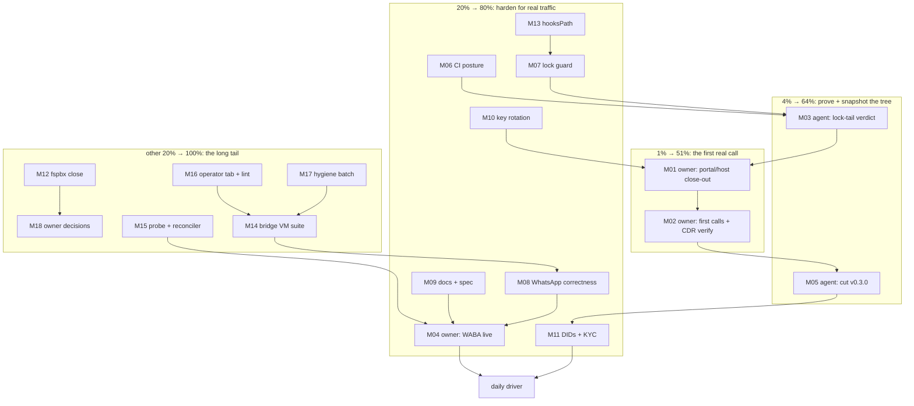

# Pareto Plan — First-Call Lockdown (round 10, 2026-09-30 12:50)

> **Input:** `TODO_LIST.md` at 2026-09-30 12:47 (29 rows: 2 High, 13
> owner-Blocked, 4 Medium, 10 Low) — harvested complete by docs-health
> round 9 + this plan's three additions (lock guard, legend lint, SKILLS
> attribution). **Destination:** unchanged since round 1 — the stack
> carries the owner's real calls as the daily driver. Six rounds of
> plans converged here; the CI green at `542443a` (WhatsApp + CDR lanes)
> and the 14/0 live-host probe mean everything between us and that goal
> is now owner hands-on steps + hardening + verification debt.
> Point-in-time snapshot: annotate, never rewrite. M-rows in Step 2 are
> marker-gate scoped; Step-3 fine rows inherit their M-row verdicts.

## Step 1 — Pareto breakdown

### The 1% that delivers 51%: ONE task

**M01+M02 — the owner's first real call.** Every suite, module,
provider doc and gate in this repo exists so that `pbx.artmann.tech`
can place and receive the owner's calls. The portal/host close-out
(webhook PATCH, outbound loop, IPv6, old-server delete, §5 checklist)
converts "CI-proven" into "carrying traffic". Nothing else on the list
changes the project's real state; this does.

### The 4% that deliver 64%: +2 tasks

- **M03 — verdict the lock tail.** The only unproven input change on
  the tree (webphone `a8868fd`, 24 upstream commits). Until a full gate
  covers it, every green claim about HEAD is conditional. 30-60 min.
- **M05 — cut v0.3.0.** The section already holds WhatsApp + CDR
  attribution + the monotonicity gate; the release snapshots the
  milestone the first call will land on (rollback anchor). 30 min.

### The 20% that deliver 80%: +8 tasks

- **M04 — WABA live verification** (WhatsApp lane becomes real; owner)
- **M06 — CI posture: branch protection + failure notification** (ends
  the unnoticed-red class; the 26h-unnoticed streak is the incident)
- **M07 — lock-move guard check** (ends the unattributed-relock class;
  two incidents in one week)
- **M08 — WhatsApp correctness pair** (string-`to` tolerance + 16 MiB
  cap: the two known silent-loss bugs before real usage finds them)
- **M10 — Telnyx API-key rotation** (the key is load-bearing AND
  transited chat/tmp — pre-real-traffic hygiene)
- **M11 — Warsaw DID + KYC + DE DID** (actual numbers to call)
- **M13 — hooksPath landmine** (root cause of the missing pre-commit
  gate; one owner-machine fix)
- **M09 — WhatsApp docs bundle + spec cross-check** (operator
  enablement path + the T.38-era verification bar)

### The other 20% (to 100%): the long tail

M12 (fspbx close-out), M14 (bridge VM suite), M15 (probe + reconciler
lane), M16 (operator tab + legend lint), M17 (test hygiene + eval
warning + SKILLS note), M18 (owner small-decisions batch: E2E
promotion, mainProgram, sops example, GitHub residual, scrub
placeholders). None block the first call; all raise the floor.

## Step 2 — Comprehensive plan (30–100 min tasks, 18 total)

Sorted by importance / impact / effort / customer-value. Owner-lane
tasks are marked; the agent can execute every other row.

| ID  | Task (30–100 min)                                                                                                                                      | Lane  | Impact   | Effort | Source row(s)      |
| --- | ----------------------------------------------------------------------------------------------------------------------------------------------------- | ----- | -------- | ------ | ------------------ |
| M01 | First-call close-out, portal/host steps: PATCH messaging-profile webhook URL, close the outbound-call loop, re-add static IPv6 + AAAA, delete the old billing server | owner | Critical | 100min | High deployment row |
| M02 | First real calls both directions + CDR rows + webphone History verify (deploy.md §5 checklist on the live host)                                          | owner | Critical | 30min  | High deployment row |
| M03 | Verdict the webphone lock tail: push the tail, land an airtight origin verdict; fallback = local `telephony-webphone` (+fax) suites                      | agent | Critical | 30-60min | High lock-tail row + verdict row |
| M04 | WABA live verification: embedded signup, VOICE OTP, `messaging.whatsapp.{enable,did}` on the live host, round trip both directions incl. media          | owner | High     | 60min  | WhatsApp owner row  |
| M05 | Cut v0.3.0: date `[Unreleased]`, tag, `gh release create`, metadata refresh                                                                             | agent | High     | 30min  | v0.3.0 row          |
| M06 | CI posture: branch protection + required checks or minimum failure notification                                                                        | owner | Critical | 30min  | CI-posture row      |
| M07 | Lock-move guard check: fail when a tracked input moves without a matching CHANGELOG line (drift-alarm pattern)                                           | agent | High     | 60-90min | lock-guard row      |
| M08 | WhatsApp correctness pair: outbound status-event string-`to` tolerance + per-channel 16 MiB inbound media cap                                            | agent | Medium   | 60min  | 2 Medium rows       |
| M09 | WhatsApp docs bundle + OpenAPI spec cross-check: deploy.md recipe, ops-runbook 40008 ladder, pbx-prod commented block, preview_url note, spec3.json diff | agent | Medium   | 45min  | 2 Low rows          |
| M10 | Rotate the Telnyx API key + update the scrub-pattern prefix (key is load-bearing and transited chat//tmp)                                               | owner | Medium   | 30min  | key-rotation row    |
| M11 | Warsaw DID re-purchase + 5 KYC requirements inside the ~48h window + DE DID order                                                                       | owner | High     | 40min  | Warsaw DID row      |
| M12 | fspbx trial sign-off + execute the verdict (revoke PAT, stop VM, trash or relocate)                                                                     | owner | Medium   | 30min  | fspbx row           |
| M13 | Fix the global `~/.gitconfig core.hooksPath` landmine at home-manager level + heal + canary re-test                                                      | owner | Medium   | 30min  | hooksPath row       |
| M14 | Bridge WhatsApp VM suite against an in-VM stub Telnyx (outbound + inbound + fail-closed arms)                                                            | agent | Medium   | 100min | VM-suite row        |
| M15 | WhatsApp smoke probe script + reconciler WABA registration lane                                                                                          | agent | Low      | 90min  | 2 rows              |
| M16 | Operator SMS tab channel rendering + FEATURES legend-vs-usage lint                                                                                       | agent | Low      | 45min  | 2 rows              |
| M17 | Test hygiene batch: 5 MiB fixture tightening, eval warning whatsapp-without-messaging, SKILLS attribution note                                            | agent | Low      | 40min  | 3 rows              |
| M18 | Owner small-decisions batch: browser E2E promotion, mainProgram policy, sops example host, GitHub residual appetite, scrub placeholders                  | owner | Low      | 60min  | 5 rows              |

## Step 3 — Fine breakdown (≤12 min per task, 71 tasks)

Fine rows inherit their M-row verdict (house convention). Sorted by
parent priority, then execution order inside the parent.

| ID  | Task (≤12min)                                                                    | Parent | Value |
| --- | -------------------------------------------------------------------------------- | ------ | ----- |
| F01 | PATCH the messaging-profile webhook URL in the Telnyx portal                      | M01    | High  |
| F02 | Close the outbound-call loop: CC app + outbound profile settings verified         | M01    | High  |
| F03 | Re-add static IPv6 + AAAA record (probe showed AAAA absent)                       | M01    | High  |
| F04 | Delete the old (billing) server                                                   | M01    | High  |
| F05 | Run the deploy.md §5 checklist paste-pack on the live host                        | M01    | High  |
| F06 | Trunk hardening: Telnyx source CIDRs into `allowedCidrs`                          | M01    | Med   |
| F07 | fail2ban posture check on the live host                                           | M01    | Med   |
| F08 | Hetzner Cloud Firewall apply per docs/security.md                                 | M01    | Med   |
| F09 | One `ssh-audit` triage run                                                        | M01    | Med   |
| F10 | First real calls, both directions                                                 | M02    | High  |
| F11 | Verify CDR rows + webphone History for those calls                                | M02    | High  |
| F12 | Record the milestone (CHANGELOG/FEATURES if the shape changed)                    | M02    | Med   |
| F13 | Push the unpushed tail (or confirm the daemon did)                                | M03    | High  |
| F14 | Watch + land the origin verdict, read airtight per run                            | M03    | High  |
| F15 | Fallback arm A: local `telephony-webphone` suite                                  | M03    | Med   |
| F16 | Fallback arm B: local `telephony-fax` + `fax-feed` suites                          | M03    | Med   |
| F17 | Record the verdict in the TODO row (evidence refresh)                             | M03    | Med   |
| F18 | Meta Business Manager embedded signup via the Telnyx portal                       | M04    | High  |
| F19 | Number verification via VOICE OTP (SMS-to-VoIP is Meta "Not Recommended")         | M04    | High  |
| F20 | Set `messaging.whatsapp.{enable,did}` on the live host + rebuild                  | M04    | High  |
| F21 | Round trip both directions incl. media                                            | M04    | High  |
| F22 | Pin the REAL 40008 wording into the guidance-matcher tests                        | M04    | Med   |
| F23 | Date `[Unreleased]`, finalize entries                                             | M05    | Med   |
| F24 | Tag `v0.3.0` + `gh release create`                                                | M05    | Med   |
| F25 | Repo metadata refresh check                                                       | M05    | Low   |
| F26 | Draft branch-protection settings (required-checks list)                           | M06    | High  |
| F27 | Wire failure notification (badge/email)                                           | M06    | High  |
| F28 | Apply protection after owner sign-off                                             | M06    | High  |
| F29 | Design the lock-guard mechanism (lock diff ↔ CHANGELOG grep)                      | M07    | Med   |
| F30 | Implement the check (script or drift_alarm arm)                                   | M07    | Med   |
| F31 | Wire into flake checks + negative self-test                                        | M07    | Med   |
| F32 | Spot-check in a full gate                                                         | M07    | Low   |
| F33 | Write the failing test for string-`to` status events                              | M08    | Med   |
| F34 | Teach `forward_message_status` tolerance; test green                              | M08    | Med   |
| F35 | Per-channel cap: 16 MiB WhatsApp / 5 MiB MMS constant split                       | M08    | Med   |
| F36 | Tests for the cap split (both channels)                                           | M08    | Med   |
| F37 | `docs/deploy.md` §WhatsApp enablement recipe                                      | M09    | Med   |
| F38 | `docs/ops-runbook.md` WhatsApp debugging (40008 ladder, window state)             | M09    | Med   |
| F39 | pbx-prod commented block + `preview_url` deliberate-False note                    | M09    | Low   |
| F40 | Fetch Telnyx spec3.json, diff the WhatsApp schemas                                | M09    | Med   |
| F41 | Date-stamp the doc row; correct if the spec differs                               | M09    | Low   |
| F42 | Generate the new Telnyx API key in the portal                                     | M10    | Med   |
| F43 | Update the key consumers (scripts/secrets)                                        | M10    | Med   |
| F44 | Update the scrub-pattern prefix + scrub-check run                                 | M10    | Med   |
| F45 | Warsaw DID re-purchase                                                            | M11    | Med   |
| F46 | Submit the 5 KYC requirements inside the release window                           | M11    | Med   |
| F47 | DE national DID order                                                             | M11    | Med   |
| F48 | Sign the fspbx verdict banner                                                     | M12    | Low   |
| F49 | Execute: revoke PAT, stop VM, trash or relocate the snapshot                      | M12    | Low   |
| F50 | home-manager: real global hooks dir or drop `core.hooksPath`                      | M13    | Med   |
| F51 | Heal this repo's hook + canary re-test                                            | M13    | Med   |
| F52 | Scaffold the stub-Telnyx VM fixture (webphone-suite pattern)                      | M14    | Med   |
| F53 | Drive the WhatsApp outbound endpoint in-VM                                        | M14    | Med   |
| F54 | Drive the inbound WHATSAPP event forward in-VM                                    | M14    | Med   |
| F55 | Assert fail-closed + `/gateway/health` lane states                                | M14    | Med   |
| F56 | Green the suite + wire the flake check                                            | M14    | Med   |
| F57 | Probe script skeleton (vantage-probe pattern)                                     | M15    | Low   |
| F58 | Thread-tag assertion + verdict table                                              | M15    | Low   |
| F59 | Reconciler: `GET /v2/whatsapp/phone_numbers` desired-state lane                   | M15    | Low   |
| F60 | Reconciler tests + docs touch                                                     | M15    | Low   |
| F61 | Operator JS: channel badge for `type: WHATSAPP` rows                              | M16    | Low   |
| F62 | Suite assert for the rendered distinction                                         | M16    | Low   |
| F63 | FEATURES legend-vs-usage lint (grep check or drift arm)                           | M16    | Low   |
| F64 | 5 MiB fixture via monkeypatched size constant                                     | M17    | Low   |
| F65 | Eval warning: `whatsapp.enable` without `messaging.enable`                        | M17    | Low   |
| F66 | SKILLS repo attribution note for the `r`-kind change                              | M17    | Low   |
| F67 | Browser E2E promotion decision (periodic/per-push/lock-triggered)                 | M18    | Low   |
| F68 | flake-meta-checker mainProgram policy decision                                    | M18    | Low   |
| F69 | sops-nix example host go/no-go                                                    | M18    | Low   |
| F70 | GitHub residual-exposure decision (support GC vs accept)                          | M18    | Low   |
| F71 | Scrub placeholders: fill or delete the three                                      | M18    | Low   |

## Execution graph (mermaid)

Critical path: **M03 → M01 → M02 → M05** (verdict the tree, close out
the host, place the calls, snapshot the release). Everything in the 20%
tier hangs off that path and can run interleaved; the tail is
floor-raising, never blocking.

## Provenance

- Source: `TODO_LIST.md` (29 rows at 12:47), `ROADMAP.md` OQ9/OQ10,
  docs-health round-9 harvest ledger, this session's live CI findings
  (green `542443a` run 36696533753; lock moves `4b769a5`→`93d3a53`→
  `a8868fd`).
- New tasks surfaced by this plan already added to TODO_LIST (lock
  guard, legend lint, SKILLS attribution) — the plan is the snapshot,
  TODO_LIST is the living source.
- Do not verschlimmbessern: no speculative rewrites; every change must
  leave the plan and the repo verifiably no worse than found.
