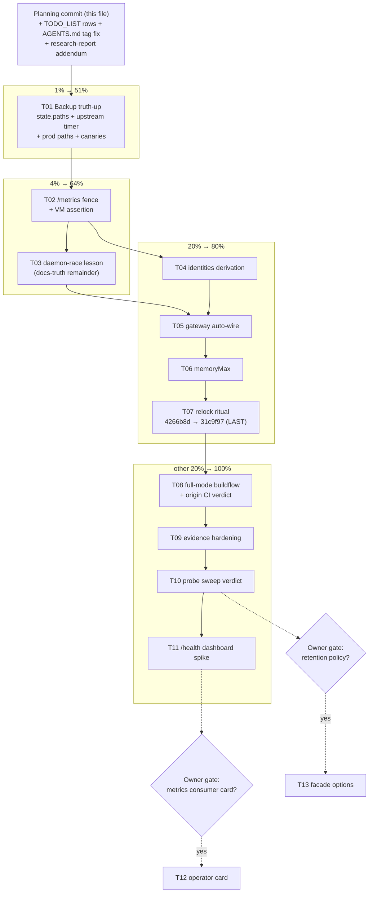

# SUPERB: webphone maximization Pareto plan — 2026-10-01 06:19

**Source:** the 2026-10-01 webphone deep-dive audit
(`docs/research/2026-10-01_webphone-deep-dive.html`, commit `40131d1`;
adoption 78/100, 4 missed opportunities, lock 20 commits behind main) and
the session status report
(`docs/status/2026-10-01_06-15_webphone-deep-dive-session-status.md`).
**Goal:** close every audit finding the Pareto way — smallest set first,
nothing verschlimmbessert, every change behind an existing gate.

**New findings made during THIS planning pass** (beyond the audit):

1. `services.telephony.state.paths` / `state.sqliteDatabases`
   (modules/telephony/default.nix:54-62) exist precisely so backup tooling
   "never hardcodes" module paths — yet they omit the webphone entirely
   (`/var/lib/webphone`, `webphone.db`), and the pbx-prod template does not
   consume them at all.
2. pbx-prod's backup comment promises "voicemail/CDR/recordings are not
   single-copy" (hosts/pbx-prod/default.nix:129) but its `paths` list ships
   none of `/var/lib/telephony/recordings`, `cdr-csv` (and `cdr.enable =
   true` is set!) or any webphone data. Comment/config contradiction =
   three gaps, one mechanism away from fixed.
3. Upstream tags do NOT stop at v2.6.0 (AGENTS.md was stale; v2.8.0 tagged
   2026-09-30 — verified `git tag --sort=-creatordate`). AGENTS.md fixed in
   the planning commit.

**Decision defaults encoded** (owner may override at the gates):

- `/metrics` → **fence-first** (loopback-only), consumer card optional later.
- Relock → **ride main now** (`31c9f97`): the standing owner decision is
  "webphone tracks main", module surface is proven identical at the pin.
- Execution order → all stack-side nix changes land on the CURRENT pin
  first; the relock is the LAST code change so a red suite blames exactly
  one variable (the lock move), per the lock-bump runbook.

---

## Pareto breakdown

### The 1% that delivers 51%

**T01 — Backup truth-up (webphone + recordings + CDR).** The only
data-loss-class finding in the audit, now tripled by the planning-pass
findings. One mechanism (`state.paths` + upstream's drill-verified online
backup timer) closes all three holes.

### The 4% that delivers 64%

- **T01** (above)
- **T02 — /metrics fence + VM assertion.** Closes an internet-exposed,
  unconsumed surface with one nginx location.
- **T03 — docs-truth remainder.** TODO_LIST rows, AGENTS.md tag-note fix,
  research-report addendum (all three EXECUTED in the planning commit);
  remaining: the daemon-race lesson entry.

### The 20% that delivers 80%

- **T04 — `settings.identities` derivation** (own-number display; the stack
  already owns the extension→DID data).
- **T05 — Gateway auto-wire** (`mode=webhook`, `webhook_url`,
  `webhook_secret_file` when `messaging.enable`) — kills the manual CHANGEME
  seam and the secret-drift class upstream built `webhook_secret_file` for.
- **T06 — `memoryMax`** in the pbx-prod template (defense in depth).
- **T07 — Relock ritual** `4266b8d → 31c9f97`: mobile tab bar, a11y, loading
  skeletons, transcript day-grouping, mic pre-warm (accept-to-speak latency).

### The other 20% (to reach 100%)

- **T08 — Full-mode buildflow verification** (`--build-mode full --max-time
  60m`; green shape = the 4 documented port-collision findings) + origin CI
  verdict via `gh run view`.
- **T09 — Evidence hardening:** browser-render the audit report, full
  Unreleased CHANGELOG delta, demo-VM `/metrics` probe (post-fence), report
  addendum (upstream module-check citations + score weighting).
- **T10 — Open-probe exposure sweep** (`/healthz`, `/livez`, `/startupz`
  through the vhost catch-all) — verdict: fence or document-and-leave.
- **T11 — `/health` dashboard spike** (VM scratch, compare against the
  operator window; default: keep off).
- **T12 — [OWNER-GATED] /metrics consumer card** in telephony-operator.
- **T13 — [OWNER-GATED] Facade policy options** (`webphone.retentionDays`,
  `webphone.timezone`).
- Standing note (no task): watch for the upstream v2.9.0 cut — the relock
  target may move mid-train; always forward-pin to the first green rev.

---

## Comprehensive plan (medium granularity, 30–100 min)

Sorted by importance / impact / effort / customer-value. Order = execution
order (docs first, data durability second, exposure third, polish, lock
move last, verification, then gated extras).

| #   | Task                                                                                                                                                                                                                                                                                                                              | Impact      | Effort | Customer value / why this order                                                         |
| --- | --------------------------------------------------------------------------------------------------------------------------------------------------------------------------------------------------------------------------------------------------------------------------------------------------------------------------------- | ----------- | ------ | --------------------------------------------------------------------------------------- |
| T01 | **Backup truth-up end-to-end**: extend `state.paths`/`state.sqliteDatabases` with webphone data; `services.webphone.backup.enable = mkDefault true`; pbx-prod `paths` consumes `state.paths` (+ backup snapshot dir, keeps `/etc/ssh` + secretsDir); canary round-trips (webphone blob, recording, CDR row) in `tests/backup.nix` | Critical    | 90min  | Only finding that can lose user data; fixes 3 gaps with the mechanism built for it      |
| T02 | **/metrics fence**: nginx `location = /metrics` (allow 127.0.0.1, deny all) + suite assertion (loopback 200, external 403)                                                                                                                                                                                                        | High        | 45min  | Closes an internet-exposed surface; one location + one test                             |
| T03 | **Docs-truth remainder**: daemon-race lesson (`docs/lessons/operating.md`) — TODO_LIST/AGENTS.md/report-addendum parts already executed in the planning commit                                                                                                                                                                    | Medium      | 15min  | Keeps the knowledge base honest; zero code risk                                         |
| T04 | **identities derivation**: verify `gateways` attr shape, derive map in `web.nix`, assert in `config.js` test                                                                                                                                                                                                                      | Medium      | 45min  | Visible own-number polish for every user; zero-risk display feature                     |
| T05 | **Gateway auto-wire**: `settings.gateway = { mode, webhook_url, webhook_secret_file }` in `messaging.nix` when enabled; conflict assertion vs operator-set `webhook_secret`; prune pbx-prod CHANGEME block; messaging-suite assertion                                                                                             | Medium-High | 60min  | Operator DX + secret single-source; removes the last manual seam                        |
| T06 | **memoryMax** in `hosts/pbx-prod` + eval check                                                                                                                                                                                                                                                                                    | Low-Medium  | 30min  | Host survives a Go leak; one line                                                       |
| T07 | **Relock ritual** `4266b8d → 31c9f97`: binary build, fast gates, CHANGELOG rev mention (lock-guard!), webphone + configjs suites, browser E2E (markup changed — mandatory), hand-authored commit naming revs                                                                                                                      | High        | 90min  | Delivers the mobile/a11y/latency UX; LAST code change so lock-move blame stays isolated |
| T08 | **Full-mode verification**: `buildflow --build-mode full --max-time 60m` to the documented green shape; `gh run view` origin verdict on the pushed head                                                                                                                                                                           | High        | 60min  | Proves the whole train, not the parts                                                   |
| T09 | **Evidence hardening batch**: render report in a browser (fix any dead CSS class), read full Unreleased CHANGELOG delta (+append note), demo-VM `/metrics` probe post-fence, append addendum (upstream module-check citations, score weighting)                                                                                   | Low         | 60min  | Converts code-reasoned claims into probe evidence; closes self-review gaps              |
| T10 | **Open-probe sweep**: `/healthz` `/livez` `/startupz` through-vhost verdict (fence or document-and-leave, with rationale)                                                                                                                                                                                                         | Low         | 30min  | Same exposure class T02 closed; likely documentation-only outcome                       |
| T11 | **/health dashboard spike**: VM scratch with `settings.dashboard.enable = true`; verdict vs the operator window (default: keep off)                                                                                                                                                                                               | Low         | 30min  | Decides the last unused upstream surface deliberately, not by silence                   |
| T12 | **[OWNER-GATED] /metrics consumer card**: telephony-operator fetches `/metrics` (build_info, uptime, counts) behind the existing basic-auth realm                                                                                                                                                                                 | Medium      | 90min  | Turns the fenced surface into operator value; only if the owner wants a consumer at all |
| T13 | **[OWNER-GATED] Facade policy options**: `webphone.retentionDays` + `webphone.timezone` (`mkOption` + description + settings wiring + eval test)                                                                                                                                                                                  | Low         | 45min  | Data-minimization knob; only if a retention policy actually applies                     |

13 tasks, all TODOs covered, none over 100 min.

---

## Fine breakdown (max 12 min per task)

Grouped by parent task, globally sorted by execution order (= the table
above). "Suite" steps are single monitored launches; triage/fix is a
separate step.

| #  | Step                                                                                                                                                                                                 | Est | Verify via                                      |
| -- | ---------------------------------------------------------------------------------------------------------------------------------------------------------------------------------------------------- | --- | ----------------------------------------------- |
| 1  | `state.paths` += `/var/lib/webphone-backup` (conditional `webphone.enable`) in `modules/telephony/default.nix`                                                                                       | 10m | `nix eval` pbx `services.telephony.state.paths` |
| 2  | `state.sqliteDatabases` += `/var/lib/webphone/webphone.db` (same condition)                                                                                                                          | 5m  | eval as above                                   |
| 3  | `web.nix`: `services.webphone.backup.enable = lib.mkDefault true` + why-comment (consistency via `.backup`, restic carries the snapshot dir)                                                         | 10m | eval `services.webphone.backup.enable`          |
| 4  | `hosts/pbx-prod`: `backups.paths` = `state.paths`-consuming merge (recordings, cdr-csv, telnyx-webhooks, webphone-backup) + existing `/etc/ssh`, secretsDir                                          | 12m | eval toplevel (`checks.telephony-eval` shape)   |
| 5  | `tests/backup.nix`: enable webphone on the node; plant canaries (webphone blob file under `/var/lib/webphone`, recording file, CDR csv row)                                                          | 12m | local test edit review                          |
| 6  | `tests/backup.nix` testScript: restore assertions for all three canaries (exact bytes back)                                                                                                          | 12m | test review                                     |
| 7  | Run `telephony-backup` VM suite; triage any fallout                                                                                                                                                  | 12m | suite green                                     |
| 8  | Fast gates: `nix fmt` + `checks.telephony-eval`                                                                                                                                                      | 10m | green                                           |
| 9  | Commit T01 (detailed message: the three gaps + mechanism)                                                                                                                                            | 5m  | `git log -1`                                    |
| 10 | `web.nix`: `locations."= /metrics"` — `allow 127.0.0.1; deny all;` + `proxyPass` to the app upstream                                                                                                 | 10m | eval                                            |
| 11 | `tests/webphone.nix`: loopback `/metrics` 200 (Prometheus text sniff) + client-side vhost `/metrics` 403                                                                                             | 12m | test review                                     |
| 12 | Run `telephony-webphone` suite; triage                                                                                                                                                               | 12m | green                                           |
| 13 | Commit T02                                                                                                                                                                                           | 5m  | `git log -1`                                    |
| 14 | `docs/lessons/operating.md`: daemon-race lesson (assemble in /tmp, `mv` atomically; cite `1e552f4` half-written-report incident)                                                                     | 12m | doc review                                      |
| 15 | Verify `gateways.<name>` option shape + `did` field (read options.nix block)                                                                                                                         | 5m  | source read                                     |
| 16 | `web.nix`: `settings.identities = lib.mapAttrs (_: g: g.did) cfg.gateways` behind `mkIf (cfg.gateways != {})` — with normalized-extension key caveat comment                                         | 10m | eval                                            |
| 17 | `tests/webphone.nix`: `/config.js` (or settings eval) carries an identities entry                                                                                                                    | 10m | test review                                     |
| 18 | Suite + fast gates + commit T04                                                                                                                                                                      | 12m | green                                           |
| 19 | `messaging.nix`: `services.webphone.settings.gateway = { mode = "webhook"; webhook_url = loopback bridge /gateway; webhook_secret_file = cfg.messaging.gatewaySecretFile; }` (mkIf messaging.enable) | 10m | eval                                            |
| 20 | Assertion: exactly-one-of operator `webhook_secret` vs auto `webhook_secret_file` (legible eval error)                                                                                               | 10m | eval-check rejection arm                        |
| 21 | `hosts/pbx-prod`: prune the now-obsolete gateway CHANGEME comment block (keep the secret-file convention note)                                                                                       | 5m  | doc review                                      |
| 22 | `tests/messaging.nix`: assert the rendered webphone config carries webhook mode + URL (eval arm or in-VM check)                                                                                      | 12m | test review                                     |
| 23 | Messaging suite + fast gates + commit T05                                                                                                                                                            | 12m | green                                           |
| 24 | `hosts/pbx-prod`: `services.webphone.memoryMax = "512M"`                                                                                                                                             | 5m  | eval                                            |
| 25 | Commit T06                                                                                                                                                                                           | 5m  | `git log -1`                                    |
| 26 | `nix flake update webphone` (expect `4266b8d → 31c9f97`)                                                                                                                                             | 5m  | `jq .nodes.webphone.locked.rev flake.lock`      |
| 27 | `nix build .#webphone` (store-path version sanity)                                                                                                                                                   | 12m | build ok                                        |
| 28 | Fast-gate battery: fmt, statix, deadnix, `telephony-eval`, `markers-check`, `lock_guard` dry expectations                                                                                            | 12m | green                                           |
| 29 | `CHANGELOG.md` `[Unreleased]`: entry naming old→new rev + the why (mobile/a11y/mic pre-warm) — REQUIRED for `checks.lock-guard`                                                                      | 10m | `python3 scripts/lock_guard.py`                 |
| 30 | `telephony-webphone` + `configjs_check` suites                                                                                                                                                       | 12m | green                                           |
| 31 | Browser E2E (`nix build -L .#telephony-browser`) — markup changed (mobile tab bar, skeletons), so mandatory per runbook                                                                              | 12m | green                                           |
| 32 | HAND-AUTHORED commit T07 naming revs + ritual results (never the daemon heuristic on a lock move)                                                                                                    | 10m | `git log -1`                                    |
| 33 | `buildflow --build-mode full --max-time 60m`; triage to the documented green shape (exactly the 4 port-collision findings)                                                                           | 12m | findings shape                                  |
| 34 | Push head, `gh run view <id> --json ...` airtight origin verdict (cancel ≠ red protocol)                                                                                                             | 12m | CI verdict                                      |
| 35 | Browser-render `docs/research/2026-10-01_webphone-deep-dive.html`; fix any dead CSS class via append/addendum                                                                                        | 12m | visual check                                    |
| 36 | Read full Unreleased CHANGELOG delta `4266b8d..31c9f97`; append version-table addendum if items were missed                                                                                          | 12m | doc addendum                                    |
| 37 | Demo-VM probe (`nix run .#vm`): external `/metrics` 403, loopback 200 — probe evidence for the report                                                                                                | 12m | probe output                                    |
| 38 | Report addendum: upstream `nix/module-check-backup.nix` + `module-check-csrf.nix` citations; publish the 24-capability enumeration + score weighting                                                 | 12m | doc addendum                                    |
| 39 | Probe sweep verdict `/healthz` `/livez` `/startupz` through-vhost (fence or document-and-leave; note `/healthz` is the app's own probe surface — loopback consumer only)                             | 12m | verdict note                                    |
| 40 | `/health` dashboard spike: VM scratch `settings.dashboard.enable = true`; compare operator window; verdict (default off)                                                                             | 12m | verdict note                                    |
| 41 | [GATED] T12a: operator Go — fetch/parse `/metrics` into a card model                                                                                                                                 | 12m | unit test                                       |
| 42 | [GATED] T12b: render card behind existing basic-auth realm                                                                                                                                           | 12m | operator suite                                  |
| 43 | [GATED] T12c: suite + commit T12                                                                                                                                                                     | 12m | green                                           |
| 44 | [GATED] T13a: `webphone.retentionDays` + `webphone.timezone` options (type + description, mkOption discipline)                                                                                       | 12m | eval                                            |
| 45 | [GATED] T13b: settings wiring + eval-check happy/rejection arms                                                                                                                                      | 12m | `checks.telephony-eval`                         |
| 46 | [GATED] T13c: commit T13                                                                                                                                                                             | 5m  | `git log -1`                                    |

46 steps, every medium task covered, none over 12 min.

---

## Execution graph

## Gates map (what proves what)

- T01 → `telephony-backup` VM suite (round-trip), `checks.telephony-eval`
- T02/T04 → `telephony-webphone` VM suite + `configjs_check.py`
- T05 → `telephony-messaging` VM suite + eval rejection arm
- T07 → lock-bump runbook battery incl. `checks.lock-guard` (CHANGELOG rev
  mention) and the browser E2E (`legacyPackages.telephony-browser`)
- T08 → full-mode buildflow green shape + airtight `gh run view` verdict
- Everything → `nix flake check` (the CI gate) before push

## Verschlimmbessern guardrails

- No renames, no refactors, no new abstractions: every change is an option
  value, one derivation line, one nginx location, or one test.
- Backup default-on rides upstream's own drill-verified timer (not a new
  script); restic still owns off-host copies.
- The relock lands LAST and alone, hand-authored, per the documented ritual.
- Nothing here touches the working live-deployment lane (TODO_LIST BLOCKED
  rows stay untouched).

## Status

- Planning artifacts executed in this commit: TODO_LIST harvest (6 rows),
  AGENTS.md stale tag-note fix, research-report addendum (verified tag fact
  - new backup-gap finding).
- Execution NOT started — awaiting the "get shit done" go (skill: Full
  Execution Mode after approval).
