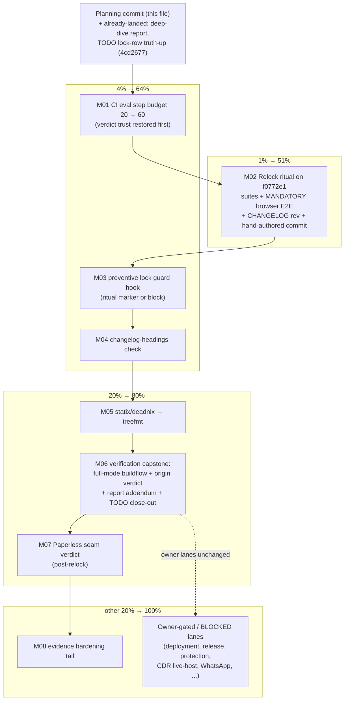

# SUPERB: flake-inputs remediation Pareto plan — 2026-10-07 00:38

**Trigger:** the 2026-10-07 flake-inputs deep dive
(`docs/research/2026-10-07_flake-inputs-deep-dive.html`; portfolio 90/100,
webphone 88/100). Input _usage_ is superb; this plan converts its findings
into the executable remediation train. Scope: everything the audit surfaced
plus the two open TODO_LIST rows it intersects (the lock-sweep row, the
CI-green row). Owner-BLOCKED lanes are enumerated in the "other 20%" section,
not planned — they are not agent-executable.

**Facts on the ground at planning time:**

- `checks.lock-guard` is RED at HEAD: webphone sits at `f0772e1` (locked
  2026-10-06 22:27) after FOUR unattributed daemon sweeps
  (`208bf6e`/`f2bf1ee`/`bc9406e`/`f4f0d75`), 71 commits / 31 code files past
  the last attributed rev `3928dbd1`. Markup deltas (`enroll.js`, `auth.js`,
  `tw.css`) make the browser E2E mandatory per the runbook — it has not run
  on any swept rev.
- Origin CI cannot produce a green verdict even after a perfect relock: the
  per-system eval step hard-times-out at 20 minutes (run 37528539317, killed
  at 63/70 checks mid-aarch64). The 120-min fix (`c19bdea`) raised the JOB
  budget, not the STEP budget.
- Upstream webphone is 15 docs-only commits ahead of `f0772e1` — the lock is
  code-current, so the ritual targets the CURRENT pin, not a fresh bump.
- The other five inputs sit exactly at upstream HEAD; nothing else in the
  lock needs moving.

## Pareto breakdown

### The 1% that delivers 51%

**M02 — the attributed relock ritual on `f0772e1`.** The single defect that
makes `nix flake check` (local AND origin) red and leaves the production
template riding 71 unvetted commits. One ritual execution — binary build,
fast gates, webphone suites, browser E2E, CHANGELOG rev entry, hand-authored
commit — turns the only red gate green and re-vets the input everything else
depends on.

### The 4% that deliver 64%

- **M01 — CI eval step budget fix** (raise the per-system eval step's
  `timeout-minutes`, 30min). Without it the 1% cannot be _proven_ at origin:
  verdicts stay untrustworthy for every future move.
- **M03 — preventive lock guard hook** (pre-commit refuses `flake.lock`
  webphone-rev moves without a ritual marker). Kills the incident class at
  its root: 2026-09-24, 2026-09-25, 2026-10-01, 2026-10-05/06 — four
  unattributed sweeps in two weeks; `lock-guard` only catches them after
  the fact.
- **M04 — changelog-headings as a hermetic check** (30min): the one hook in
  the battery that is pure Python over a tracked file yet has no CI
  counterpart (the hook lane fails silently — 2026-09-29 incident).

### The 20% that deliver 80%

- **M05 — statix/deadnix onto treefmt-nix programs**: same lints, same flags
  (`repeated_keys`, `no-lambda-pattern-names`), one `checks.format` gate,
  `nix fmt` autofix, two runCommands and two duplicated hooks deleted.
- **M06 — full verification capstone**: full-mode buildflow to the documented
  green shape, push, airtight `gh run view` verdict, deep-dive report
  addendum, TODO rows closed.
- **M07 — Paperless fax-archive seam verdict** (post-relock): upstream
  shipped `settings.paperless.*`; this stack has the complete inbound-fax
  story. Evaluate, then GO (small facade) or NO-GO (recorded verdict).

### The other 20% (to reach 100%)

Not planned as tasks — owner-gated or out of lane, enumerated so nothing is
lost: first-real-deployment close-out lane (BLOCKED, owner hands-on), v0.3.0
release cut (BLOCKED, owner timing), branch protection / failure
notification (BLOCKED, workflow change), CDR cancelled-leg live-host
investigation (TODO_LIST Medium, live-host lane — NOT input-related),
WhatsApp WABA live verification (BLOCKED, Meta business verification),
`docs/providers/` pricing re-verification (Low, M), sops-nix example host
(BLOCKED, owner), browser-E2E CI promotion (BLOCKED, owner), scrub-pattern
placeholders + `~/.gitconfig` hooksPath landmine (BLOCKED, owner), residual
history-exposure appetite (BLOCKED, owner). Carry-overs from the 2026-10-01
plan's gated pair (T12 metrics consumer card, T13 retention/timezone
facades) stay default-skip unless the owner re-opens them.

## Step 2 — comprehensive plan (medium granularity, 30–100 min)

Sorted by importance / impact / effort / customer-value. Order = execution
order (trust-restoring wiring first, the ritual second and alone, the class
killers third, consolidation fourth, verification capstone, then gated
extras).

| #   | Task                                                                                                                                                                                                                                                                                                                       | Impact     | Effort | Customer value / why this order                                                                   |
| --- | -------------------------------------------------------------------------------------------------------------------------------------------------------------------------------------------------------------------------------------------------------------------------------------------------------------------------- | ---------- | ------ | ------------------------------------------------------------------------------------------------- |
| M01 | **CI eval step budget**: raise the per-system eval step's `timeout-minutes` 20 → 60 (job stays 120) + why-comment citing run 37528539317's 20:00 kill at 63/70 checks                                                                                                                                                      | Critical   | 30min  | Restores verdict trust BEFORE the relock, so its push can actually go green                       |
| M02 | **Relock ritual on `f0772e1`** (the runbook, verbatim): upstream DOM-contract selector pre-check, binary build, fast gates, webphone + empty-secret + configjs suites, messaging + fax-feed suites, MANDATORY browser E2E, CHANGELOG `3928dbd1 → f0772e1` entry, hand-authored commit; then delete the TODO lock-sweep row | Critical   | 90min  | The 1%: turns the only red gate green, re-vets 71 unvetted commits, restores "CI means something" |
| M03 | **Preventive lock guard**: pre-commit hook refusing staged webphone-rev moves without a `relock:`/ritual marker in the message (scripts + negative/positive arms + AGENTS.md note)                                                                                                                                         | High       | 60min  | Fourth incident in two weeks; post-hoc lock-guard is not prevention                               |
| M04 | **changelog-headings hermetic check**: `pkgs.runCommand` mirroring lock-guard's shape over `tests/changelog_headings.py`; negative arm proves it bites                                                                                                                                                                     | Medium     | 30min  | Gate runs in CI, not only on machines with a healed hook (2026-09-29 silent-failure class)        |
| M05 | **treefmt consolidation**: `programs.statix` (`disabled-lints = ["repeated_keys"]`) + `programs.deadnix` (`no-lambda-pattern-names = true`); delete `checks.statix`/`checks.deadnix` runCommands + the two duplicated pre-commit hooks; retire `statix.toml`                                                               | Medium     | 45min  | One format gate, `nix fmt` autofix, minus two checks to maintain — zero lint-surface change       |
| M06 | **Verification capstone**: full-mode buildflow to the documented green shape (exactly the 4 port-collision findings), push, airtight `gh run view` verdict (cancel ≠ red protocol), deep-dive report addendum, close TODO_LIST row 22                                                                                      | High       | 60min  | Proves the whole train at origin, not the parts; converts the audit's claims into landed evidence |
| M07 | **Paperless seam verdict** (post-relock): read the upstream seam, GO/NO-GO; GO = `services.telephony.webphone.paperless.{enable,url,tokenFile}` facade + env-file token (`WEBPHONE_PAPERLESS__TOKEN`) + eval arms; NO-GO = recorded verdict in FEATURES.md                                                                 | Medium-Low | 100min | Decides the last unsurfaced upstream capability deliberately, not by silence                      |
| M08 | **Evidence hardening tail**: browser-render the 2026-10-07 deep-dive report (dead-CSS check, addendum-only fixes); TODO_LIST truth pass once the CI verdict lands                                                                                                                                                          | Low        | 30min  | Converts code-reasoned audit claims into rendered/probed evidence                                 |

8 tasks, all audit findings + both intersecting TODO rows covered, none over
100 min. The owner-BLOCKED lanes above stay untouched by design.

## Step 3 — fine breakdown (max 12 min per task)

Fine rows inherit their parent task's verdict and stay bare by the
markers convention (AGENTS.md). "Suite" steps are single monitored launches;
triage/fix is always a separate step. Sorted by execution order (= the table
above).

| #  | Step                                                                                                                                                                                                         | Est | Verify via                                  |
| -- | ------------------------------------------------------------------------------------------------------------------------------------------------------------------------------------------------------------ | --- | ------------------------------------------- |
| 1  | Read `.github/workflows/ci.yml` eval step; confirm the 20-min `timeout-minutes` and the job-level 120                                                                                                        | 5m  | source read                                 |
| 2  | Raise the eval step `timeout-minutes` 20 → 60 + why-comment (run 37528539317, killed at 63/70 mid-aarch64; per-check eval degrades to ~2min)                                                                 | 10m | yaml edit                                   |
| 3  | Commit M01 (detailed message: step-vs-job budget lesson + the run evidence)                                                                                                                                  | 5m  | `git log -1`                                |
| 4  | Selector pre-check: `git show f0772e1:<templ/js paths>` for every selector `tests/browser-e2e.py` + `tests/configjs_check.py` assert — BEFORE any VM time (the 2026-10-01 lesson)                            | 12m | selector list, zero missing                 |
| 5  | `nix build .#webphone` at the current lock; sanity the store-path version literal (no `--version` flag exists)                                                                                               | 12m | build ok                                    |
| 6  | Fast gates: `nix fmt`, statix, deadnix, `checks.telephony-eval`, `markers-check`, drift alarm                                                                                                                | 12m | green                                       |
| 7  | `CHANGELOG.md` `[Unreleased]`: the `3928dbd1 → f0772e1` entry — 71 commits / 31 code files, passkey/session/enroll + crm + paperless seam, the four-sweep incident, suite + E2E verdicts                     | 10m | `python3 scripts/lock_guard.py` PASS        |
| 8  | Suites batch 1: `telephony-webphone` + `telephony-webphone-empty-secret` + configjs check                                                                                                                    | 12m | green                                       |
| 9  | Suites batch 2: `telephony-messaging` + `telephony-fax-feed` (gateway/webhook/fax surfaces touched by the delta)                                                                                             | 12m | green                                       |
| 10 | Browser E2E `nix build -L .#telephony-browser` — MANDATORY (markup deltas: `enroll.js`, `auth.js`, `tw.css`)                                                                                                 | 12m | green                                       |
| 11 | HAND-AUTHORED commit M02 naming old→new revs, the why, and every gate verdict (never a daemon heuristic on a lock move); minimize the relock→commit window (the daemon swept mid-ritual twice on 2026-10-01) | 10m | `git log -1`                                |
| 12 | Delete the TODO_LIST lock-sweep row (done → CHANGELOG is its home); run the drift alarm                                                                                                                      | 5m  | drift gate PASS                             |
| 13 | Write the preventive hook script (staged `flake.lock` webphone rev differs from HEAD's AND no `relock:`/ritual marker in the prepared message → fail with the runbook pointer)                               | 12m | script + `--help`                           |
| 14 | Wire it in `flake.nix` `pre-commit.settings.hooks` (`files = "flake\\.lock$"`, `pass_filenames = false`)                                                                                                     | 10m | hook listed                                 |
| 15 | Negative arm: plant an unmarked lock move → hook BLOCKS; positive arm: marker present → passes                                                                                                               | 12m | both hook outputs                           |
| 16 | AGENTS.md: one paragraph in the pre-commit battery list (what it guards, how to satisfy it)                                                                                                                  | 10m | doc review                                  |
| 17 | Commit M03 (detailed message: the four-incident class + the two verification arms)                                                                                                                           | 5m  | `git log -1`                                |
| 18 | `checks.changelog-headings = pkgs.runCommand` mirroring lock-guard's shape over `tests/changelog_headings.py CHANGELOG.md`                                                                                   | 12m | check evals                                 |
| 19 | Negative arm: temporarily duplicate a `### <type>` heading inside one version → check FAILS; restore                                                                                                         | 12m | both directions                             |
| 20 | Commit M04 (detailed message: hermetic-shape rationale, sandbox limits of the other hooks)                                                                                                                   | 5m  | `git log -1`                                |
| 21 | `treefmt.programs`: `statix.enable = true` + `disabled-lints = ["repeated_keys"]`; `deadnix.enable = true` + `no-lambda-pattern-names = true`                                                                | 10m | eval                                        |
| 22 | Delete `checks.statix` + `checks.deadnix` runCommands; retire `statix.toml` (treefmt generates the settings file now — verify the ignore/nix_version fields are not load-bearing first)                      | 12m | `checks.format` evals                       |
| 23 | Drop the duplicated statix + deadnix pre-commit hooks (keep nixfmt: commit-time autofix is its own value)                                                                                                    | 10m | `nix develop -c pre-commit run --all-files` |
| 24 | `nix fmt` idempotence + lint-surface equivalence spot-check (same findings before/after on a scratch clone of a flagged sample)                                                                              | 12m | green + no new findings                     |
| 25 | Commit M05 (detailed message: consolidation, the equivalence proof, statix.toml retirement)                                                                                                                  | 5m  | `git log -1`                                |
| 26 | `buildflow --build-mode full --max-time 60m`; triage to the documented green shape (exactly the 4 port-collision findings — anything else is a regression)                                                   | 12m | findings shape                              |
| 27 | Push head; `gh run view <id> --json headSha,status,conclusion,event,jobs` airtight verdict; on any cancel, read the step timestamps before calling it infra                                                  | 12m | CI verdict GREEN                            |
| 28 | Deep-dive report addendum: resolutions appended to `docs/research/2026-10-07_flake-inputs-deep-dive.html` (never rewrite the body)                                                                           | 12m | doc addendum                                |
| 29 | Close TODO_LIST row 22 (CI-gate green confirmation) with the run id as evidence                                                                                                                              | 10m | drift gate PASS                             |
| 30 | Commit M06 (detailed message: the full verdict + what the train proved)                                                                                                                                      | 5m  | `git log -1`                                |
| 31 | Read the upstream Paperless seam at `f0772e1`: `internal/paperless`, settings keys, any docs/plan verdicts                                                                                                   | 12m | source read                                 |
| 32 | GO/NO-GO verdict vs the deployment picture (fax archive value; if no Paperless instance is in scope: NO-GO)                                                                                                  | 12m | verdict note                                |
| 33 | [GO] `options.nix`: `services.telephony.webphone.paperless.{enable,url,tokenFile}` (type + description; plain/`*File` pair discipline, exactly-one-of assertion)                                             | 12m | eval                                        |
| 34 | [GO] `web.nix`: `settings.paperless.url` wiring + token via the existing env-file renderer (`WEBPHONE_PAPERLESS__TOKEN`, never the store)                                                                    | 12m | eval                                        |
| 35 | [GO] Eval arms: rendered settings shape happy path + empty/missing tokenFile fails closed (the 2026-10-01 outage class)                                                                                      | 12m | `checks.telephony-eval`                     |
| 36 | [GO] Commit M07 (detailed message: the seam, the verdict rationale, the facade) / [NO-GO] FEATURES.md verdict note + commit                                                                                  | 5m  | `git log -1`                                |
| 37 | Browser-render the deep-dive report; dead-CSS or layout breaks fixed via addendum only                                                                                                                       | 12m | visual check                                |
| 38 | Final TODO_LIST truth pass + Commit M08                                                                                                                                                                      | 12m | drift gate PASS + `git log -1`              |

38 steps, every medium task covered, none over 12 min.

## Execution graph

## Gates map (what proves what)

- M01 → the next origin run reaching the main gate (no 20-min step kill;
  cancel ≠ red protocol on any anomaly)
- M02 → lock-bump runbook battery: binary build, fast gates, the five
  suites, `checks.lock-guard` (CHANGELOG rev mention), and the browser E2E
  (`legacyPackages.telephony-browser`)
- M03 → the hook's own negative arm (unmarked move BLOCKS) + positive arm
- M04 → check green + negative arm (duplicated heading fails)
- M05 → `checks.format` green with identical lint findings before/after
- M06 → full-mode buildflow green shape + airtight `gh run view` GREEN
- M07 → eval arms (GO) or FEATURES.md verdict note (NO-GO)
- Everything → `nix flake check` before each push; the local gate IS the
  ritual's finish line

## Verschlimmbessern guardrails

- No renames, no refactors, no new abstractions: every change is a yaml
  timeout, one hook, one check, one treefmt block, one options facade, or
  the documented ritual.
- The relock is the ONLY lock move in the train, lands ALONE in its commit,
  hand-authored, per the runbook — and targets the pin already in the tree
  (`f0772e1`), NOT a fresh upstream bump (upstream's 15-commit lead is
  docs-only; a new bump would widen the unvetted surface).
- CI edits touch only the step budget; the gate semantics (`nix flake check`
  content) change only via M04/M05, each with its own negative arm.
- treefmt consolidation must not change WHAT the linters flag — same
  disabled lints, same deadnix flags, equivalence proven before the checks
  are deleted.
- Nothing chases nixpkgs HEAD (the mod_enum lesson); nothing touches the
  owner-BLOCKED TODO rows; the live-deployment lane stays untouched.
- History is never rewritten: the daemon's heuristic attribution of the
  report commit (`4cd2677`) is accepted cost, documented here, not
  "repaired".

## Status

- Planning-time executions already landed (via daemon heuristic commit
  `4cd2677`, attribution eaten — accepted, see guardrails): the deep-dive
  report `docs/research/2026-10-07_flake-inputs-deep-dive.html` and the
  TODO_LIST lock-row truth-up (rev pair `3928dbd1 → f0772e1`, 71-commit/31
  code-file delta).
- This file is the plan of record; execution starts at M01 on instruction.
