# Execution Plan: v0.1.0 → Trustworthy Telephony Stack (Pareto)

> **Resolved (docs-health pass 2026-08-27):** every task in this plan is
> executed — 34/34 mediums plus all three gates; verdicts are inline in the
> §2 table. Archived for history; living work lives in TODO_LIST.md.

**Date:** 2026-08-21 09:51 CEST
**Source of truth:** `TODO_LIST.md` (27 open items incl. 4 blocked) — this plan is a point-in-time snapshot; new tasks surfaced by planning were added back to TODO_LIST.md.
**Method:** Pareto planning skill — 1%/4%/20% tiers, medium tasks (30-100 min), then fine breakdown (≤12 min each).
**Context:** v0.1.0 is public (tag on `0aa7e92`, CI green per report testimony). The customer is a NixOS user deploying a real PBX. Today's gaps are **verification depth** (7 features PARTIALLY_FUNCTIONAL for lack of behavioural evidence) and **exposure** (open 5080, public TURN credentials, store-baked secrets).

---

## 1. Pareto Breakdown

### The 1% that delivers 51% — SIP-level VM tests (M1-M2)

One lever: scripted SIP REGISTER/INVITE + gateway/denial-path assertions in the
VM test. Why this is the keystone:

- Flips ~7 PARTIALLY_FUNCTIONAL FEATURES rows to verified (extensions, ring
  groups, gateway, denial paths, registrations).
- Guards every later change in this plan (each task below lands with proof).
- It is the **only unblocked High-impact item** (secrets + browser E2E wait on
  user decisions Q2/Q3) — no alternative competes on leverage-per-hour.

### The 4% that delivers 64% — + behavioural tests & closing the open doors (M3-M9)

- Behavioural tests: recording file appears, voicemail fallback, config.js
  parse, 5061/5080 listeners (M3-M4).
- Inbound ITSP restriction: `apply-inbound-acl` + 5080 firewall CIDRs (M5-M6).
- TURN REST auth: `use-auth-secret` + ephemeral credentials (M7-M9).

Verification depth plus the two unauthenticated attack surfaces — the stack
becomes defensible, not just demonstrable.

### The 20% that delivers 80% — + hardening, ergonomics, ops (M10-M23)

CDR rotation, `tls.mode = "acme"`, multi-gateway + LCR, recordings browsing,
`extraConfigFiles` escape hatch, sounds license fix, nix-review pass, direct CI
verification, aarch64 eval, pre-commit hooks, AGENTS doc-lifecycle block.

### The other 20% (to reach 100%) — UX depth & polish (M24-M34)

Webphone resilience + multi-call + DTMF + history, ops runbook, split test
suite, full aarch64 validation, systemd hardening, ext-ip split, demo polish,
CSP, sip.js update script — plus executing the blocked decisions (B1-B3).

### Blocked gates (decide, then execute)

| ID     | Item                               | Gate                                                                                                           |
| ------ | ---------------------------------- | -------------------------------------------------------------------------------------------------------------- |
| ~~B1~~ | ~~Secrets: sops-nix vs agenix~~    | ~~ROADMAP open question 1 (user decision)~~ done at `97ea2b3`                                                  |
| ~~B2~~ | ~~Browser E2E (chromium, 1-2 GB)~~ | ~~ROADMAP open question 3 (user appetite)~~ done (browser E2E green + manual CI job)                           |
| ~~B3~~ | ~~Local directory rename~~         | ~~Status report 09:49 §g Q1 (breaks shells)~~ **Won't implement - owner keeps the historical directory name.** |

---

## 2. Comprehensive Plan — medium tasks (30-100 min each, ALL TODOs)

Sorted by tier, then impact/effort/customer-value. `Dep` = dependencies.

| ID      | Tier     | Task                                                                                                                               | Impact   | Effort     | Dep     | Unblocks / verifies                               |
| ------- | -------- | ---------------------------------------------------------------------------------------------------------------------------------- | -------- | ---------- | ------- | ------------------------------------------------- |
| ~~M1~~  | ~~1%~~   | ~~Scripted SIP REGISTER + INVITE over loopback TCP in the VM test~~ done at `8c411aa`                                              | ~~High~~ | ~~100min~~ | ~~—~~   | ~~Extensions, registrations, webphone transport~~ |
| ~~M2~~  | ~~1%~~   | ~~Gateway REG-state + 403/503 denial-path dialplan tests~~ done at `8c411aa`                                                       | ~~High~~ | ~~60min~~  | ~~M1~~  | ~~Gateway, toll_allow gate, no-gateway 503~~      |
| ~~M3~~  | ~~4%~~   | ~~Recording behavioural test: call → WAV file exists~~ done at `8c411aa`                                                           | ~~High~~ | ~~60min~~  | ~~M1~~  | ~~`recording.enable`~~                            |
| ~~M4~~  | ~~4%~~   | ~~Voicemail-fallback + config.js JSON-parse + 5061/5080 listener tests~~ done at `8c411aa`                                         | ~~High~~ | ~~90min~~  | ~~M1~~  | ~~Ring-group VM fallback, TLS transport, config~~ |
| ~~M5~~  | ~~4%~~   | ~~`external.applyInboundAcl` option (gateway IP list → ACL)~~ done at `8c411aa`, `ec3ca47`                                         | ~~High~~ | ~~90min~~  | ~~—~~   | ~~Inbound ITSP trust boundary~~                   |
| ~~M6~~  | ~~4%~~   | ~~Firewall option: restrict 5080 to provider CIDRs~~ done at `8c411aa`, `ec3ca47`                                                  | ~~High~~ | ~~60min~~  | ~~M5~~  | ~~Attack-surface reduction~~                      |
| ~~M7~~  | ~~4%~~   | ~~coturn `use-auth-secret` (REST auth) module wiring~~ done at `4e34dc4`                                                           | ~~High~~ | ~~90min~~  | ~~—~~   | ~~TURN credential model~~                         |
| ~~M8~~  | ~~4%~~   | ~~Ephemeral TURN credential delivery into `config.js`~~ done at `4e34dc4`                                                          | ~~High~~ | ~~90min~~  | ~~M7~~  | ~~No static creds served publicly~~               |
| ~~M9~~  | ~~4%~~   | ~~TURN REST-auth allocation test in VM~~ done at `4e34dc4`                                                                         | ~~Med~~  | ~~60min~~  | ~~M8~~  | ~~Proof the relay actually authenticates~~        |
| ~~M10~~ | ~~20%~~  | ~~CDR: `mod_cdr_csv` rotation to `/var/lib` (+ optional sink stub)~~ done at `a6f198e`                                             | ~~Med~~  | ~~60min~~  | ~~—~~   | ~~Call records~~                                  |
| ~~M11~~ | ~~20%~~  | ~~`tls.mode = "acme"`: enum + `security.acme` wiring~~ done at `a6f198e`                                                           | ~~Med~~  | ~~90min~~  | ~~—~~   | ~~Production TLS for nginx~~                      |
| ~~M12~~ | ~~20%~~  | ~~ACME cert provisioning into FS `certs_dir` for 5061~~ done at `a6f198e`                                                          | ~~Med~~  | ~~80min~~  | ~~M11~~ | ~~SIP-over-TLS with real cert~~                   |
| ~~M13~~ | ~~20%~~  | ~~Gateways `attrsOf` migration + per-gateway dialplan/LCR~~ done at `f64e544`                                                      | ~~Med~~  | ~~100min~~ | ~~M2~~  | ~~Multi-trunk routing~~                           |
| ~~M14~~ | ~~20%~~  | ~~Multi-gateway tests + README options-tour update~~ done at `f64e544`                                                             | ~~Med~~  | ~~90min~~  | ~~M13~~ | ~~Docs match new shape~~                          |
| ~~M15~~ | ~~20%~~  | ~~Recordings browsing: `location /recordings` + basic auth (opt-in)~~ done at `71fea3b`                                            | ~~Med~~  | ~~90min~~  | ~~M3~~  | ~~Listen to recordings~~                          |
| ~~M16~~ | ~~20%~~  | ~~Recordings retention/pruning systemd timer~~ done at `71fea3b`                                                                   | ~~Low~~  | ~~80min~~  | ~~M15~~ | ~~Disk hygiene~~                                  |
| ~~M17~~ | ~~20%~~  | ~~`extraConfigFiles` escape hatch (attrsOf path → configDir)~~ done at `0f44e2d`                                                   | ~~Med~~  | ~~60min~~  | ~~—~~   | ~~Anything not modelled, without forking~~        |
| ~~M18~~ | ~~20%~~  | ~~`sounds.nix` `meta.license` → `lib.licenses.*` (+ music CC-BY note)~~ done at `bc2a3fc`                                          | ~~Low~~  | ~~15min~~  | ~~—~~   | ~~Correct package metadata~~                      |
| ~~M19~~ | ~~20%~~  | ~~Run `nix-review` skill checklist against the flake~~ done at `951a083`                                                           | ~~Med~~  | ~~60min~~  | ~~—~~   | ~~Nix quality gate~~                              |
| ~~M20~~ | ~~20%~~  | ~~Verify CI green directly (`gh run list`/`watch`), cite in FEATURES~~ done at `e8c9eb9`, `288662c`                                | ~~Med~~  | ~~30min~~  | ~~—~~   | ~~First-hand CI evidence~~                        |
| ~~M21~~ | ~~20%~~  | ~~`nix flake check --all-systems` once (aarch64 evaluation)~~ done (--all-systems eval green)                                      | ~~Low~~  | ~~30min~~  | ~~—~~   | ~~Declared ≠ evaluated gap~~                      |
| ~~M22~~ | ~~20%~~  | ~~pre-commit hooks (nixfmt/statix/deadnix/gitleaks)~~ done at `bc4c9cc`                                                            | ~~Low~~  | ~~60min~~  | ~~—~~   | ~~Contributor hygiene~~                           |
| ~~M23~~ | ~~20%~~  | ~~AGENTS.md doc-lifecycle block + citation hardening to option names~~ done (AGENTS doc-lifecycle block + option-name citations)   | ~~Low~~  | ~~60min~~  | ~~—~~   | ~~Docs survive refactors~~                        |
| ~~M24~~ | ~~rest~~ | ~~systemd hardening review (freeswitch, telephony-tls units)~~ done (sandboxed units incl. AF_NETLINK fix)                         | ~~Low~~  | ~~60min~~  | ~~—~~   | ~~Unit sandboxing~~                               |
| ~~M25~~ | ~~rest~~ | ~~Split `ext-sip-ip` / `ext-rtp-ip` options~~ done (natSipAddress/natRtpAddress landed)                                            | ~~Low~~  | ~~60min~~  | ~~—~~   | ~~Asymmetric NAT support~~                        |
| ~~M26~~ | ~~rest~~ | ~~Demo polish (forward 443, console banner) + CSP header~~ done at `375c9d4`, `56df068`                                            | ~~Low~~  | ~~60min~~  | ~~—~~   | ~~First-run UX, baseline browser security~~       |
| ~~M27~~ | ~~rest~~ | ~~sip.js update script (`packages/webphone/update.sh`)~~ done at `b50dcf9`                                                         | ~~Low~~  | ~~30min~~  | ~~—~~   | ~~Dependency freshness~~                          |
| ~~M28~~ | ~~rest~~ | ~~Webphone auto-reconnect + registration refresh~~ done at `5a52c1f`                                                               | ~~Low~~  | ~~90min~~  | ~~—~~   | ~~Survives socket drops~~                         |
| ~~M29~~ | ~~rest~~ | ~~Webphone remember-me (localStorage)~~ done at `5a52c1f`                                                                          | ~~Low~~  | ~~60min~~  | ~~M28~~ | ~~Login ergonomics~~                              |
| ~~M30~~ | ~~rest~~ | ~~Webphone multi-call handling~~ done at `5a52c1f`                                                                                 | ~~Low~~  | ~~90min~~  | ~~—~~   | ~~Second incoming call handled~~                  |
| ~~M31~~ | ~~rest~~ | ~~Webphone DTMF keypad + call history + duration timer~~ done at `5a52c1f`                                                         | ~~Low~~  | ~~90min~~  | ~~M30~~ | ~~IVR usability~~                                 |
| ~~M32~~ | ~~rest~~ | ~~Split `tests/pbx.nix` into named tests (webphone/dialplan/tls)~~ done at `76a49d4`, `d96484b`                                    | ~~Low~~  | ~~100min~~ | ~~M4~~  | ~~Fast bisect~~                                   |
| ~~M33~~ | ~~rest~~ | ~~Ops runbook (fs_cli cheat-sheet, cert rotation, gateway debug) + arch diagram~~ done at `76a49d4`, `195bf3a`                     | ~~Low~~  | ~~100min~~ | ~~M12~~ | ~~Operability~~                                   |
| ~~M34~~ | ~~rest~~ | ~~aarch64 full validation (cross-build or native runner)~~ done (cross-builds + eval green; TCG boot ceiling recorded in FEATURES) | ~~Low~~  | ~~100min~~ | ~~M21~~ | ~~Second platform proven~~                        |
| ~~B1~~  | ~~gate~~ | ~~Secrets via sops-nix/agenix (then `hosts/pbx` demo secrets swapped)~~ done at `97ea2b3`                                          | ~~High~~ | ~~1-2d~~   | ~~Q2~~  | ~~Store-secret elimination~~                      |
| ~~B2~~  | ~~gate~~ | ~~Browser E2E WebRTC test (chromium fake media, 1000→1001)~~ done (browser E2E green + manual CI job)                              | ~~High~~ | ~~1d~~     | ~~Q3~~  | ~~Full media-path proof~~                         |
| ~~B3~~  | ~~gate~~ | ~~Local directory rename to public repo name~~ **Won't implement - owner keeps the historical directory name.**                    | ~~Low~~  | ~~15min~~  | ~~Q1~~  | ~~Typo cleanup~~                                  |

Totals: 34 actionable tasks (~35.6 h) + 3 gated (B1-B3).

---

## 3. Fine Breakdown — micro tasks ≤12 min each (ALL TODOs)

> Resolved 2026-08-27: all micro tasks shipped with their parent tasks
> (see §2 verdicts); the tables below are the historical breakdown.

Grouped by parent; execute top to bottom within a group. `⏱` sums to the
parent estimate including verification runs.

### M1 — SIP-level REGISTER/INVITE test (100min)

| ID   | Task                                                                           | Min | Dep  |
| ---- | ------------------------------------------------------------------------------ | --- | ---- |
| M1.1 | Write test-node helper: python SIP over TCP helper (REGISTER with digest auth) | 12  | —    |
| M1.2 | Test: REGISTER 1000 succeeds, `sofia status profile internal reg` shows it     | 12  | M1.1 |
| M1.3 | Test: REGISTER with wrong password → 401/403                                   | 10  | M1.1 |
| M1.4 | Test: INVITE 1000→9196 via TCP gets 200 + RTP flags in fs_cli                  | 12  | M1.2 |
| M1.5 | Test: second REGISTER same user (multi-device) both listed                     | 10  | M1.2 |
| M1.6 | Run full `nix flake check`, fix fallout, commit                                | 12  | M1.4 |

### M2 — Gateway/denial tests (60min)

| ID   | Task                                                                 | Min | Dep  |
| ---- | -------------------------------------------------------------------- | --- | ---- |
| M2.1 | Test config with dummy gateway (fictitious proxy)                    | 10  | —    |
| M2.2 | Test: `sofia status gateway itsp` shows REG state (TRYING/FAILED ok) | 12  | M2.1 |
| M2.3 | Test: E.164 dial with `allowInternational = false` → 403             | 12  | M2.1 |
| M2.4 | Test: E.164 dial with gateway null → 503                             | 10  | —    |
| M2.5 | Gate + commit                                                        | 10  | M2.3 |

### M3 — Recording test (60min)

| ID   | Task                                                                                            | Min | Dep  |
| ---- | ----------------------------------------------------------------------------------------------- | --- | ---- |
| M3.1 | Test: originate recorded loopback call, assert `.wav` grows in `/var/lib/freeswitch/recordings` | 12  | M1   |
| M3.2 | Test: recording disabled config → no file                                                       | 10  | M3.1 |
| M3.3 | Gate + commit                                                                                   | 10  | M3.2 |

### M4 — Voicemail/config/ports tests (90min)

| ID   | Task                                                                   | Min | Dep  |
| ---- | ---------------------------------------------------------------------- | --- | ---- |
| M4.1 | Test: dial 2000 with no answer → voicemail app executes (fs_cli trace) | 12  | M1   |
| M4.2 | Test: `*98` voicemail check prompt path executes                       | 12  | M4.1 |
| M4.3 | Test: `config.js` parses as JSON in python; TURN creds present         | 10  | —    |
| M4.4 | Test: ports 5061 and 5080 listening (loopback via netcat/python)       | 12  | —    |
| M4.5 | Gate + commit                                                          | 10  | M4.4 |

### M5 — `applyInboundAcl` option (90min)

| ID   | Task                                                                          | Min | Dep  |
| ---- | ----------------------------------------------------------------------------- | --- | ---- |
| M5.1 | Option `gateway.allowedCidrs` (listOf str, default [])                        | 10  | —    |
| M5.2 | Generator: emit `acl.conf.xml` list + wire `apply-inbound-acl` when non-empty | 12  | M5.1 |
| M5.3 | Assertion: ACL name valid; docs in option description                         | 10  | M5.2 |
| M5.4 | Eval-check with/without; format                                               | 8   | M5.3 |
| M5.5 | Test: inbound INVITE from non-listed IP → rejected (M2-style)                 | 12  | M5.2 |
| M5.6 | Gate + commit                                                                 | 10  | M5.5 |

### M6 — 5080 CIDR firewall (60min)

| ID   | Task                                                           | Min | Dep  |
| ---- | -------------------------------------------------------------- | --- | ---- |
| M6.1 | Option `firewall.restrictExternalTo` (listOf str, default [])  | 10  | —    |
| M6.2 | Wire: extra firewall rules for 5080 when set (nftables ranges) | 12  | M6.1 |
| M6.3 | Eval-check + README security note                              | 10  | M6.2 |
| M6.4 | Gate + commit                                                  | 8   | M6.3 |

### M7 — coturn REST auth wiring (90min)

| ID   | Task                                                                      | Min | Dep  |
| ---- | ------------------------------------------------------------------------- | --- | ---- |
| M7.1 | Replace `user=` static line with `use-auth-secret` + `static-auth-secret` | 12  | —    |
| M7.2 | Options: `turn.authSecret` (str, required when enable)                    | 10  | M7.1 |
| M7.3 | Assertion + migration note in description                                 | 8   | M7.2 |
| M7.4 | Update test config to REST mode                                           | 10  | M7.2 |
| M7.5 | Gate + commit                                                             | 10  | M7.4 |

### M8 — Ephemeral TURN creds (90min)

| ID   | Task                                                                                   | Min | Dep  |
| ---- | -------------------------------------------------------------------------------------- | --- | ---- |
| M8.1 | Generate HMAC-SHA1 time-limited creds helper in module (nix/FS or small served script) | 12  | M7   |
| M8.2 | Serve creds via generated `config.js` (timestamp-window valid)                         | 12  | M8.1 |
| M8.3 | Old static `turn.username/password` options deprecated with warning                    | 10  | M8.2 |
| M8.4 | README TURN section rewrite                                                            | 10  | M8.3 |
| M8.5 | Gate + commit                                                                          | 8   | M8.4 |

### M9 — TURN allocation test (60min)

| ID   | Task                                                       | Min | Dep  |
| ---- | ---------------------------------------------------------- | --- | ---- |
| M9.1 | Test: STUN request to 3478 gets response                   | 10  | M8   |
| M9.2 | Test: TURN allocate with generated creds succeeds (python) | 12  | M9.1 |
| M9.3 | Test: wrong creds → 401                                    | 8   | M9.2 |
| M9.4 | Gate + commit                                              | 10  | M9.3 |

### M10 — CDR rotation (60min)

| ID    | Task                                                                         | Min | Dep   |
| ----- | ---------------------------------------------------------------------------- | --- | ----- |
| M10.1 | `cdr.conf.xml` generator: csv rotate on, dir under `/var/lib/freeswitch/cdr` | 12  | —     |
| M10.2 | `recording`-style option `cdr.enable` (default false)                        | 10  | M10.1 |
| M10.3 | Test: call → CDR csv row appears                                             | 12  | M10.2 |
| M10.4 | Gate + commit                                                                | 8   | M10.3 |

### M11 — `tls.mode = "acme"` (90min)

| ID    | Task                                                                 | Min | Dep   |
| ----- | -------------------------------------------------------------------- | --- | ----- |
| M11.1 | Add `acme` to enum + `tls.acmeEmail` option                          | 10  | —     |
| M11.2 | Wire `security.acme.certs.${domain}` (webserver group, nginx reload) | 12  | M11.1 |
| M11.3 | Point nginx vhost at acme paths when mode = acme                     | 10  | M11.2 |
| M11.4 | Eval-check all three modes + assertions (email required)             | 10  | M11.3 |
| M11.5 | Gate + commit                                                        | 8   | M11.4 |

### M12 — ACME cert to FS 5061 (80min)

| ID    | Task                                                                         | Min | Dep   |
| ----- | ---------------------------------------------------------------------------- | --- | ----- |
| M12.1 | systemd unit/path to concat fullchain+key into FS `certs_dir/wss.pem` layout | 12  | M11   |
| M12.2 | Reload freeswitch on cert change (PathChanged)                               | 10  | M12.1 |
| M12.3 | README TLS section update (acme end-to-end)                                  | 10  | M12.2 |
| M12.4 | Gate + commit                                                                | 8   | M12.3 |

### M13 — Gateways `attrsOf` + LCR (100min)

| ID    | Task                                                                                    | Min | Dep   |
| ----- | --------------------------------------------------------------------------------------- | --- | ----- |
| M13.1 | Type change: `gateways` attrsOf gatewayType (back-compat shim for old single `gateway`) | 12  | —     |
| M13.2 | Generator: one `<gateway>` per attr + `bridge` with priority order                      | 12  | M13.1 |
| M13.3 | DID routing per-gateway in public context                                               | 12  | M13.2 |
| M13.4 | Assertions update (unique names/DIDs)                                                   | 10  | M13.3 |
| M13.5 | Host + test configs migrated                                                            | 10  | M13.4 |
| M13.6 | Gate + commit                                                                           | 10  | M13.5 |

### M14 — Gateway tests + docs (90min)

| ID    | Task                                                 | Min | Dep   |
| ----- | ---------------------------------------------------- | --- | ----- |
| M14.1 | Tests: two gateways, distinct DIDs route correctly   | 12  | M13   |
| M14.2 | Tests: LCR priority order in generated bridge string | 10  | M14.1 |
| M14.3 | README options tour + example update                 | 12  | M13   |
| M14.4 | FEATURES/TODO harvest (statuses flip)                | 8   | M14.2 |
| M14.5 | Gate + commit                                        | 8   | M14.3 |

### M15 — Recordings serving (90min)

| ID    | Task                                                                 | Min | Dep   |
| ----- | -------------------------------------------------------------------- | --- | ----- |
| M15.1 | Option `recording.serve.enable` + `serve.basicAuthUser/PasswordFile` | 12  | M3    |
| M15.2 | nginx `location /recordings` (alias, autoindex, auth_basic)          | 12  | M15.1 |
| M15.3 | Test: GET /recordings/ 401 without creds, 200 with                   | 12  | M15.2 |
| M15.4 | README note (consent law reminder)                                   | 8   | M15.2 |
| M15.5 | Gate + commit                                                        | 8   | M15.3 |

### M16 — Retention timer (80min)

| ID    | Task                                            | Min | Dep   |
| ----- | ----------------------------------------------- | --- | ----- |
| M16.1 | Option `recording.retentionDays` (null default) | 10  | M15   |
| M16.2 | systemd timer + `find -mtime +N -delete` script | 12  | M16.1 |
| M16.3 | Test: aged file removed, fresh kept             | 12  | M16.2 |
| M16.4 | Gate + commit                                   | 8   | M16.3 |

### M17 — `extraConfigFiles` (60min)

| ID    | Task                                                                    | Min | Dep   |
| ----- | ----------------------------------------------------------------------- | --- | ----- |
| M17.1 | Option `extraConfigFiles` (attrsOf path)                                | 10  | —     |
| M17.2 | Merge into freeswitchConfig attrset (lib.recursiveUpdate semantics doc) | 12  | M17.1 |
| M17.3 | Eval-check override example; README paragraph                           | 10  | M17.2 |
| M17.4 | Gate + commit                                                           | 8   | M17.3 |

### M18 — sounds license fix (15min)

| ID    | Task                                                     | Min | Dep   |
| ----- | -------------------------------------------------------- | --- | ----- |
| M18.1 | `license = lib.licenses.mpl11` + comment for music CC-BY | 8   | —     |
| M18.2 | `nix build .#freeswitch-sounds` + gate + commit          | 7   | M18.1 |

### M19 — nix-review pass (60min)

| ID    | Task                                                    | Min | Dep   |
| ----- | ------------------------------------------------------- | --- | ----- |
| M19.1 | Load nix-review skill, run checklist over flake         | 12  | —     |
| M19.2 | Fix findings ≤5min each on the spot; ticket bigger ones | 12  | M19.1 |
| M19.3 | Re-gate + record outcomes in TODO_LIST                  | 10  | M19.2 |

### M20 — CI direct verify (30min)

| ID    | Task                                                  | Min | Dep   |
| ----- | ----------------------------------------------------- | --- | ----- |
| M20.1 | `gh run list --limit 5`, confirm green on latest main | 8   | —     |
| M20.2 | Cite run URL in FEATURES.md CI row evidence           | 8   | M20.1 |
| M20.3 | Commit                                                | 6   | M20.2 |

### M21 — aarch64 eval (30min)

| ID    | Task                                                                      | Min | Dep   |
| ----- | ------------------------------------------------------------------------- | --- | ----- |
| M21.1 | `nix flake check --all-systems` (or eval nixosConfigurations for aarch64) | 12  | —     |
| M21.2 | Fix eval fallout if any; record result                                    | 12  | M21.1 |
| M21.3 | Commit                                                                    | 6   | M21.2 |

### M22 — pre-commit hooks (60min)

| ID    | Task                                                          | Min | Dep   |
| ----- | ------------------------------------------------------------- | --- | ----- |
| M22.1 | `.pre-commit-config.yaml` (nixfmt, statix, deadnix, gitleaks) | 12  | —     |
| M22.2 | `pre-commit run --all-files` clean                            | 12  | M22.1 |
| M22.3 | AGENTS.md note + commit                                       | 8   | M22.2 |

### M23 — doc-lifecycle + citations (60min)

| ID    | Task                                                                               | Min | Dep   |
| ----- | ---------------------------------------------------------------------------------- | --- | ----- |
| M23.1 | AGENTS.md: 6-line doc-ownership block (one home per fact, TODO deletes done items) | 12  | —     |
| M23.2 | TODO_LIST/FEATURES: swap `file:line` cites for option names                        | 12  | M23.1 |
| M23.3 | Verify links resolve; commit                                                       | 10  | M23.2 |

### M24 — systemd hardening (60min)

| ID    | Task                                                                              | Min | Dep   |
| ----- | --------------------------------------------------------------------------------- | --- | ----- |
| M24.1 | Audit freeswitch + telephony-tls units (ProtectSystem/PrivateTmp/NoNewPrivileges) | 12  | —     |
| M24.2 | Apply safe directives; keep VM test green                                         | 12  | M24.1 |
| M24.3 | Gate + commit                                                                     | 8   | M24.2 |

### M25 — ext-ip split (60min)

| ID    | Task                                                          | Min | Dep   |
| ----- | ------------------------------------------------------------- | --- | ----- |
| M25.1 | Options `natSipAddress` / `natRtpAddress` (null → natAddress) | 12  | —     |
| M25.2 | Generator consumes both vars                                  | 10  | M25.1 |
| M25.3 | Eval-check + README; gate + commit                            | 10  | M25.2 |

### M26 — Demo polish + CSP (60min)

| ID    | Task                                                           | Min | Dep   |
| ----- | -------------------------------------------------------------- | --- | ----- |
| M26.1 | `virtualisation.forwardPorts` 443→443 in `hosts/pbx`           | 10  | —     |
| M26.2 | Console banner: URL, extensions, demo passwords                | 12  | M26.1 |
| M26.3 | CSP header on webphone vhost (self, wss connect) + test assert | 12  | —     |
| M26.4 | Gate + commit                                                  | 8   | M26.3 |

### M27 — sip.js update script (30min)

| ID    | Task                                                                | Min | Dep   |
| ----- | ------------------------------------------------------------------- | --- | ----- |
| M27.1 | `update.sh`: fetch latest version+hash via npm, rewrite default.nix | 12  | —     |
| M27.2 | `nix build .#webphone` smoke + commit                               | 10  | M27.1 |

### M28 — Webphone reconnect (90min)

| ID    | Task                                                     | Min | Dep   |
| ----- | -------------------------------------------------------- | --- | ----- |
| M28.1 | Transport disconnect handler with backoff reconnect      | 12  | —     |
| M28.2 | Re-register after reconnect; status shows retry count    | 12  | M28.1 |
| M28.3 | Registration expiry refresh (re-REGISTER before TTL)     | 12  | M28.2 |
| M28.4 | Manual: kill nginx in VM, watch reconnect; gate + commit | 12  | M28.3 |

### M29 — Remember-me (60min)

| ID    | Task                                                        | Min | Dep   |
| ----- | ----------------------------------------------------------- | --- | ----- |
| M29.1 | Opt-in "remember extension" → localStorage (password never) | 12  | M28   |
| M29.2 | Prefill + sign-out clears; prettier; gate + commit          | 10  | M29.1 |

### M30 — Multi-call (90min)

| ID    | Task                                                             | Min | Dep   |
| ----- | ---------------------------------------------------------------- | --- | ----- |
| M30.1 | Session array replacing singletons; hold current on new incoming | 12  | —     |
| M30.2 | UI: active-call list + per-call controls                         | 12  | M30.1 |
| M30.3 | Accept second call (no reject), manual two-browser check         | 12  | M30.2 |
| M30.4 | Gate + commit                                                    | 8   | M30.3 |

### M31 — DTMF/history/timer (90min)

| ID    | Task                                                     | Min | Dep   |
| ----- | -------------------------------------------------------- | --- | ----- |
| M31.1 | Keypad shown when established; RTP-event DTMF via sip.js | 12  | M30   |
| M31.2 | Call history (localStorage, last 20) + duration timer    | 12  | M31.1 |
| M31.3 | Ringback tone on Inviter Progress; gate + commit         | 12  | M31.2 |

### M32 — Split test suite (100min)

| ID    | Task                                                                  | Min | Dep   |
| ----- | --------------------------------------------------------------------- | --- | ----- |
| M32.1 | `tests/webphone.nix` (serving, config.js, proxy) from current asserts | 12  | M4    |
| M32.2 | `tests/dialplan.nix` (echo, extensions, groups, denial, VM)           | 12  | M32.1 |
| M32.3 | `tests/tls-turn.nix` (cert bootstrap, 5061, coturn)                   | 12  | M32.2 |
| M32.4 | flake checks per test; shared node config module                      | 12  | M32.3 |
| M32.5 | Full gate + commit                                                    | 10  | M32.4 |

### M33 — Ops runbook (100min)

| ID    | Task                                       | Min | Dep   |
| ----- | ------------------------------------------ | --- | ----- |
| M33.1 | `docs/ops-runbook.md`: fs_cli cheat-sheet  | 12  | —     |
| M33.2 | Cert rotation + gateway debug walkthroughs | 12  | M33.1 |
| M33.3 | Mermaid architecture diagram in README     | 12  | —     |
| M33.4 | Link from README/AGENTS; commit            | 8   | M33.3 |

### M34 — aarch64 validation (100min)

| ID    | Task                                         | Min | Dep   |
| ----- | -------------------------------------------- | --- | ----- |
| M34.1 | Cross-compile `packages` for aarch64 locally | 12  | M21   |
| M34.2 | Boot QEMU aarch64 demo VM if feasible        | 12  | M34.1 |
| M34.3 | Record findings in FEATURES.md; commit       | 10  | M34.2 |

### Gates B1-B3 (execute after user answers)

| ID   | Task                                                                                           | Min | Dep |
| ---- | ---------------------------------------------------------------------------------------------- | --- | --- |
| B1.* | Secrets: chosen tool wiring, template render at activation, demo config migration, tests, docs | —   | Q2  |
| B2.* | Browser E2E: chromium into VM test, fake media flags, 1000→1001 assert, CI closure check       | —   | Q3  |
| B3.1 | `mv` directory, fix shells/remotes, verify flake still resolves                                | 15  | Q1  |

---

## 4. Execution Graph

```mermaid
flowchart TD
    subgraph T1["Tier 1 — the 1% that delivers 51%"]
        M1[M1 SIP REGISTER/INVITE test]
        M2[M2 gateway + denial tests]
        M1 --> M2
    end

    subgraph T2["Tier 2 — to 64%: behavioural tests + close open doors"]
        M3[M3 recording test]
        M4[M4 voicemail/config/port tests]
        M5[M5 applyInboundAcl]
        M6[M6 5080 CIDR firewall]
        M7[M7 coturn REST auth]
        M8[M8 ephemeral TURN creds]
        M9[M9 TURN allocation test]
        M2 --> M3 --> M4
        M5 --> M6
        M7 --> M8 --> M9
    end

    subgraph T3["Tier 3 — to 80%: hardening + ergonomics"]
        M10[M10 CDR]
        M11[M11 acme mode] --> M12[M12 FS 5061 cert]
        M13[M13 gateways attrsOf] --> M14[M14 gw tests+docs]
        M15[M15 recordings serve] --> M16[M16 retention]
        M17[M17 extraConfigFiles]
        M18[M18 sounds license]
        M19[M19 nix-review]
        M20[M20 CI verify]
        M21[M21 aarch64 eval]
        M22[M22 pre-commit]
        M23[M23 doc lifecycle]
    end

    subgraph T4["Tier 4 — to 100%: UX depth + polish"]
        M24[M24 systemd hardening]
        M25[M25 ext-ip split]
        M26[M26 demo polish + CSP]
        M27[M27 sip.js update script]
        M28[M28 reconnect] --> M29[M29 remember-me]
        M30[M30 multi-call] --> M31[M31 DTMF/history]
        M32[M32 split tests]
        M33[M33 ops runbook]
        M34[M34 aarch64 full]
    end

    Q1{{Q1 rename dir?}}
    Q2{{Q2 sops-nix or agenix?}}
    Q3{{Q3 browser E2E appetite?}}

    B1[B1 secrets wiring]
    B2[B2 browser E2E]
    B3[B3 rename]

    T1 --> T2 --> T3 --> T4
    M4 --> M32
    M3 --> M15
    M12 --> M33
    M21 --> M34
    Q1 -.-> B3
    Q2 -.-> B1
    Q3 -.-> B2
    B1 -. highest impact after gates .-> T4
```

Execution order: T1 strictly first (it verifies everything after it), then T2
left-to-right (test column, then security column), T3 in table order, T4 last.
Answer Q1-Q3 whenever convenient — B1 is the highest-impact item in the whole
plan once unblocked.

---

## 5. Rules of engagement

- **No Verschlimmbesserung**: every task ends with `nix flake check` green;
  if a change fights the architecture (e.g. multi-gateway LCR complexity),
  stop and reconsider instead of wedging it in.
- Each micro-task commits only when the gate is green (task groups above
  already include their gate+commit step).
- Features flipped to verified get: FEATURES.md status update + TODO removal +
  CHANGELOG entry in the same commit (single-home-per-fact discipline).
- This plan is a snapshot. Living state lives in TODO_LIST.md; to refresh this
  file later, annotate it (docs-health ANNOTATE), never rewrite.
