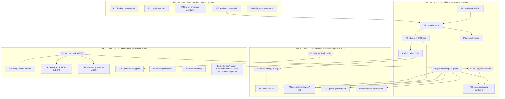

# Pareto Plan Round 3: CI Green → First Real Call → Daily Driver (continuation)

**When:** 2026-09-18 15:12 CEST (cli `date`)
**Sources:** `TODO_LIST.md` (18 verified rows after the 2026-09-18 morning
docs-health round 4), status report
`docs/status/2026-09-18_09-56_docs-health-round4-archive-all-loose-snapshots.md`
(§f 1–50), the live round-2 plan (open lanes carried with stable P-IDs),
ROADMAP. **Supersedes:** the round-2 plan's open-lane scheduling only —
its done lanes stay annotated history; **P-IDs stay stable** so
TODO_LIST/report citations do not rot; new lanes are P0 (reused,
re-executed), P33–P40.
**Living state:** point-in-time snapshot; executed work lands in
`TODO_LIST.md` (delete-the-row) and `CHANGELOG.md`; refresh by annotating.
**Format note (recorded override):** the pareto-planning skill's styled-HTML
default is overridden by the owner's standing instruction: `.md` + a
mermaid.js execution graph (same override as the round-2 plan).
**Secrecy rule:** no real domains, DIDs, IPs, usernames, or key material
here — real values live in the private flake, the gitignored scrub
patterns, and `~/.pbx-prod-secrets/`.

---

## 1. Pareto Breakdown

### The 1% that delivers 51% — public repo, trustworthy gates, the security edge (P0, P33, P1–P5)

Everything from the morning docs-health round (11 archives, TODO rebuild,
9 on-sight fixes) plus the treefmt fix sits on local main, **14 commits
unpushed**, while origin CI is red on the old head. Until the push lands
and CI goes green, nothing else is verifiable from outside (P0 — executed
at plan-commit time per the owner's explicit instruction). The one open
item with a security edge on real traffic is the operator surface: the
`telephony` group (nginx a member) can read the whole FreeSWITCH state
tree including `core.db` (P33 decision + implementation). Then the deploy
lane (P1–P5, owner hands-on) turns the best-tested hypothesis into a
phone.

### The 4% that delivers 64% — release anchor + operator daily-driver + clean signal (G2, G4/P18, P36, P37, P34)

The fspbx verdict (G2) closes the last open decision and unblocks the
upstream-filing framing. Release 0.3.0 (P18, gated on G4 timing — the
`[Unreleased]` section now spans the operator API + window, the
user-visible conference `#` change, fax, opsTools, scrub labels,
ahead-check, the webphone extraction, and the lint/devShell/tag work) is
the public anchor of the deployment era. The operator window/API tail
(P36) and quality-gate curation (P37) make the ops surface and every
future gate signal trustworthy. The webphone coordination lane (P34)
closes the UI repo's known `.badge[hidden]` bug and lands its v0.1.1
here.

### The 20% that delivers 80% — proofs, depth, and hygiene (P27, P31, P32, P38, P39)

Backup restore proof (P27 — only backup+ls is proven), the round-2/3
hygiene probes (P31: hash-verification sweep, buildflow doctor/upgrade/
VACUUM, "1 skipped", mypy decision, one canonical full-mode run, dprint
purpose), the docs-health arrow-annotator contribution (P32 — this repo
hand-appends hundreds of routed markers per round because the shipped
tools lack the verdict kind), the test/docs depth pack (P38: deploy §5
probes for the new surface, the config.js contacts assert, runbook
rotation-TTL note), and the drift_alarm extensions (P39: fail on
cited-path ghosts and on citations of non-archived snapshots).

### The other 20% (to reach 100%) — owner gates, external world, upstream, fleet (G3, P19.1, P24, P25, P35, P40, blocked set)

Telnyx key rotation + residual-exposure appetite + scrub-pattern
placeholders (G3 pack), Warsaw/DE DIDs (P24), browser-CI cadence (P25),
upstream filing prep (P35: nix eager-registry offline abort, virtiofsd
`--rlimit-nofile` — verify-before-filing first), sibling/fleet duties
(P40: pbx-artmann AGENTS distill, fleet devShell lint pinning, domains-
repo hygiene), and the standing blocked set (mainProgram policy, upstream
BuildFlow feedback, sops-nix example host). Explicitly NOT tasks:
ROADMAP themes 1–6 raw ideas stay raw until refined.

**Totals: 24 medium tasks (15–100 min) + 5 owner gates + ~110 micro
tasks (≤12 min).**

## 2. Comprehensive Plan — medium tasks (30–100 min, ALL TODOs)

Sorted by tier, then impact / effort / customer-value. `Dep` =
dependencies. `G*` = owner gate. `USER` = owner hands-on steps inside.

| ID    | Tier | Task                                                                                                                                                                                                                                                                                                                                                                                                                                                                 | Impact   | Effort | Dep     | Unblocks / verifies                                        |
| ----- | ---- | -------------------------------------------------------------------------------------------------------------------------------------------------------------------------------------------------------------------------------------------------------------------------------------------------------------------------------------------------------------------------------------------------------------------------------------------------------------------- | -------- | ------ | ------- | ---------------------------------------------------------- |
| P0    | 1%   | Repo delivery: push the 14-commit backlog (docs-health round 4 + the pending treefmt fix), confirm origin CI green on the new head — executed at plan-commit time (see §6) **→ done — CI green at `40bbc64` (run 35349322610, 2026-09-18 15:28; verified by the 15:43 session; §6 log)**                                                                                                                                                                             | Critical | 15min  | —       | Everything public; CI arbitrates the round-4 tree          |
| P33   | 1%   | Operator security hardening: owner decision on the ACL scope (dedicated read group vs accept the trust circle), then implement: narrower-group ACL or documented acceptance + the dedicated stream-token secret (replacing the ESL-password HMAC key) in any case **→ open — TODO_LIST Medium row (operator security hardening); G5 owner decision pending**                                                                                                         | Critical | 100min | P0, G5  | The ops surface is safe to expose to real traffic          |
| P1    | 1%   | Deployment execution pack (USER-gated): rescue-enable + power-cycle, rerun the fixed `install-pbx.sh` from evo-x2, `push-secrets.sh`, BatchMode, log to file **→ open — deploy lane (TODO_LIST High row; owner hands-on)**                                                                                                                                                                                                                                           | Critical | 100min | P0, G1  | Server runs the fixed closure; secrets spliced             |
| P2    | 1%   | Live-stack verification: units, webhook health endpoint 200, ACME issuer, gateway REGED, deploy.md §5 walk (+ the new operator/fax/phoneApi probes from P38) **→ open — deploy lane (TODO_LIST High row)**                                                                                                                                                                                                                                                           | Critical | 45min  | P1      | The stack is actually up, not just installed               |
| P3    | 1%   | Inbound wiring + SMS loop: PATCH messaging-profile webhook URL, send+receive one SMS via the token-gated `/recent`, close the "did it ring" loop from webhook events, wire the JSONL to `operator.smsMessageStore` **→ open — deploy lane (TODO_LIST High row)**                                                                                                                                                                                                     | Critical | 45min  | P2      | The 09-14 open loops finally close                         |
| P4    | 1%   | First real calls + CDR: webphone registers on the real host, outbound E.164 with US-DID caller-ID, inbound → ring group, Master.csv rows **→ open — deploy lane (TODO_LIST High row; G4 release gate)**                                                                                                                                                                                                                                                              | Critical | 60min  | P2, G4? | The product works; the original release gate               |
| P5    | 1%   | Deploy hygiene: static IPv6 + AAAA re-add, delete the old (billing) server, deploy.md drift commit **→ open — deploy lane (TODO_LIST High row)**                                                                                                                                                                                                                                                                                                                     | High     | 50min  | P2      | One server, one truth; v6 reachable                        |
| G2    | 4%   | fspbx verdict sign-off (owner): kill = revoke the live Sanctum PAT + stop VM + trash the trial dir; keep = relocate + snapshot. Unblocks P22's historical framing (verdict memo already landed) and 3 evidence loose ends **→ open — TODO_LIST blocked row (fspbx verdict sign-off)**                                                                                                                                                                                | High     | 15min  | —       | Trial lane closes; loose ends adjudicated                  |
| P18   | 4%   | Release 0.3.0: date `[Unreleased]`, tag, `gh release create`, repo metadata refresh, release-notes callout that opsTools needs a rebuild to take effect **→ open — TODO_LIST blocked row (cut v0.3.0; owner timing call)**                                                                                                                                                                                                                                           | High     | 40min  | P0, G4  | Public anchor for the deployment era                       |
| P36   | 4%   | Operator window/API tail: CDR pagination (server hard-clamps at 500), CSV export, phone-api auth lockout (backoff), HTTP Range in `send_file`, `vm_read` mark-read flip, healthz voicemail-db probe; 403-vs-401 test once lockout lands **→ done — 2026-09-24 session (CHANGELOG Added 2026-09-24; `checks.telephony-operator` green)**                                                                                                                              | High     | 100min | P0      | The ops surface stops being read-only-fragile              |
| P37   | 4%   | Quality-gate curation: the 5 detect-only bandit findings in the operator package (B404, B607×2, B405+B314 — inline nosec with rationale or the defusedxml decision), tidy/bless the `AUDIO-DEBUG-TEST` prints in `tests/operator.nix`, shellcheck SC1083 batch in `scripts/` **→ done — 2026-09-24 (bandit 0 findings, shellcheck 0, `ahead-check.sh` fetch bug fixed; CHANGELOG Fixed 2026-09-24)**                                                                 | Medium   | 60min  | P0      | Gate signal stops masking real findings                    |
| P34   | 4%   | Webphone coordination (mostly out-of-repo): verify the `.badge[hidden]` fix upstream, cut webphone v0.1.1 (owner tag-policy call), visual QA pass, then bump this repo's `webphone` input lock and re-run the webphone + browser suites **→ overtaken — the upstream v2 rebuild replaced the v0.1.x UI line (badge/visual-QA moot); the lock rides main per the 2026-09-18 owner decision; live follow-up = the shared-contacts TODO row**                           | Medium   | 60min  | P0      | The UI repo's known bug class closes; lock current         |
| P27   | 20%  | Backup-suite upgrade: assert a real `restic restore` round-trip (only backup+ls proven); decide /etc host keys in backup paths; confirm fax TIFFs + operator creds dir coverage **→ done — 2026-09-24 (full `restic restore` round-trip + `/etc/ssh` into the prod template's backup paths; `checks.telephony-backup` green)**                                                                                                                                       | Medium   | 45min  | —       | Restore stops being an untested assumption                 |
| P31   | 20%  | Round-2/3/4 hygiene probes: batch `git show --stat` the ~25 round-2-cited hashes; `buildflow doctor --verbose` vs reality; `buildflow upgrade` + db VACUUM; identify the "1 skipped" step; mypy-coverage decision; one canonical `buildflow --build-mode full --max-time 60m` run; dprint purpose **→ done — 2026-09-24 hygiene probes (15/15 cited hashes resolve, doctor reconciled, db VACUUM, mypy all-files decision, dprint purpose kept; 13:38 report §a.9)** | Medium   | 100min | P0      | Evidence hardened; tool drift known                        |
| P32   | 20%  | Docs-health arrow-annotator contribution: routed-arrow kind (`→ done/open/…`) with line-count-preserving writes, exact-match anchors, per-shape dry-runs — landed in the skill assets, with this repo as the test corpus **→ done — the docs-health skill ships `annotate-rows.py`/`annotate-prose.py` (13:38 report §a.9: "P32 already landed")**                                                                                                                   | Medium   | 60min  | —       | Future docs-health rounds drop to half the effort          |
| P38   | 20%  | Test/docs depth pack: deploy.md §5 gains operator/fax/phoneApi probes; `tests/webphone.nix` asserts config.js carries the contacts JSON (verified absent); runbook note on extension-password rotation ↔ API auth-cache TTL **→ done — 2026-09-24 (P38 remainder; CHANGELOG Added 2026-09-24)**                                                                                                                                                                      | Medium   | 45min  | P0      | The new surface is deploy- and regression-covered          |
| P39   | 20%  | drift_alarm extensions: fail when a TODO row cites a path that does not exist (the ghost-citation class the round-4 rebuild fixed by hand), and when it cites a non-archived point-in-time snapshot; negative-test both arms **→ done — 2026-09-24 (both citation arms + 12-case `--self-test`; `checks.docs-drift`)**                                                                                                                                               | Medium   | 45min  | —       | The gate catches the whole citation-rot class mechanically |
| P19.1 | rest | Telnyx API key rotation (owner): rotate in the portal, update the CC/outbound-profile scripts + the `KEY…` scrub pattern in the same action, verify the scripts still work **→ open — TODO_LIST blocked row (Telnyx key rotation)**                                                                                                                                                                                                                                  | High     | 30min  | G3      | Credential debt stops compounding                          |
| P24   | rest | Warsaw + DE DIDs (owner, external): re-purchase in the 48h KYC window, DE national order, then second-gateway stanza + dialplan/dest entries + tests **→ open — TODO_LIST blocked row (Warsaw/DE DIDs)**                                                                                                                                                                                                                                                             | High     | 50min  | G3, P4  | International coverage grows                               |
| P25   | rest | Browser-E2E CI cadence (owner): pick periodic/per-push; edit the workflow; verify one run **→ open — TODO_LIST blocked row (browser E2E CI cadence)**                                                                                                                                                                                                                                                                                                                | Low      | 15min  | G3      | The 1–2 GB suite earns its keep automatically              |
| P35   | rest | Upstream filing prep (verify-before-filing first): the nix eager-global-registry offline abort (nix 2.34), virtiofsd `--rlimit-nofile` for the VM framework; drafts + repro scripts staged in `docs/upstream.md` **→ open — ROADMAP theme 5 upstream items (verify-before-filing first)**                                                                                                                                                                            | Low      | 60min  | G2      | The findings help everyone; framing no longer blocked      |
| P40   | rest | Sibling/fleet duties (out-of-repo): distill the operator-session gotchas (fs-state ACL unit, the `/var/lib/freeswitch` symlink trap) into the private flake's AGENTS.md; pin lint binaries in devShells of other BuildFlow repos; domains-repo AGENTS.md hygiene **→ open — out-of-repo fleet duties (on demand; no repo home)**                                                                                                                                     | Low      | 60min  | —       | The fleet stops re-learning the same lessons               |
| G3    | rest | Owner security/exposure pack (one batched decision set): key-rotation timing (P19.1), residual-exposure appetite + pre-rewrite clone inventory, scrub-pattern placeholders fill-or-delete **→ open — TODO_LIST blocked rows (key rotation, scrub placeholders, residual exposure)**                                                                                                                                                                                  | High     | 15min  | —       | Four blocked rows become work or Won't-implement           |
| BLK   | rest | Standing blocked set (owner-decided, no plan lane until decided): `flake-meta-checker` mainProgram policy; upstream BuildFlow feedback (max_time keys, todo-checker marker naming, mainProgram carve-out); sops-nix example-host wiring; GitHub residual-exposure handling (inside G3) **→ open — TODO_LIST blocked rows (standing owner-decided set)**                                                                                                              | Low      | —      | owner   | —                                                          |
| P9    | rest | Trunk hardening: Telnyx source CIDRs into `allowedCidrs` + `restrictExternalTo`, fail2ban on prod, negative probe from a non-listed source — owner-gated until first calls (P4) **→ open — deploy lane tail (the TODO_LIST High row names trunk hardening)**                                                                                                                                                                                                         | High     | 40min  | P4      | Port 5080 speaks only to the provider                      |

Owner gates: **G1** rescue-boot/reinstall hands-on · **G2** fspbx verdict ·
**G3** security/exposure pack · **G4** release timing (0.3.0; originally
"after first real call" — the owner may fire early, the plan supports
both) · **G5** operator ACL-scope appetite (new; pair with G3's batched
decision set). Blocked rows with no plan lane (standing, owner-decided):
mainProgram policy; upstream BuildFlow feedback; sops-nix example host.

## 3. Fine Breakdown — micro tasks ≤12 min each (ALL TODOs)

Sorted within each parent by execution order; parents stay tier-sorted.
Micro rows inherit their parent row's verdict (the recorded
parent-marker convention).

### P0 — Repo delivery (15min) — EXECUTED at plan-commit time (§6)

| ID   | Task                                                                        | Effort |
| ---- | --------------------------------------------------------------------------- | ------ |
| P0.1 | Write this plan + TODO_LIST alignment rows (detailed commit)                | 12min  |
| P0.2 | `git push` the 14-commit backlog (owner-authorized in this instruction)     | 3min   |
| P0.3 | Watch the new CI run through its early gates (~4 min); full matrix to green | 12min  |

### P33 — Operator security hardening (100min, G5 decision first)

| ID     | Task                                                                                   | Effort |
| ------ | -------------------------------------------------------------------------------------- | ------ |
| P33.1  | G5 (owner): accept the `telephony` trust circle vs dedicated read-only group           | 10min  |
| P33.2  | Inventory the consumers: grep the group grants, nginx membership, recordings access    | 12min  |
| P33.3  | If narrowing: design the ro-group (members, ACL entries, default ACLs)                 | 12min  |
| P33.4  | Implement the ACL change in the fs-state-acl unit + wire the group                     | 12min  |
| P33.5  | Dedicated stream-token secret: option `operator.streamTokenSecretFile` (+plain twin)   | 12min  |
| P33.6  | Switch the HMAC keying to the new secret; keep the ESL password out of token minting   | 12min  |
| P33.7  | Secrets posture: hosts/pbx demo value + pbx-prod CHANGEME file + push-secrets doc line | 12min  |
| P33.8  | Operator suite: token path asserts still green; add a wrong-secret denial assert       | 12min  |
| P33.9  | Runbook: token-secret rotation procedure (revoke-all semantics)                        | 8min   |
| P33.10 | CHANGELOG + FEATURES row updates; full fast gates                                      | 8min   |

### P1 — Deployment execution pack (100min, USER-gated)

| ID   | Task                                                                                                    | Effort |
| ---- | ------------------------------------------------------------------------------------------------------- | ------ |
| P1.1 | Runbook snippet: rescue-enable, power-cycle, exact `install-pbx.sh` invocation (BatchMode, log-to-file) | 12min  |
| P1.2 | Verify `install-pbx.sh` on evo-x2 points at the fixed closure (`zstdcat \| cpio -t \| grep virtio`)     | 12min  |
| P1.3 | `nix run .#initrd-audit -- --platform cloud <initrd>` on the exact closure being shipped                | 12min  |
| P1.4 | USER: enable rescue system + power-cycle                                                                | 5min   |
| P1.5 | USER: run `install-pbx.sh` (fails fast, foreground, logged)                                             | 20min  |
| P1.6 | USER: run `push-secrets.sh`; verify perms + splice (`@TELEPHONY_` absent from runtime XML)              | 12min  |
| P1.7 | Post-install smoke: five units active, first-boot journal sane                                          | 12min  |

### P2 — Live-stack verification (45min)

| ID   | Task                                                                            | Effort |
| ---- | ------------------------------------------------------------------------------- | ------ |
| P2.1 | Webhook health: `GET /telnyx/webhooks/health` → 200 (force IPv4 past DNS cache) | 12min  |
| P2.2 | ACME: real issuer (not placeholder), vhost serving, port 80 only in acme mode   | 12min  |
| P2.3 | USER: `fs_cli` → `sofia status gateway` REGED (loopback socket)                 | 10min  |
| P2.4 | Walk deploy.md §5 incl. the P38 operator/fax/phoneApi probes; fix drift inline  | 12min  |

### P3 — Inbound wiring + SMS loop (45min)

| ID   | Task                                                                                  | Effort |
| ---- | ------------------------------------------------------------------------------------- | ------ |
| P3.1 | PATCH messaging-profile `webhook_url` → live endpoint; confirm 200                    | 10min  |
| P3.2 | USER: text the US DID; read the reply via the token-gated `/recent`                   | 12min  |
| P3.3 | Redial the test target; answer "did it ring" from webhook call events                 | 12min  |
| P3.4 | Private flake: wire the webhook JSONL to `operator.smsMessageStore` (one line)        | 5min   |
| P3.5 | Record Telnyx webhook behaviors (retries, event shapes) in `docs/providers/telnyx.md` | 12min  |

### P4 — First real calls + CDR (60min)

| ID   | Task                                                              | Effort |
| ---- | ----------------------------------------------------------------- | ------ |
| P4.1 | USER: webphone login on the real host; register 1000 over wss     | 10min  |
| P4.2 | Outbound E.164: audio + caller-ID shows the DID                   | 12min  |
| P4.3 | Inbound: call the DID from the mobile; ring group answers         | 10min  |
| P4.4 | Master.csv: one row per leg; sanity-check rates vs credit         | 12min  |
| P4.5 | Post-first-call status report skeleton + CHANGELOG `[Unreleased]` | 12min  |

### P5 — Deploy hygiene (50min)

| ID   | Task                                                                      | Effort |
| ---- | ------------------------------------------------------------------------- | ------ |
| P5.1 | USER: read the new IPv6 /64; pin static v6 + gateway in the private flake | 12min  |
| P5.2 | Re-add AAAA via the domains repo (scoped apply); verify v6                | 12min  |
| P5.3 | USER: delete the old billing server                                       | 5min   |
| P5.4 | `git worktree prune` + stale `result*` cleanup (habit; last done 09-17)   | 2min   |
| P5.5 | Commit deploy.md drift fixes                                              | 12min  |

### G2 — fspbx verdict execution (15min + loose ends)

| ID  | Task                                                                         | Effort |
| --- | ---------------------------------------------------------------------------- | ------ |
| V.1 | USER: sign off kill-or-keep (recommendation: kill; NixOS-first; keep as ref) | 5min   |
| V.2 | If kill: revoke the live Sanctum PAT (it sits in console logs)               | 10min  |
| V.3 | If kill: stop the VM + trash the trial dir                                   | 5min   |
| V.4 | If keep: relocate to persistent storage + post-wiring snapshot               | 12min  |
| V.5 | Close the loose ends: CDR-GUI render + who-answers-1002 (verify) or moot     | 12min  |

### P18 — Release 0.3.0 (40min)

| ID    | Task                                                                       | Effort |
| ----- | -------------------------------------------------------------------------- | ------ |
| P18.1 | CHANGELOG: date `[Unreleased]` → `[0.3.0]`; headings lint green            | 12min  |
| P18.2 | Release-notes draft: opsTools "rebuild required" callout + the `#` change  | 12min  |
| P18.3 | Tag + `gh release create` from the CHANGELOG section                       | 8min   |
| P18.4 | Repo metadata refresh (description/topics: running PBX, not just template) | 8min   |

### P36 — Operator window/API tail (100min)

| ID     | Task                                                                       | Effort |
| ------ | -------------------------------------------------------------------------- | ------ |
| P36.1  | CDR pagination: `limit`/`offset` params + total-count header               | 12min  |
| P36.2  | Operator UI: pagination controls on the CDR table                          | 12min  |
| P36.3  | CSV export endpoint for the (filtered) CDR view                            | 12min  |
| P36.4  | Operator UI: CSV export button                                             | 8min   |
| P36.5  | Auth lockout: fail-counter + backoff window on phone-api basic auth        | 12min  |
| P36.6  | `tests/operator.nix`: lockout assert (403 after N fails) + 403-vs-401 leg  | 12min  |
| P36.7  | HTTP Range support in `send_file` (single-range; 206 + Content-Range)      | 12min  |
| P36.8  | `vm_read` mark-read flip endpoint (mod_voicemail `vm_save` under the hood) | 12min  |
| P36.9  | healthz: voicemail-db-reachable probe → health card red instead of a 500   | 12min  |
| P36.10 | Operator suite re-run + CHANGELOG/FEATURES rows                            | 8min   |

### P37 — Quality-gate curation (60min)

| ID    | Task                                                                                   | Effort |
| ----- | -------------------------------------------------------------------------------------- | ------ |
| P37.1 | Decide defusedxml vs trusted-input nosec for the operator XML parsing (B405/B314)      | 12min  |
| P37.2 | Apply the decision + rationale comments; bandit green on the operator package          | 12min  |
| P37.3 | B404/B607: nosec-with-rationale or absolute paths for `systemctl`/`openssl` subprocess | 12min  |
| P37.4 | `tests/operator.nix`: tidy or bless the `AUDIO-DEBUG-TEST` failure-dump prints         | 8min   |
| P37.5 | shellcheck SC1083 batch across `scripts/` (brace literals)                             | 12min  |
| P37.6 | Re-run the flake lint checks + a buildflow fast pass                                   | 8min   |

### P34 — Webphone coordination (60min, mostly out-of-repo)

| ID    | Task                                                                                | Effort |
| ----- | ----------------------------------------------------------------------------------- | ------ |
| P34.1 | Verify the `.badge[hidden]` CSS fix landed upstream (render-and-look, not just DOM) | 12min  |
| P34.2 | Owner tag-policy call: v0.1.1 cut vs re-point v0.1.0 (see the 09-18 report g.1)     | 10min  |
| P34.3 | Visual QA pass: dark/light × en/de screenshots (the render-and-look rule)           | 12min  |
| P34.4 | Bump this repo's `webphone` input lock; both toplevels eval                         | 8min   |
| P34.5 | Re-run `telephony-webphone` + browser E2E against the new lock                      | 12min  |
| P34.6 | CHANGELOG line for the input bump                                                   | 6min   |

### P27 — Backup restore proof (45min)

| ID    | Task                                                                      | Effort |
| ----- | ------------------------------------------------------------------------- | ------ |
| P27.1 | Backup-suite `restic restore` round-trip assert (canary out == canary in) | 12min  |
| P27.2 | Decide /etc host keys in backup paths (private-flake posture)             | 12min  |
| P27.3 | Confirm fax TIFFs + operator creds dir are inside the restic paths        | 12min  |
| P27.4 | Runbook sync if the recipe changed                                        | 6min   |

### P31 — Hygiene probes (100min)

| ID    | Task                                                                            | Effort |
| ----- | ------------------------------------------------------------------------------- | ------ |
| P31.1 | Batch `git show --stat` the ~25 hashes cited by docs-health round 2 (log table) | 12min  |
| P31.2 | Correct any mis-mapped markers found by the sweep (annotate, never rewrite)     | 12min  |
| P31.3 | `buildflow doctor --verbose` vs reality (the 9 "unavailable" tools that ran)    | 12min  |
| P31.4 | `buildflow upgrade` + the suggested buildflow.db VACUUM                         | 12min  |
| P31.5 | Identify the final green run's "1 skipped" step                                 | 8min   |
| P31.6 | mypy-coverage decision (all tests/*.py vs selenium-only) + config flip          | 12min  |
| P31.7 | One canonical `buildflow --build-mode full --max-time 60m` run, end-to-end      | 12min+ |
| P31.8 | dprint purpose check (config? files?) — keep or skip the step with rationale    | 8min   |

### P32 — Docs-health arrow-annotator contribution (60min)

| ID    | Task                                                                                    | Effort |
| ----- | --------------------------------------------------------------------------------------- | ------ |
| P32.1 | Spec the routed-arrow kind (`→ done/open/deferred/overtaken — <home>`) into the grammar | 12min  |
| P32.2 | Implement with the invariants: exact-match anchors, descending writes, shape re-read    | 12min  |
| P32.3 | Dry-run/shape tests against a scratch corpus (include this repo's ugliest table shapes) | 12min  |
| P32.4 | Land in the skill assets + note in its changelog                                        | 12min  |
| P32.5 | Use it for the next real annotation batch; feed findings back                           | 12min  |

### P38 — Test/docs depth pack (45min)

| ID    | Task                                                                            | Effort |
| ----- | ------------------------------------------------------------------------------- | ------ |
| P38.1 | deploy.md §5: operator window (login + cards), fax dir, phoneApi history probes | 12min  |
| P38.2 | `tests/webphone.nix`: assert config.js carries the contacts JSON                | 12min  |
| P38.3 | Runbook: extension-password rotation ↔ API auth-cache TTL interplay note        | 8min   |
| P38.4 | Fast gates + CHANGELOG/FEATURES touches                                         | 8min   |

### P39 — drift_alarm extensions (45min)

| ID    | Task                                                                            | Effort |
| ----- | ------------------------------------------------------------------------------- | ------ |
| P39.1 | Arm 1: fail when a cited evidence path does not exist (extract paths from rows) | 12min  |
| P39.2 | Arm 2: fail when a row cites a `docs/status/` (non-archived) snapshot           | 12min  |
| P39.3 | Negative-test both arms; rebuild `checks.docs-drift` green                      | 12min  |
| P39.4 | Re-point any rows the new arms flag (expect: zero after the round-4 rebuild)    | 6min   |

### P19.1 — Telnyx key rotation (30min, owner-gated)

| ID     | Task                                                              | Effort |
| ------ | ----------------------------------------------------------------- | ------ |
| P19.1a | USER: rotate the key in the portal (old key still load-bearing)   | 10min  |
| P19.1b | Update the CC/outbound-profile scripts + the `KEY…` scrub pattern | 12min  |
| P19.1c | Verify the scripts still work; scrub gate green                   | 8min   |

### P24 — Warsaw + DE DIDs (50min, owner + external)

| ID    | Task                                                               | Effort |
| ----- | ------------------------------------------------------------------ | ------ |
| P24.1 | USER: re-purchase Warsaw in the portal                             | 10min  |
| P24.2 | USER: submit the 5 KYC requirements inside the ~48h release window | 12min  |
| P24.3 | USER: DE national order + KYC                                      | 12min  |
| P24.4 | Second-gateway stanza + dialplan/dest entries + tests              | 12min  |

### P25 — Browser-E2E CI cadence (15min, owner-gated)

| ID    | Task                            | Effort |
| ----- | ------------------------------- | ------ |
| P25.1 | USER: pick periodic/per-push    | 5min   |
| P25.2 | Edit `.github/workflows/ci.yml` | 10min  |
| P25.3 | Verify one run                  | 12min  |

### P35 — Upstream filing prep (60min)

| ID    | Task                                                                                  | Effort |
| ----- | ------------------------------------------------------------------------------------- | ------ |
| P35.1 | Repro script for the nix eager-registry offline abort (the NIX_CONF_DIR sandbox)      | 12min  |
| P35.2 | Draft issue text (github-voice register) for the nix finding                          | 12min  |
| P35.3 | Repro + draft for virtiofsd `--rlimit-nofile` (guest_fd_limit message names the knob) | 12min  |
| P35.4 | Stage both in `docs/upstream.md` with the verify-before-filing checklist ticked       | 12min  |
| P35.5 | File after owner go-ahead (G2 settles the fspbx framing first)                        | 12min  |

### P40 — Sibling/fleet duties (60min, out-of-repo)

| ID    | Task                                                                                     | Effort |
| ----- | ---------------------------------------------------------------------------------------- | ------ |
| P40.1 | Private flake AGENTS.md: distill the fs-state ACL unit + bind-mount symlink-trap gotchas | 12min  |
| P40.2 | Private flake AGENTS.md: operator window exists upstream; enable at next rebuild         | 8min   |
| P40.3 | Fleet: pin lint binaries in devShells of the other BuildFlow-covered repos               | 12min  |
| P40.4 | Domains repo AGENTS.md: persist the NAMECHEAP_CLIENT_IP/dig workaround; stray tfplan     | 12min  |
| P40.5 | pbx-artmann TODO_LIST/FEATURES refresh (stale since the 09-14 install run)               | 12min  |

### G3 — Owner security/exposure pack (15min, one batched decision set)

Decisions inside: key-rotation timing (unblocks P19.1); residual-exposure
appetite + pre-rewrite clone inventory; scrub-pattern placeholders
fill-or-delete; operator ACL appetite (G5, unblocks P33).

## 4. Execution Graph

## 5. Verification / sorting criteria

- **Impact**: unblocks other work > owner-visible capability > hygiene.
- **Effort**: calibrated against this week's actuals (docs-health round 4
  ≈ 5h wall including annotation archaeology; VM suite ≈ 2–25 min each).
- **Customer-value**: the only customer is the owner — "can I make, take,
  and trust calls yet" outranks everything; "can I see what happened"
  (CDR/health) next; "does the gate tell the truth" underlies both.
- **Anti-Verschlimmbesserung rules**: every code task ends with the
  relevant gate green (`nix flake check` or the targeted suite) + `nix
  fmt` BEFORE the daemon can ship it; docs tasks end with the drift +
  changelog + scrub gates; the operator surface stays a window, never an
  editor; no real values in this repo (scrub gate enforces); P-IDs stay
  stable across plan rounds so citations never rot; done work is DELETED
  from TODO_LIST, never struck.

## 6. Execution log (append-only)

- 2026-09-18 15:12 — plan created; supersedes the round-2 plan's open-lane
  scheduling (its done lanes remain annotated history). New lanes: P33–P40
  from the 2026-09-18 morning docs-health round + status report; carried
  lanes keep stable P-IDs (P1–P5, G2–G4, P9, P18, P19.1, P24, P25, P27,
  P31, P32).
- 2026-09-18 15:12 — **P0.1 DONE**: this plan + the TODO_LIST alignment
  rows committed with a detailed message per the owner's explicit
  "git commit with VERY DETAILED message(s)" instruction.
- 2026-09-18 15:12 — **P0.2 executed**: `git push` of the full backlog
  (14 daemon-absorbed commits + this plan commit) per the owner's
  explicit "git push" instruction. P0.3 (CI watch) queued.
- 2026-09-18 15:43 — **P0.3 DONE**: CI run `35349322610` green at head
  `40bbc64` (verified by the 15:43 handoff-verification session); the
  P0 lane is fully closed.
- 2026-09-25 — docs-health round: §2 lanes annotated with verdicts (the
  2026-09-24 execution session closed P36/P37/P38/P39/P27/P31/P32; open
  lanes route to TODO_LIST/ROADMAP homes); superseded plan archived per
  the every-item-marked convention.
