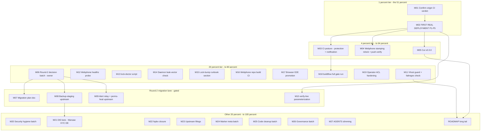

# Plan: First call to daily driver — round 4 (Pareto execution plan)

- **Written**: 2026-09-29 04:52 CEST
- **Source of truth**: `TODO_LIST.md` as of 2026-09-29 04:50 (19 open TODO rows
  - 12 owner-blocked rows, incl. the 7 rows folded in from the round-6 status
    report) + the round-2 upstream-migration lanes (owner-gated) + ROADMAP raw
    ideas as the backlog tier.
- **Method**: docs-health → pareto-planning. Medium tasks are 30–100 min
  (max 27); fine tasks are ≤12 min each (124 total). Sorted by
  importance/impact/effort/customer-value, where the customers are, in order:
  the owner-operator (a production PBX), public integrators of the module,
  and future AI sessions working this tree.
- **Posture**: do not verschlimmbessern. Every change must leave the repo
  verifiably no worse. Owner-gated lanes stay gated — this plan sequences
  them, it does not decide them.

## Pareto breakdown

### The 1% that delivers 51%

**The first real deployment (P1–P5) plus its proof of green.** Everything
else in this repo exists to serve a running PBX: the providers decision, the
reconciler, the messaging bridge, the runbooks, the metal-boot proofs — all
are built and VM-proven, and all convert to actual value the moment the
stack answers a real call on real hardware. It is blocked only by ~2h of
owner hands-on steps. Its one repo-side prerequisite: a completed CI verdict
on the exact train being deployed (the two runs after the relock were
runner-shutdown cancels, not code failures).

### The 4% that delivers 64%

Add three compounding items:

1. **CI posture on main** (branch protection / failure notification) — makes
   every future push trustworthy; the 26h-unnoticed red streak is the
   counter-example already paid for.
2. **Webphone stamping relock** (verify the producer rev is on origin main,
   relock, run the ritual ladder) — closes the MMS Content-Type feature end
   to end in production instead of leaving the bridge's preferred path dead
   at the current lock.
3. **Cut v0.3.0** — turns ~5 weeks of accumulated Unreleased work into a
   consumable, referenceable release.

### The 20% that delivers 80%

Add the trust/hygiene core: the guard rows (vhost split-brain guard,
eval-time failregex check, webphone healthz probe, daemon leak-vector
check), the lock-governance tooling (lock-doctor script, lock-bump runbook
section, webphone repo build CI, browser-E2E promotion), the one full-gate
run (`buildflow --build-mode full`), the operator ACL hardening, and the
**round-2 owner decision batch** (backup doctrine, timing, kexec appetite)
which unblocks the entire upstream-migration lane.

### The other 20% (to 100%)

Security hygiene (Telnyx key rotation, scrub-pattern placeholders, Warsaw
DID + KYC + DE DID, fspbx closure, GitHub residual exposure), upstream
filings (nix-ssh-config home-manager, BuildFlow feedback), governance
leftovers (flake-meta policy, sops example host), docs/meta debt (marker
convention recording, retro marker sweeps, AGENTS slimming, inline-assert
extraction, contacts cross-link), and the ROADMAP long tail (binary cache,
vulnix replacement, lock-diff CI, aarch64 KVM suite, smoke-script adoption,
machine-readable repo surface).

## Execution graph

## Step 2 — comprehensive plan (30–100 min tasks, 27 total)

Sorted by importance / impact / effort / customer-value. `Gate` marks an
owner decision or hands-on step that must happen first.

| #   | Task (30–100 min)                                                                                                                                                                                                                                             | Impact   | Effort | Customer value                   | Gate            |
| --- | ------------------------------------------------------------------------------------------------------------------------------------------------------------------------------------------------------------------------------------------------------------- | -------- | ------ | -------------------------------- | --------------- |
| M01 | Confirm a completed origin CI verdict ≥ `3c87f80`; push/rerun if the daemon or runner stalled **→ done — GREEN at `b8f211d` (run 36538651011, 2026-09-29; the five prior cancels were runner infra)**                                                         | Critical | 30min  | Trust in the deployed train      | —               |
| M02 | FIRST REAL DEPLOYMENT P1–P5: rescue boot, install, secrets, webhook, first calls, CDR, hardening pass **→ open — owner hands-on (TODO_LIST High blocked row; host-identity question reroutes it)**                                                            | Critical | 100min | The product exists (owner)       | Owner hands-on  |
| M03 | CI posture: branch protection + required checks, or failure notification; verify with a red probe branch **→ open — owner decision (TODO_LIST CI-posture Critical row)**                                                                                      | Critical | 30min  | Every future push trustworthy    | Owner decision  |
| M04 | Webphone stamping relock: verify producer rev on origin main, relock, full ritual ladder **→ done — relock `3d8df3f` → `045edfe` at `f53397a` (producer rev verified reachable; CHANGELOG 2026-09-29)**                                                       | High     | 60min  | MMS feature works end to end     | —               |
| M05 | Cut v0.3.0: finalize Unreleased, tag, `gh release create`, metadata refresh, verify tag CI **→ open — owner timing (TODO_LIST v0.3.0 row; Unreleased finalized + hook-green)**                                                                                | High     | 45min  | Integrators can pin a version    | Owner timing    |
| M06 | Round-2 decision batch: backup doctrine, migration timing, kexec appetite; record as ADR-style notes **→ open — owner decisions (gates M07–M09)**                                                                                                             | High     | 30min  | Unblocks the migration lane      | Owner decisions |
| M07 | Round-2 migration plan doc: belongs-table, scrub checklist, invariants, verification matrix **→ open — gated on M06**                                                                                                                                         | High     | 90min  | Safe upstream moves              | M06             |
| M08 | Backup-staging module option upstream (sqlite .backup, MANIFEST, retention, freshness) + VM test **→ open — gated on M06**                                                                                                                                    | High     | 100min | Backup story for every consumer  | M06             |
| M09 | Alert-relay collision fix + secrets perms-heal option upstream + tests **→ open — gated on M06**                                                                                                                                                              | Medium   | 90min  | One alert story, one secrets dir | M06             |
| M10 | Parameterize verify-live.sh into the repo as the deploy.md §5 companion (+ messaging 401 arm) **→ done — `scripts/verify-live.sh` landed + live-proven 14 checks / 0 failures (CHANGELOG Added 2026-09-29)**                                                  | Medium   | 45min  | Repeatable post-deploy proof     | —               |
| M11 | Vhost split-brain guard (force upstream nginx option off) + eval-time failregex check **→ done — vhost guard + `checks.telephony-failregex` landed 2026-09-29, negative arm proven**                                                                          | Medium   | 60min  | Structurally can't collide       | —               |
| M12 | Webphone /healthz probe in the health unit + monitoring test arm **→ done — `/healthz` probe + monitoring suite stop→FAIL→recover arm (CHANGELOG Added 2026-09-29)**                                                                                          | Medium   | 45min  | UI deaths become visible         | —               |
| M13 | lock-doctor script: revs vs upstream HEADs + verdict-per-rev (cancel ≠ red) **→ done — `scripts/lock-doctor.py` with cancel-≠-red verdicts + `--self-test`**                                                                                                  | Medium   | 45min  | Lock reviews become mechanical   | —               |
| M14 | Daemon leak-vector verification: can auto-commits bypass scrub/gitleaks? **→ done — daemon source-verified (plain git commit, no --no-verify); hooksPath landmine found, canary-proven, `heal-pre-commit-hook.sh` landed (CHANGELOG Fixed 2026-09-29)**       | Medium   | 30min  | Public-repo safety               | —               |
| M15 | Lock-bump runbook section + upstream command-sheet alignment **→ done — ops-runbook "Lock-bump runbook" section (CHANGELOG Added 2026-09-29)**                                                                                                                | Medium   | 45min  | Future sessions relock safely    | —               |
| M16 | Webphone repo build CI workflow (build + go tests on push) **→ done — webphone CI landed 2026-09-29, first run green (AGENTS record)**                                                                                                                        | High     | 60min  | "First green rev" provable       | —               |
| M17 | Browser E2E promotion: periodic or lock-rev trigger in ci.yml **→ open — owner cadence (TODO_LIST E2E blocked row)**                                                                                                                                          | High     | 30min  | Browser regressions caught       | Owner cadence   |
| M18 | `buildflow --build-mode full --max-time 60m` run + triage of anything it surfaces **→ done — run 3× and triaged; 24-finding Python backlog fixed; green shape recorded (09-20 report §a.8)**                                                                  | Medium   | 75min  | The full pipeline proven again   | —               |
| M19 | Operator ACL hardening: narrower FS-state group + dedicated stream-token secret + suites **→ done — `telephony-fs` group + `streamTokenSecret{,File}` + operator suite green (09-20 report §a.2)**                                                            | Medium   | 90min  | Least-privilege operator surface | —               |
| M20 | Security hygiene: rotate Telnyx API key, update scrub prefix, fill/drop OWNER-TO-ADD placeholders **→ open — owner (TODO_LIST blocked rows)**                                                                                                                 | Medium   | 30min  | Credential hygiene               | Owner           |
| M21 | DID lane: Warsaw repurchase + 5 KYC requirements inside the window + DE national DID **→ open — owner (TODO_LIST blocked row)**                                                                                                                               | High     | 60min  | Real inbound numbers             | Owner           |
| M22 | fspbx trial closure: sign-off, revoke PAT, stop VM, trash trial dir **→ open — owner sign-off (TODO_LIST blocked row)**                                                                                                                                       | Medium   | 30min  | No zombie attack surface         | Owner sign-off  |
| M23 | Upstream filings: nix-ssh-config home-manager relock issue/PR + BuildFlow feedback (verify first) **→ done — nix-ssh-config#5, BuildFlow#25–27 + batch 2 (#28, git-hooks.nix#754, pma#341); one candidate dropped as stale-premise (09-20 §a.4, 10-15 §a.4)** | Medium   | 90min  | Ecosystem fixes flow both ways   | —               |
| M24 | Marker meta batch: record open-row convention in AGENTS; retro per-item + row-uniformity sweeps **→ done — convention in AGENTS + retro sweeps: 90 verdicts / 15 files, zero unmarked (09-20 §a.5)**                                                          | Low      | 60min  | Archive stays honest             | —               |
| M25 | Code cleanup: extract the inline config.js python assertion + contacts wire cross-link **→ done — `tests/configjs_check.py` + three-way contacts cross-link (09-20 §a.3)**                                                                                    | Low      | 45min  | Maintainable contract tests      | —               |
| M26 | Governance batch: flake-meta mainProgram policy, GitHub residual-exposure appetite, sops example go/no-go **→ open — owner appetite calls (TODO_LIST blocked rows)**                                                                                          | Low      | 45min  | Closed open questions            | Owner           |
| M27 | AGENTS.md slimming pass (16.2 KB → target ~14 KB, traps stay inline) **→ done — 16.7 → 15.2 KB, traps kept inline (09-20 §a.6; 14 KB-target deviation recorded)**                                                                                             | Low      | 75min  | Session onboarding stays fast    | —               |

## Step 3 — fine breakdown (124 tasks, ≤12 min each)

Grouped under their medium parent (global order = the sorted order above;
within a group, execution order). `g` marks an owner/hands-on gate step.

_Annotation 2026-09-29: every fine task inherits its parent M-row verdict
in Step 2 — the micro-steps are decompositions, not independent items._

| #      | Micro-task                                                                   | Min | Gate |
| ------ | ---------------------------------------------------------------------------- | --- | ---- |
| f01.01 | Read origin CI verdict for the daemon-pushed head (`gh run list/view`)       | 5   | —    |
| f01.02 | If unpushed: `ahead-check.sh`, let/push the tail                             | 5   | —    |
| f01.03 | If runner-canceled again: rerun the workflow, read the completed verdict     | 10  | —    |
| f01.04 | Record verdict in the TODO row, close it, CHANGELOG if notable               | 5   | —    |
| f02.01 | Hetzner rescue mode enable + power-cycle the server                          | 10  | g    |
| f02.02 | Rerun `install-pbx.sh` from evo-x2                                           | 10  | g    |
| f02.03 | Run `push-secrets.sh`                                                        | 10  | g    |
| f02.04 | Verify the webhook health endpoint                                           | 10  | g    |
| f02.05 | PATCH the messaging-profile webhook URL                                      | 10  | g    |
| f02.06 | Close the outbound-call loop                                                 | 12  | g    |
| f02.07 | Re-add static IPv6 + AAAA record                                             | 10  | g    |
| f02.08 | Delete the old (billing) server                                              | 10  | g    |
| f02.09 | Run the deploy.md §5 verification checklist                                  | 12  | g    |
| f02.10 | First real calls + CDR rows check                                            | 12  | g    |
| f02.11 | Trunk hardening: Telnyx source CIDRs + fail2ban posture                      | 12  | g    |
| f02.12 | Live security pass: Hetzner Cloud Firewall apply + one `ssh-audit` run       | 12  | g    |
| f03.01 | Owner picks: protection vs notification vs both                              | 5   | g    |
| f03.02 | Configure branch protection + required checks via API                        | 10  | —    |
| f03.03 | Or configure the failure notification path                                   | 10  | —    |
| f03.04 | Verify with a deliberately red probe branch                                  | 10  | —    |
| f04.01 | Compare webphone origin/main vs the local checkout (stamping rev reachable?) | 10  | —    |
| f04.02 | Push the stamping commits upstream if stalled (owner lane)                   | 10  | g    |
| f04.03 | Relock the webphone input                                                    | 5   | —    |
| f04.04 | `nix build .#webphone` first-arm proof                                       | 10  | —    |
| f04.05 | Fast gates + webphone VM suites                                              | 12  | —    |
| f04.06 | Browser E2E if the delta touches markup or the bundle                        | 12  | —    |
| f04.07 | Hand-authored relock commit naming old→new revs + why                        | 10  | —    |
| f04.08 | CHANGELOG line + close the two relock/push-verify TODO rows                  | 10  | —    |
| f05.01 | Finalize the Unreleased section (dates, headings hook)                       | 10  | —    |
| f05.02 | Tag vX.Y.Z (annotated)                                                       | 5   | g    |
| f05.03 | `gh release create` with notes                                               | 10  | —    |
| f05.04 | Repo metadata refresh (topics/description)                                   | 10  | —    |
| f05.05 | Verify the tag's CI run went green                                           | 10  | —    |
| f06.01 | Owner picks the backup doctrine (restic dogfood vs staging+pull upstream)    | 10  | g    |
| f06.02 | Owner picks round-2 timing (now vs after deploy backlog)                     | 5   | g    |
| f06.03 | Owner picks kexec appetite (public/private/fleet)                            | 5   | g    |
| f06.04 | Record decisions (ADR-style note) + route TODO rows                          | 10  | —    |
| f07.01 | Draft the belongs-table                                                      | 12  | —    |
| f07.02 | Copy the never-publish scrub checklist verbatim                              | 10  | —    |
| f07.03 | Write the invariants list                                                    | 10  | —    |
| f07.04 | Write the verification matrix                                                | 12  | —    |
| f07.05 | Review pass + file under docs/planning                                       | 10  | —    |
| f08.01 | `backupStaging` option interface (types + descriptions)                      | 12  | —    |
| f08.02 | Staging script: sqlite .backup + state.paths copy + MANIFEST                 | 12  | —    |
| f08.03 | Retention + freshness/disk-full checks                                       | 12  | —    |
| f08.04 | Timers + unit hardening                                                      | 12  | —    |
| f08.05 | VM test suite (stage → verify → restore path)                                | 12  | —    |
| f08.06 | Downstream migration notes (what the private repo drops)                     | 10  | —    |
| f08.07 | Gates + CHANGELOG + FEATURES row                                             | 12  | —    |
| f09.01 | Design the alert-collision resolution (module owns the template)             | 12  | —    |
| f09.02 | Module-owned relay unit + template fix                                       | 12  | —    |
| f09.03 | `secretsDir` option + perms-heal unit                                        | 12  | —    |
| f09.04 | Tests for both arms                                                          | 12  | —    |
| f09.05 | Downstream coordination + gates + CHANGELOG                                  | 12  | —    |
| f10.01 | Strip host literals from verify-live.sh                                      | 12  | —    |
| f10.02 | Parameterize by domain                                                       | 10  | —    |
| f10.03 | Land as the deploy.md §5 companion                                           | 10  | —    |
| f10.04 | Add the messaging 401/403 arm                                                | 12  | —    |
| f11.01 | Force `services.webphone.nginx.enable = false` in web.nix                    | 10  | —    |
| f11.02 | Eval assertion or test guarding the collision                                | 12  | —    |
| f11.03 | fail2ban-regex runCommand check skeleton                                     | 12  | —    |
| f11.04 | Canned log-line fixtures for both filters                                    | 12  | —    |
| f11.05 | Wire into checks + gates + row closures                                      | 10  | —    |
| f12.01 | Add the /healthz probe to the health unit                                    | 12  | —    |
| f12.02 | monitoring.nix test arm                                                      | 12  | —    |
| f12.03 | Gates + row close                                                            | 10  | —    |
| f13.01 | lock-doctor skeleton + flake.lock parsing                                    | 12  | —    |
| f13.02 | Upstream HEAD comparison via gh api                                          | 12  | —    |
| f13.03 | Verdict lookup with cancel-≠-red handling                                    | 12  | —    |
| f13.04 | Self-test + usage note                                                       | 10  | —    |
| f14.01 | Trace the daemon's commit path (which hook, if any, runs)                    | 12  | —    |
| f14.02 | Canary test: plant a scrub-pattern string, watch the daemon                  | 12  | —    |
| f14.03 | Mitigate or record accepted risk + close the row                             | 10  | —    |
| f15.01 | Draft the runbook lock-bump section (ritual from AGENTS)                     | 12  | —    |
| f15.02 | Gate-ladder table (cheap → build → suites → E2E → full)                      | 10  | —    |
| f15.03 | Cross-link the upstream owner command sheet                                  | 12  | —    |
| f15.04 | Gates + row close                                                            | 10  | —    |
| f16.01 | Draft the webphone CI workflow yml                                           | 12  | —    |
| f16.02 | Build + go-test steps                                                        | 12  | —    |
| f16.03 | Caching/pinning decisions                                                    | 10  | —    |
| f16.04 | Verify on a real push + close the row                                        | 12  | —    |
| f17.01 | Owner picks the E2E cadence                                                  | 5   | g    |
| f17.02 | Wire schedule/lock-rev trigger in ci.yml                                     | 10  | —    |
| f17.03 | Smoke-run + CI-budget check + row close                                      | 12  | —    |
| f18.01 | Kick `buildflow --build-mode full --max-time 60m`                            | 10  | —    |
| f18.02 | Triage findings (accepted-noise list in AGENTS is the baseline)              | 12  | —    |
| f18.03 | Fix/route real findings + update the remainder note + close row              | 12  | —    |
| f19.01 | ACL group design (who reads FS state; keep nginx recordings access)          | 12  | —    |
| f19.02 | Narrower group wiring in pbx.nix                                             | 12  | —    |
| f19.03 | Preserve/regression-test the recordings access path                          | 12  | —    |
| f19.04 | Dedicated stream-token secret option                                         | 12  | —    |
| f19.05 | Suite updates + gates + row close                                            | 12  | —    |
| f20.01 | Generate + swap the Telnyx API key                                           | 10  | g    |
| f20.02 | Update the KEY-prefix scrub pattern                                          | 5   | —    |
| f20.03 | Fill or drop the three OWNER-TO-ADD placeholders                             | 10  | g    |
| f20.04 | scrub-check --history run + row closures                                     | 10  | —    |
| f21.01 | Warsaw DID re-purchase in the portal                                         | 10  | g    |
| f21.02 | Submit the 5 KYC requirements inside the window                              | 12  | g    |
| f21.03 | DE national DID order                                                        | 12  | g    |
| f21.04 | Update providers doc lead-times + row close                                  | 10  | —    |
| f22.01 | Record the sign-off                                                          | 5   | g    |
| f22.02 | Revoke the live Sanctum PAT                                                  | 5   | g    |
| f22.03 | Stop the VM + trash the trial dir                                            | 10  | g    |
| f22.04 | Close the loose ends note + row                                              | 10  | —    |
| f23.01 | Verify-before-filing: nix-ssh-config HM staleness still true                 | 12  | —    |
| f23.02 | File the nix-ssh-config issue/PR                                             | 12  | —    |
| f23.03 | Verify + draft BuildFlow feedback items                                      | 12  | —    |
| f23.04 | File BuildFlow issues + row close                                            | 12  | —    |
| f24.01 | Write the open-row marker convention into AGENTS Conventions                 | 10  | —    |
| f24.02 | Run the block-aware per-item checker over all archived files                 | 12  | —    |
| f24.03 | Fix any unmarked items found (annotate, never rewrite)                       | 12  | —    |
| f24.04 | Row-uniformity sweep + record expected open-row warnings + close rows        | 12  | —    |
| f25.01 | Extract the inline config.js python assertion to a file                      | 12  | —    |
| f25.02 | Wire the extracted fixture into the suite                                    | 10  | —    |
| f25.03 | Cross-link the contacts wire contract comments both directions               | 12  | —    |
| f25.04 | Gates + row closures                                                         | 10  | —    |
| f26.01 | flake-meta mainProgram: accept the finding or wait for the carve-out         | 10  | g    |
| f26.02 | Draft the GitHub support GC request (residual exposure)                      | 12  | g    |
| f26.03 | Clone inventory on other machines (owner knowledge)                          | 10  | g    |
| f26.04 | sops example host: go/no-go + row close                                      | 10  | g    |
| f27.01 | Inventory stale/duplicated AGENTS passages                                   | 12  | —    |
| f27.02 | Compress lesson-adjacent prose to docs/lessons pointers                      | 12  | —    |
| f27.03 | Move one-off history to CHANGELOG/docs homes                                 | 12  | —    |
| f27.04 | Verify ~14 KB budget + gates + row close                                     | 12  | —    |

## Backlog tier (ROADMAP homes, not TODOs)

| Item                                     | Home                               | Why not now                                                               |
| ---------------------------------------- | ---------------------------------- | ------------------------------------------------------------------------- |
| Binary cache for VM closures             | ROADMAP theme 5                    | L effort, CI-time optimization **→ open — ROADMAP theme 5**               |
| Vulnix replacement scanner               | ROADMAP theme 5                    | Blocked on BuildFlow scanner story **→ open — ROADMAP theme 5**           |
| Lock-diff CI step                        | ROADMAP theme 5                    | Lock-doctor (M13) informs the shape **→ open — M13 done, shape informed** |
| aarch64 KVM suite                        | ROADMAP q8                         | Hardware + owner decision **→ open — ROADMAP q8**                         |
| Webphone smoke-script adoption           | ROADMAP theme 3                    | Nice-to-have post-M16 **→ open — M16 done**                               |
| Machine-readable repo surface (llms.txt) | ROADMAP theme 5                    | Docs depth, no user pain today **→ open — ROADMAP theme 5**               |
| nixpkgs upstreamability push             | ROADMAP theme 5 + docs/upstream.md | Post-deployment stability first **→ open — post-deploy**                  |

## Guardrails

- Gates before glory: `nix fmt` + cheap checks always precede any
  VM-realizing run; long gates start only when the tree is believed-final.
- Owner-gated rows (marked `g` / Gate column) are never auto-executed.
- Done work leaves TODO_LIST the moment it is verified; CHANGELOG records it.
- This plan is a point-in-time snapshot; annotate, never rewrite. TODO_LIST
  and ROADMAP stay the living sources.
