# Plan: Verdict → Reality → Deploy — Round 6 (Pareto execution plan)

- **Written**: 2026-09-30 00:47 CEST
- **Source of truth**: `TODO_LIST.md` as of 2026-09-30 00:46 (2 TODO High/AI
  rows + 1 TODO Medium + 2 TODO Low + 13 BLOCKED owner rows) + the round-6
  carry set from the round-7 docs-health arc reports + ROADMAP raw ideas as
  the backlog tier.
- **Situation at plan time**: origin/main was advanced to `f868e24` by the
  owner/sibling lane (the 20-commit tail is PUSHED); its CI run
  `36641103487` is in progress and is the live verdict for the whole
  round-3/4/5 + docs-arc + trunk-probe train. The apparent red at `d28c9c1`
  (run `36542220144`) is the documented runner-shutdown-cancel class — all
  checks were ✅ at the cancel point (infra, not code). Two local commits
  remain unpushed; this plan's landing push (mandated by the round-6
  instruction) carries them.
- **Method**: docs-health → pareto-planning. Medium tasks are 30–100 min
  (27 total); fine tasks are ≤12 min each (103 total). Sorted by
  importance/impact/effort/customer-value, where the customers are, in
  order: the owner-operator (a production PBX), public integrators of the
  module, and future AI sessions working this tree.
- **Posture**: do not verschlimmbessern. Every change must leave the repo
  verifiably no worse. Owner-gated lanes stay gated — this plan sequences
  them, it does not decide them. The push mandate covers THIS plan's
  landing commit only (round-5 precedent wording).

## Pareto breakdown

### The 1% that delivers 51%

**A completed green origin CI verdict on the full main state.** Everything
this repo has produced for five days — the relock, guards, checks, scripts,
the docs-truth arc, the sibling trunk-probe code — has exactly zero
external trust until origin completes a run on it. One verdict (already in
flight at `f868e24` + this plan's landing push) underwrites every other
line of this plan; a REAL red (not a cancel) becomes the new 1% and
preempts everything.

### The 4% that delivers 64%

Add two compounding items:

1. **Host-identity reality check** (M02) — one `verify-live.sh` pass plus a
   decision packet converts the Critical P1–P5 row from "scope unknown"
   into either "verify + close" or "do it all". It gates every deploy
   decision made so far and is AI-executable right now.
2. **CI posture on main** (M03) — protection + required checks (or
   notification): every FUTURE push becomes trustworthy; the 26h-unnoticed
   red streak and the cancel-shaped "failure" at `d28c9c1` are the paid-for
   evidence. Owner decision, ~30min AI execution once decided.

### The 20% that delivers 80%

Add the value-conversion core: the **P1–P5 deploy lane** (M04 — first real
calls + CDR rows on real hardware; the entire repo exists for this), the
**v0.3.0 cut** (M05 — five weeks of Unreleased becomes a pinnable release),
the **round-2 owner decision batch** (M06 — unblocks the M07–M09
upstream-migration chain), the **security hygiene batch** (M12 — Telnyx key
rotation coupled to the scrub pattern), and the **DID lane** (M13 — real
inbound numbers inside the KYC window).

### The other 20% (to 100%)

Marker-gate wiring + plan-preset decision (M10), webphone repo polish
(M11), fspbx closure (M14), hooksPath landmine (M15), browser-E2E cadence
(M16), GitHub residual exposure (M17), sops example go/no-go (M18),
mainProgram policy (M19), nix-ssh-config merge + relock (M20), ROADMAP
Q6–Q8 sweep (M21), the skill-lane contribution (M22), the post-tail
full-gate cadence run (M23), /tmp-durability lesson to crush-config (M24),
BuildFlow binary refresh + skip_steps (M25), the demo/launch video +
website wave (M26), and the docs-health round-8 standing cadence (M27).
ROADMAP long tail stays routed (binary cache, vulnix replacement, lock-diff
CI, llms.txt, smoke-script, aarch64 KVM).

## Step 2 — comprehensive plan (30–100 min tasks, 27 total)

Sorted by importance / impact / effort / customer-value. `Gate` marks an
owner decision or hands-on step that must happen first.

| #   | Task (30–100 min)                                                                                                                                                                               | Impact   | Effort | Customer value                           | Gate                 |
| --- | ----------------------------------------------------------------------------------------------------------------------------------------------------------------------------------------------- | -------- | ------ | ---------------------------------------- | -------------------- |
| M01 | Land a COMPLETED green origin CI verdict on the full main state (watch 36641103487 + this plan's landing push; cancel ≠ red; max 3 reruns; a REAL red preempts the plan and becomes the new 1%) **→ open — infra kill-ledger (10 runs, 9x cancel + 1x SIGTERM), protocol exhausted at 3 reruns; owner support/job-split lane (TODO_LIST verdict row)** | Critical | 45min  | Trust in everything below                | Push mandate (given) |
| M02 | Host-identity reality check: full `scripts/verify-live.sh` pass + host-side evidence where granted + decision packet (live-finished vs old billing server) rerouting P1–P5 **→ done — verify-live 14/0, identity answered (9ba5546)** | Critical | 30min  | Ends the "is it live?" ambiguity         | —                    |
| M03 | CI posture: owner picks protection+required-checks vs notification; implement via API; verify with a deliberately red probe branch **→ open — owner decision (TODO_LIST CI-posture row)** | Critical | 30min  | Every future push trustworthy            | Owner decision       |
| M04 | FIRST REAL DEPLOYMENT P1–P5 (or "already-live" shortcut): webhook URL PATCH, outbound loop, IPv6/AAAA, old-server delete, §5 checklist, first calls + CDR, trunk hardening, live security pass **→ open — owner hands-on; rerouted to close-out row** | Critical | 100min | The product exists (owner)               | M02 + owner hands-on |
| M05 | Cut v0.3.0: date `[Unreleased]`, annotated tag, `gh release create`, metadata refresh, verify tag CI **→ open — owner timing (row stands)** | High     | 45min  | Integrators can pin a version            | Owner timing         |
| M06 | Round-2 decision batch: backup doctrine (restic dogfood vs staging+pull), migration timing, kexec appetite — ADR-style notes + row routing **→ open — owner decisions** | High     | 30min  | Unblocks the migration lane              | Owner decisions      |
| M07 | Round-2 migration plan doc: belongs-table, never-publish scrub checklist, invariants, verification matrix **→ open — gated on M06** | High     | 90min  | Safe upstream moves                      | M06                  |
| M08 | Backup-staging module option upstream (sqlite .backup, MANIFEST, retention, freshness) + VM test **→ open — gated on M06** | High     | 100min | Backup story for every consumer          | M06                  |
| M09 | Alert-relay collision fix + `secretsDir` perms-heal option upstream + tests **→ open — gated on M06** | Medium   | 90min  | One alert story, one secrets dir         | M06                  |
| M10 | Marker-gate batch: wire `scripts/markers_check.py` as a flake check + decide the plan-section preset (or record the convention) **→ done — checks.markers-check wired + Step-2 preset; first sweep caught 5ba5d2b dropping four verdicts (4cea337)** | Medium   | 45min  | Archive honesty CI-enforced              | —                    |
| M11 | Webphone repo polish: `SECURITY.md` + `DOMAIN_LANGUAGE.md` upstream (webphone CI verdicts each) **→ done — SECURITY.md upstream green (baa9c2f, run 36675268502); DOMAIN_LANGUAGE draft ratification owner (a4fedef)** | Low      | 60min  | Upstream repo reaches parity             | —                    |
| M12 | Security hygiene: rotate Telnyx API key, update KEY-prefix scrub pattern, fill-or-drop 3 OWNER-TO-ADD placeholders, `scrub-check --history --strict` **→ open — owner (rotate key)** | Medium   | 30min  | Credential hygiene                       | Owner                |
| M13 | DID lane: Warsaw re-purchase + 5 KYC requirements inside the ~48h window; DE national DID order; providers doc lead-times **→ open — owner portal** | High     | 60min  | Real inbound numbers                     | Owner portal         |
| M14 | fspbx trial closure: verdict sign-off → revoke Sanctum PAT, stop VM, trash trial dir; close loose ends **→ open — owner sign-off** | Medium   | 30min  | No zombie attack surface                 | Owner sign-off       |
| M15 | Fix host-global `core.hookspath=.githooks` landmine (home-manager): real dir or drop; re-run the canary through a fresh repo **→ open — owner home-manager** | Medium   | 30min  | Every repo's hooks actually run          | Owner                |
| M16 | Browser E2E CI cadence: pick periodic / per-push / lock-rev trigger; wire + smoke-run **→ open — owner cadence** | Low      | 30min  | Browser regressions caught               | Owner cadence        |
| M17 | GitHub residual-exposure call: support GC request vs accept residual; stale Dependabot PR-ref audit; clone inventory **→ open — owner** | Low      | 30min  | Closure on the rewrite                   | Owner                |
| M18 | sops-nix example host go/no-go (docs recipe stands) **→ open — owner go/no-go** | Low      | 20min  | Secrets story complete                   | Owner                |
| M19 | flake-meta mainProgram policy: accept the info finding vs park on BuildFlow#27 **→ open — owner policy** | Low      | 15min  | Noise baseline closed                    | Owner                |
| M20 | Merge nix-ssh-config `update_flake_lock_action` branch once its CI is green; relock the input here; fast gates **→ open — owner merge; branch carries NO CI runs, master lock-updates fail weekly (checked 2026-09-30)** | Medium   | 30min  | Kills the 96-behind drift at the source  | Owner merge          |
| M21 | ROADMAP open questions 6–8 sweep (qemuGuest on prod, lock governance, aarch64 emulation): decide or park with notes **→ open — owner** | Low      | 30min  | No silent open questions                 | Owner                |
| M22 | Skill-lane contribution: extend `annotate-rows.py` with the routed-arrow in-cell kind (docs-health assets) + evaluate the drift_alarm cross-file arm **→ done — kind r + port evaluation in skill assets, fan-out verified (78dc335)** | Low      | 60min  | Future docs rounds get cheaper           | —                    |
| M23 | Post-tail full-gate cadence run: `buildflow --build-mode full --max-time 60m` once M01 verdicts green; triage vs the accepted-noise baseline **→ done — full-mode 3m21s (93% cache), local nix flake check ALL green 194s over 32 checks; findings gate = exactly the 4 documented port-collision errors (the green shape); bandit 257 = banner rows (file "."), vulnix 15 toolchain advisories — accepted envelope; deviation from plan gate recorded (origin CI infra-blocked)** | Medium   | 75min  | The full pipeline proven on the new tail | M01                  |
| M24 | /tmp-durability lesson → crush-config global lessons (commit in that repo) **→ open — owner** | Low      | 15min  | Cross-fleet knowledge                    | Owner                |
| M25 | BuildFlow binary refresh via system profile + `nix-hash-fix` → `skip_steps` call **→ open — owner** | Low      | 30min  | Tooling current                          | Owner                |
| M26 | Demo/launch video + website wave (website-launch pattern) once v0.3.0 + first call exist **→ open — gated M05+M04** | Medium   | 100min | The public knows this exists             | M05 + M04            |
| M27 | Docs-health round 8 (standing cadence): annotate/archive any new snapshots, living-doc truth pass, inline health report per the loaded format **→ done — this pass: living-doc truth (AGENTS marker/preset + CI-protocol lines), plan annotated+archived, gates green** | Low      | 45min  | Docs stay honest                         | —                    |

## Step 3 — fine breakdown (103 tasks, ≤12 min each)

Grouped under their medium parent (global order = Step 2 order; within a
group, execution order). `g` marks an owner/hands-on gate step.

_Annotation 2026-09-30: every fine task inherits its parent M-row
verdict in Step 2 — the micro-steps are decompositions, not independent
items. Executed this arc: f01.01–f01.04 (verdict watch + reruns +
ledger), f02.01/03/04 (identity packet + reroute), f10.01–f10.04
(markers-check wiring + preset + negative arm + row), f11.01–f11.04
(SECURITY.md drafted/pushed/verdicted green; DOMAIN_LANGUAGE =
pre-existing draft, ratification owner), f20.01 (branch CI state
checked: no runs on the branch, master lock-updates red weekly),
f22.01/f22.02 (kind r + fixtures). All other groups stay with their
owner-gated parents._

| #      | Micro-task                                                                | Min | Gate |
| ------ | ------------------------------------------------------------------------- | --- | ---- |
| f01.01 | Watch run 36641103487 to a COMPLETED conclusion (airtight JSON read)      | 10  | —    |
| f01.02 | Push this plan's landing commit (mandate given); grab the new run id      | 5   | —    |
| f01.03 | Runner-canceled → rerun (max 3); record verdict + close the TODO row      | 12  | —    |
| f01.04 | REAL red → triage job/check, fix forward, re-verdict (preempts the plan)  | 12  | —    |
| f02.01 | `scripts/verify-live.sh pbx.artmann.tech` full pass, capture output       | 10  | —    |
| f02.02 | Host-side §5 evidence via ssh if owner grants access                      | 12  | g    |
| f02.03 | Write the decision packet (live-finished vs old billing server)           | 12  | —    |
| f02.04 | Reroute the P1–P5 TODO row + answer the owner question with evidence      | 10  | —    |
| f03.01 | Owner picks: protection+required checks vs notification vs both           | 5   | g    |
| f03.02 | Configure via API (`gh api -X PUT repos/…/branches/main/protection`)      | 10  | —    |
| f03.03 | Or configure the failure-notification path                                | 10  | —    |
| f03.04 | Verify with a deliberately red probe branch; close the row                | 10  | —    |
| f04.01 | (If already live) host-side §5 checklist + first-call/CDR evidence        | 12  | g    |
| f04.02 | PATCH the messaging-profile webhook URL                                   | 10  | g    |
| f04.03 | Close the outbound-call loop                                              | 12  | g    |
| f04.04 | Re-add static IPv6 + AAAA record                                          | 10  | g    |
| f04.05 | Delete the old (billing) server                                           | 10  | g    |
| f04.06 | First real calls + CDR rows check                                         | 12  | g    |
| f04.07 | Trunk hardening: Telnyx source CIDRs + fail2ban posture                   | 12  | g    |
| f04.08 | Live security pass: Hetzner Cloud Firewall + one `ssh-audit`              | 12  | g    |
| f04.09 | (If NOT live) rescue-boot + `install-pbx.sh` + `push-secrets.sh`          | 12  | g    |
| f05.01 | Owner dates the release                                                   | 2   | g    |
| f05.02 | CHANGELOG `[Unreleased]` → `[0.3.0] - <date>` + headings hook             | 10  | —    |
| f05.03 | Annotated tag `v0.3.0` + push tag                                         | 5   | —    |
| f05.04 | `gh release create v0.3.0` with notes                                     | 10  | —    |
| f05.05 | Verify the tag's CI run went green; close the row                         | 10  | —    |
| f06.01 | Owner picks backup doctrine (restic dogfood vs staging+pull upstream)     | 10  | g    |
| f06.02 | Owner picks round-2 timing (now vs after deploy backlog)                  | 5   | g    |
| f06.03 | Owner picks kexec appetite (public/private/fleet)                         | 5   | g    |
| f06.04 | Record ADR-style notes + route TODO rows                                  | 10  | —    |
| f07.01 | Draft the belongs-table                                                   | 12  | —    |
| f07.02 | Copy the never-publish scrub checklist verbatim                           | 10  | —    |
| f07.03 | Write the invariants list                                                 | 10  | —    |
| f07.04 | Write the verification matrix                                             | 12  | —    |
| f07.05 | Review pass + file under docs/planning                                    | 10  | —    |
| f08.01 | `backupStaging` option interface (types + descriptions)                   | 12  | —    |
| f08.02 | Staging script: sqlite .backup + state.paths copy + MANIFEST              | 12  | —    |
| f08.03 | Retention + freshness/disk-full checks                                    | 12  | —    |
| f08.04 | Timers + unit hardening                                                   | 12  | —    |
| f08.05 | VM test suite (stage → verify → restore path)                             | 12  | —    |
| f08.06 | Downstream migration notes (what the private repo drops)                  | 10  | —    |
| f08.07 | Gates + CHANGELOG + FEATURES row                                          | 12  | —    |
| f09.01 | Design the alert-collision resolution (module owns the template)          | 12  | —    |
| f09.02 | Module-owned relay unit + template fix                                    | 12  | —    |
| f09.03 | `secretsDir` option + perms-heal unit                                     | 12  | —    |
| f09.04 | Tests for both arms                                                       | 12  | —    |
| f09.05 | Downstream coordination + gates + CHANGELOG                               | 12  | —    |
| f10.01 | Wire `checks.markers-check` runCommand in flake.nix (pattern: docs-drift) | 12  | —    |
| f10.02 | Plan-preset decision: `--sections` preset vs AGENTS convention line       | 10  | —    |
| f10.03 | Planted-miss self-test through the flake check (negative arm)             | 10  | —    |
| f10.04 | Targeted check green + close the TODO row                                 | 10  | —    |
| f11.01 | Draft webphone `SECURITY.md` (nix-ssh-config parity)                      | 12  | —    |
| f11.02 | Draft webphone `DOMAIN_LANGUAGE.md`                                       | 12  | —    |
| f11.03 | Commit upstream; watch webphone CI verdict per file                       | 10  | —    |
| f11.04 | Close the TODO row                                                        | 5   | —    |
| f12.01 | Generate + swap the Telnyx API key                                        | 10  | g    |
| f12.02 | Update the KEY-prefix scrub pattern                                       | 5   | —    |
| f12.03 | Fill or drop the three OWNER-TO-ADD placeholders                          | 10  | g    |
| f12.04 | `scrub-check --history --strict` + row closures                           | 10  | —    |
| f13.01 | Warsaw DID re-purchase in the portal                                      | 10  | g    |
| f13.02 | Submit the 5 KYC requirements inside the window                           | 12  | g    |
| f13.03 | DE national DID order                                                     | 12  | g    |
| f13.04 | Update providers doc lead-times + row close                               | 10  | —    |
| f14.01 | Record the fspbx sign-off                                                 | 5   | g    |
| f14.02 | Revoke the live Sanctum PAT                                               | 5   | g    |
| f14.03 | Stop the VM + trash the trial dir                                         | 10  | g    |
| f14.04 | Close the loose-ends note + row                                           | 10  | —    |
| f15.01 | home-manager: real global hooks dir or drop the entry; deploy             | 12  | g    |
| f15.02 | Re-run the canary through a fresh repo's hook path                        | 5   | —    |
| f15.03 | Close the TODO row + record in AGENTS if behavior changed                 | 10  | —    |
| f16.01 | Owner picks the E2E cadence                                               | 5   | g    |
| f16.02 | Wire schedule/lock-rev trigger in ci.yml                                  | 10  | —    |
| f16.03 | Smoke-run + CI-budget check + row close                                   | 12  | —    |
| f17.01 | Draft the GitHub support GC request (or record acceptance)                | 12  | g    |
| f17.02 | Audit stale Dependabot PR refs                                            | 10  | —    |
| f17.03 | Clone inventory on other machines (owner knowledge) + row close           | 10  | g    |
| f18.01 | sops example host go/no-go + row close                                    | 10  | g    |
| f19.01 | Accept the mainProgram finding or park on BuildFlow#27; row close         | 10  | g    |
| f20.01 | Check nix-ssh-config branch CI state (issue #5)                           | 5   | —    |
| f20.02 | Merge `update_flake_lock_action` (owner approve)                          | 5   | g    |
| f20.03 | Relock the input here; fast gates + row close                             | 12  | —    |
| f21.01 | Write roadmap Q6–Q8 decision/park notes                                   | 12  | g    |
| f21.02 | ROADMAP update + drift alarm                                              | 10  | —    |
| f22.01 | Implement the routed-arrow kind in annotate-rows.py (skill assets)        | 12  | —    |
| f22.02 | Fixture-test against this repo's archived tables                          | 12  | —    |
| f22.03 | Commit upstream (crush-config repo)                                       | 10  | —    |
| f22.04 | drift_alarm cross-file arm: evaluate + draft or park on ROADMAP           | 12  | —    |
| f23.01 | Kick `buildflow --build-mode full --max-time 60m` (post-verdict)          | 10  | —    |
| f23.02 | Triage findings vs accepted-noise baseline (AGENTS)                       | 12  | —    |
| f23.03 | Fix/route real findings + close the TODO row                              | 12  | —    |
| f24.01 | Write the /tmp-durability lesson into crush-config references/lessons.md  | 12  | g    |
| f24.02 | Commit in the crush-config repo                                           | 5   | g    |
| f25.01 | BuildFlow binary refresh via system profile                               | 12  | g    |
| f25.02 | `nix-hash-fix` → `skip_steps` call + record                               | 12  | g    |
| f26.01 | Script the demo tour (register → call → recording → operator window)      | 12  | —    |
| f26.02 | Record + cut the launch video (hyperframes lane)                          | 12  | —    |
| f26.03 | Website skeleton (website-launch pattern) + landing page                  | 12  | —    |
| f26.04 | Publish wave: README badge links + release notes callout                  | 12  | —    |
| f27.01 | Snapshot inventory + classification (annotate/archive/leave)              | 12  | —    |
| f27.02 | Living-doc truth pass (six docs, VERIFY mode)                             | 12  | —    |
| f27.03 | Gates: markers_check + check-rows + drift alarm + link sweep              | 10  | —    |
| f27.04 | Inline health report per the loaded format                                | 10  | —    |

## Backlog tier (ROADMAP homes, not TODOs)

| Item                                     | Home                       | Why not now                        |
| ---------------------------------------- | -------------------------- | ---------------------------------- |
| Binary cache for VM closures             | ROADMAP theme 5            | L effort, CI-time optimization     |
| Vulnix replacement scanner               | ROADMAP theme 5            | Blocked on BuildFlow scanner story |
| Lock-diff CI step                        | ROADMAP theme 5            | lock-doctor informs the shape      |
| Machine-readable repo surface (llms.txt) | ROADMAP theme 5            | Docs depth, no user pain today     |
| Webphone smoke-script adoption           | ROADMAP theme 3            | Nice-to-have post-webphone-CI      |
| aarch64 KVM suite                        | ROADMAP q8                 | Hardware + owner decision          |
| nixpkgs upstreamability push             | ROADMAP + docs/upstream.md | Post-deployment stability first    |

## Guardrails

- Gates before glory: `nix fmt` + cheap checks always precede any
  VM-realizing run; long gates start only when the tree is believed-final.
- CI verdicts are read airtight (`gh run view --json …`); a canceled run is
  infra, not code — and a "failure" whose log ends in `runner has received
  a shutdown signal` is a cancel wearing a failure label (the `d28c9c1`
  precedent). Max 3 reruns against consecutive runner-cancels, then record
  - wait for the fleet.
- Owner-gated rows (marked `g` / Gate column) are never auto-executed; the
  push mandate covers this plan's landing commit only.
- Done work leaves TODO_LIST the moment it is verified; CHANGELOG records
  it. Every newly archived snapshot gets check-rows in the same session.
- This plan is a point-in-time snapshot; annotate, never rewrite.
  TODO_LIST and ROADMAP stay the living sources.

## Execution graph

```mermaid
flowchart TD
    subgraph ONE["1 percent tier - the 51 percent"]
        M01["M01 completed green verdict<br/>on the full main state"]
    end
    subgraph FOUR["4 percent tier - to 64 percent"]
        M02["M02 host-identity<br/>reality check"]
        M03["M03 CI posture"]
    end
    subgraph TWENTY["20 percent tier - to 80 percent"]
        M04["M04 P1-P5 deploy lane"]
        M05["M05 cut v0.3.0"]
        M06["M06 round-2 decisions"]
        M12["M12 security hygiene"]
        M13["M13 DID lane"]
    end
    subgraph R2["Round-2 migration lane - gated"]
        M07["M07 migration plan doc"]
        M08["M08 backup-staging upstream"]
        M09["M09 alert-relay + perms upstream"]
    end
    subgraph REST["other 20 percent - to 100 percent"]
        M10["M10 marker gate + preset"]
        M11["M11 webphone polish"]
        M14["M14 fspbx closure"]
        M15["M15 hooksPath fix"]
        M16["M16 E2E cadence"]
        M17["M17 residual exposure"]
        M18["M18 sops example"]
        M19["M19 mainProgram policy"]
        M20["M20 nix-ssh-config merge"]
        M21["M21 roadmap Q6-Q8"]
        M22["M22 skill-lane contribution"]
        M23["M23 full-gate cadence run"]
        M24["M24 /tmp lesson to crush-config"]
        M25["M25 BuildFlow binaries + skip_steps"]
        M26["M26 demo video + website"]
        M27["M27 docs-health round 8"]
    end
    M01 --> M02
    M01 --> M03
    M01 --> M23
    M02 --> M04
    M03 --> M04
    M06 --> M07
    M06 --> M08
    M06 --> M09
    M05 --> M26
    M04 --> M26
    M05 --> M13
    classDef gate fill:#f9d71c,stroke:#333,color:#000
    class M03,M04,M06,M12,M13,M14,M15,M16,M17,M18,M19,M20,M21,M24,M25 gate
    class M01,M02,M05,M07,M08,M09,M10,M11,M22,M23,M26,M27 ai
```

---

_Point-in-time snapshot — annotate, never rewrite. TODO_LIST and ROADMAP
stay the living sources._
